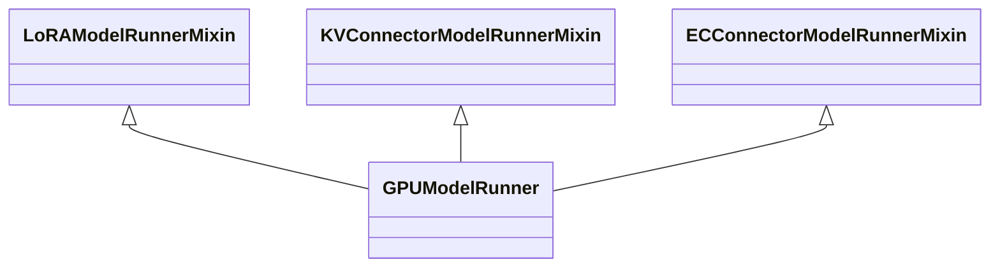
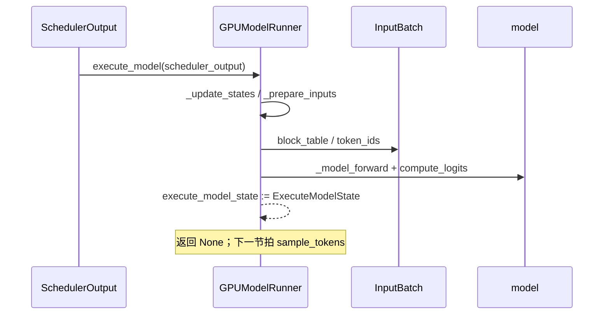

# `GPUModelRunner` (v1)

## Summary

[`GPUModelRunner`](d:\design\vllm\vllm\v1\worker\gpu_model_runner.py) 是 vLLM v1 GPU worker 上**单步 forward + 采样 +（可选）投机草稿**的编排中心：多重继承 [`LoRAModelRunnerMixin`](d:\design\vllm\vllm\v1\worker\lora_model_runner_mixin.py) / [`KVConnectorModelRunnerMixin`](d:\design\vllm\vllm\v1\worker\kv_connector_model_runner_mixin.py) / [`ECConnectorModelRunnerMixin`](d:\design\vllm\vllm\v1\worker\ec_connector_model_runner_mixin.py)，持有 `Sampler`、持久化 `InputBatch`、预分配 CUDA graph 用 token/position buffer，以及 `CudagraphDispatcher` 驱动的执行模式选择。主路径为 `execute_model` →（与 `sample_tokens` 配对的）`ExecuteModelState` 暂存 → `_sample` / `propose_draft_token_ids`。

## Sources

- 主实现（整文件）：[`gpu_model_runner.py`](d:\design\vllm\vllm\v1\worker\gpu_model_runner.py)
- 输入批与块表：[`gpu_input_batch.py`](d:\design\vllm\vllm\v1\worker\gpu_input_batch.py)、[`block_table.py`](d:\design\vllm\vllm\v1\worker\block_table.py)
- Worker 侧内存画像与 warmup：`determine_available_memory` / `compile_or_warm_up_model` 在 [`gpu_worker.py`](d:\design\vllm\vllm\v1\worker\gpu_worker.py)（非本类方法，见 §3）
- 新版对照：[`v1/worker/gpu/model_runner.py`](d:\design\vllm\vllm\v1\worker\gpu\model_runner.py)、[`v1/worker/gpu/README.md`](d:\design\vllm\vllm\v1\worker\gpu\README.md)

## 概览（10 节）

### 1. 类层次 + mixin

本文件除主类外还有：`AsyncGPUModelRunnerOutput`、`AsyncGPUPoolingModelRunnerOutput`、`ExecuteModelState`、`EncoderTimingStats`（[`gpu_model_runner.py:227-391`](d:\design\vllm\vllm\v1\worker\gpu_model_runner.py)、[`6966-6979`](d:\design\vllm\vllm\v1\worker\gpu_model_runner.py)）。

### 2. 字段表（按功能分组）

| 分组 | 代表字段 | 锚点 |
|------|----------|------|
| 配置快照 | `vllm_config`、`model_config`、`cache_config`、`compilation_config`、`speculative_config` 等 | [397-412](d:\design\vllm\vllm\v1\worker\gpu_model_runner.py) |
| 设备 / dtype | `device`、`dtype`、`kv_cache_dtype`、`pin_memory` | [418-424](d:\design\vllm\vllm\v1\worker\gpu_model_runner.py) |
| 模型 | 惰性 `self.model`（`load_model` 设置）、`model_memory_usage` | [4732-4893](d:\design\vllm\vllm\v1\worker\gpu_model_runner.py) |
| KV | `kv_caches`、`kv_cache_config`、`attn_groups`、`cross_layers_kv_cache`、`shared_kv_cache_layers` | [495-502](d:\design\vllm\vllm\v1\worker\gpu_model_runner.py)、[6724-6778](d:\design\vllm\vllm\v1\worker\gpu_model_runner.py) |
| 输入批 | `input_batch: InputBatch`、`requests: dict[str, CachedRequestState]` | [595-646](d:\design\vllm\vllm\v1\worker\gpu_model_runner.py) |
| 采样 | `sampler: Sampler`；投机时 `rejection_sampler: RejectionSampler` | [482-580](d:\design\vllm\vllm\v1\worker\gpu_model_runner.py) |
| CUDA graph | `cudagraph_dispatcher`、`cudagraph_batch_sizes` | [658-776](d:\design\vllm\vllm\v1\worker\gpu_model_runner.py) |
| 投机解码 | `drafter`（多型）、`num_spec_tokens`、`use_async_spec_decode` | [512-593](d:\design\vllm\vllm\v1\worker\gpu_model_runner.py) |
| 多模态 / 池化 | `encoder_cache`、`late_interaction_runner`、`mm_budget`；池化走 `_pool` | [505-509](d:\design\vllm\vllm\v1\worker\gpu_model_runner.py)、[3092-3109](d:\design\vllm\vllm\v1\worker\gpu_model_runner.py) |
| 跨步暂存 | `execute_model_state: ExecuteModelState \| None`、`kv_connector_output` | [378-391](d:\design\vllm\vllm\v1\worker\gpu_model_runner.py)、[852-856](d:\design\vllm\vllm\v1\worker\gpu_model_runner.py) |

### 3. `__init__` 与初始化顺序

构造阶段：缓存配置字段 → 投机分支构造 `drafter`/`rejection_sampler` → **尽早**构造 `InputBatch`（注释说明须在 `load_model` 之前，否则量化/卸载会失败，[601-609](d:\design\vllm\vllm\v1\worker\gpu_model_runner.py)）→ 预分配持久 buffer（`input_ids`、`positions`、各类 `CpuGpuBuffer`）→ `set_offloader(create_offloader(...))` [848-850](d:\design\vllm\vllm\v1\worker\gpu_model_runner.py)。

**引擎级顺序**（本类只覆盖其中子集）：`GPUWorker` 先 `model_runner.load_model`，再 `determine_available_memory`（调用 `profile_run` 等），再 `initialize_kv_cache` → `compile_or_warm_up_model`（含 `capture_model`），见 [`gpu_worker.py:318-590`](d:\design\vllm\vllm\v1\worker\gpu_worker.py)。

### 4. `load_model` / 编译与 wrapper

`load_model`（[4732-4893](d:\design\vllm\vllm\v1\worker\gpu_model_runner.py)）：`get_model_loader` → `load_model`；可选 LoRA；存在 `drafter` 时 `drafter.load_model`；EPLB 与 `CUDAGraphWrapper` / `UBatchWrapper` 包装；`STOCK_TORCH_COMPILE` 时 `model.compile(fullgraph=True)` 并提前 `return` [4860-4869](d:\design\vllm\vllm\v1\worker\gpu_model_runner.py)。

**`compile_or_warm_up_model` 不在本类**：由 `GPUWorker.compile_or_warm_up_model` 调用 `model_runner._dummy_run`、`kernel_warmup`、`model_runner.capture_model()` [549-588](d:\design\vllm\vllm\v1\worker\gpu_worker.py)。

### 5. `determine_available_memory`（GPU profile）

**不在 `GPUModelRunner`**：显存画像与「KV 可用字节」计算在 `GPUWorker.determine_available_memory`（[331-482](d:\design\vllm\vllm\v1\worker\gpu_worker.py)），内部调用 `self.model_runner.profile_run()`，可选 `model_runner.profile_cudagraph_memory()` [366-381](d:\design\vllm\vllm\v1\worker\gpu_worker.py)。

### 6. `initialize_kv_cache` / `get_kv_cache_spec`

- `get_kv_cache_spec`（[6859-6889](d:\design\vllm\vllm\v1\worker\gpu_model_runner.py)）：遍历 `AttentionLayerBase`，处理 `kv_sharing_target_layer_name` 记入 `shared_kv_cache_layers`，其余层 `get_kv_cache_spec` 填入 dict。
- `initialize_kv_cache`（[6724-6779](d:\design\vllm\vllm\v1\worker\gpu_model_runner.py)）：`deepcopy` 配置 → `initialize_attn_backend` → `prepare_kernel_block_sizes` → `may_reinitialize_input_batch` → `initialize_kv_cache_tensors` → `bind_kv_cache`；若启用 KV 传输则 `register_kv_caches` 等 [6770-6779](d:\design\vllm\vllm\v1\worker\gpu_model_runner.py)。

### 7. `_prepare_inputs`（scheduler_output → tensor）

`_prepare_inputs`（[1774-2083](d:\design\vllm\vllm\v1\worker\gpu_model_runner.py)）：`block_table.commit_block_table` → 计算 `req_indices`/`cu_num_tokens`/positions → `index_select` 填充 `input_ids`（及 prompt embeds 路径）→ `query_start_loc`、`seq_lens`、`num_computed_tokens` 等与投机/异步相关的 GPU 修正（`update_num_computed_tokens_for_batch_change`）→ `_prepare_input_ids` → 返回 `logits_indices` 与可选 `spec_decode_metadata`。

### 8. `execute_model` 主流程

`execute_model`（[3761-4112](d:\design\vllm\vllm\v1\worker\gpu_model_runner.py)）要点：校验 `execute_model_state` 为空 [3767-3771](d:\design\vllm\vllm\v1\worker\gpu_model_runner.py)；`synchronize_input_prep` 包裹下 `_update_states` → `_prepare_inputs` → `_determine_batch_execution_and_padding` → `_get_slot_mappings` + `_build_attention_metadata` → `_preprocess` → `set_forward_context` + `maybe_get_kv_connector_output` 内 `_model_forward` → 末段 `compute_logits` 或池化/PP 分支 → 填充 `ExecuteModelState` 并 **`return None`**（与 `sample_tokens` 拆分）[4093-4112](d:\design\vllm\vllm\v1\worker\gpu_model_runner.py)。

### 9. CUDA graph capture / replay

- **捕获入口**：`capture_model`（[5988-6078](d:\design\vllm\vllm\v1\worker\gpu_model_runner.py)）：`set_cudagraph_capturing_enabled(True)` + `graph_capture` 上下文中按 `cudagraph_dispatcher.get_capture_descs()` 调用 `_capture_cudagraphs`，可选 `EncoderCudaGraphManager.capture()` [6047-6049](d:\design\vllm\vllm\v1\worker\gpu_model_runner.py)，最后 `lock_workspace()` [6064-6066](d:\design\vllm\vllm\v1\worker\gpu_model_runner.py)。
- **dummy 形状**：`_dummy_run`（[5202-5571](d:\design\vllm\vllm\v1\worker\gpu_model_runner.py)）与 `_warmup_and_capture`（[6080-6113](d:\design\vllm\vllm\v1\worker\gpu_model_runner.py)）用于 warmup/capture；运行时模式由 `_determine_batch_execution_and_padding` + `set_forward_context(..., cudagraph_runtime_mode=...)` 选择 [3536-3649](d:\design\vllm\vllm\v1\worker\gpu_model_runner.py)、[4007-4018](d:\design\vllm\vllm\v1\worker\gpu_model_runner.py)。

### 10. spec decode 集成（入口级）

- **构造期**：按 `speculative_config` 选择 `NgramProposer` / `DraftModelProposer` / `NgramProposerGPU` / `DFlashProposer` / `SuffixDecodingProposer` / `EagleProposer` / `MedusaProposer` / `ExtractHiddenStatesProposer` 之一 [517-579](d:\design\vllm\vllm\v1\worker\gpu_model_runner.py)。
- **采样后**：`sample_tokens` 内根据 `input_fits_in_drafter`、`use_gpu_toks` 等决定立即或延后调用嵌套的 `propose_draft_token_ids`（最终进 `propose_draft_token_ids` [4477-4719](d:\design\vllm\vllm\v1\worker\gpu_model_runner.py)）[4179-4291](d:\design\vllm\vllm\v1\worker\gpu_model_runner.py)。

各 proposer 内部算法、与 `SpecDecodeMetadata` 字段语义见 [vllm/topics/spec-decode-eagle.md](../topics/spec-decode-eagle.md)，本页不展开。

## `InputBatch` 数据结构与状态机

`InputBatch`（[gpu_input_batch.py:81-163](d:\design\vllm\vllm\v1\worker\gpu_input_batch.py)）：每请求 `token_ids_cpu`/`num_computed_tokens_cpu`/`MultiGroupBlockTable`、采样参数 GPU 镜像、`sampling_metadata`、投机相关缓冲等。与 `GPUModelRunner` 的契约：`__init__` 创建 [619-646](d:\design\vllm\vllm\v1\worker\gpu_model_runner.py)；`_update_states` 调用 `add_request`/`remove_request`/`condense`/`refresh_metadata` [1059-1366](d:\design\vllm\vllm\v1\worker\gpu_model_runner.py)；`_prepare_inputs` 读 `token_ids_cpu` 与 block table；`sample_tokens` 写回 `token_ids_cpu` 与 `prev_sampled_token_ids` [3311-3450](d:\design\vllm\vllm\v1\worker\gpu_model_runner.py)。

块级布局见 [`block_table.py`](d:\design\vllm\vllm\v1\worker\block_table.py)（`MultiGroupBlockTable` 由 `InputBatch` 持有）。

## hidden state（§9）

| 类别 | 内容 | 锚点 |
|------|------|------|
| CUDA Stream | `async_output_copy_stream`；投机 D2H：`draft_token_ids_copy_stream`、`valid_sampled_token_count_copy_stream`、ngram GPU `_num_valid_draft_tokens_copy_stream` | [648-656](d:\design\vllm\vllm\v1\worker\gpu_model_runner.py)、[819-841](d:\design\vllm\vllm\v1\worker\gpu_model_runner.py)、[794-806](d:\design\vllm\vllm\v1\worker\gpu_model_runner.py) |
| CUDA Event | `prepare_inputs_event`、`transfer_event`（`_to_list`）、`draft_token_ids_event`、`num_accepted_tokens_event`、`valid_sampled_token_count_event`、`_num_valid_draft_tokens_event` | [651-656](d:\design\vllm\vllm\v1\worker\gpu_model_runner.py)、[809-846](d:\design\vllm\vllm\v1\worker\gpu_model_runner.py)、[6891-6904](d:\design\vllm\vllm\v1\worker\gpu_model_runner.py) |
| 线程 | `threading.Lock`：`_encoder_timing_lock` 保护 `encoder_timing_registry` | [672-674](d:\design\vllm\vllm\v1\worker\gpu_model_runner.py)、[6913-6918](d:\design\vllm\vllm\v1\worker\gpu_model_runner.py) |
| asyncio | 本文件**无** `asyncio` 引用（与 `execute_model`/`sample_tokens` 同步 API 一致） | — |
| 缓冲 / 缓存 | `input_ids`、`positions`、`kv_caches`、`encoder_cache`、`arange_np`/`query_pos`、`execute_model_state` | [676-758](d:\design\vllm\vllm\v1\worker\gpu_model_runner.py)、[495-506](d:\design\vllm\vllm\v1\worker\gpu_model_runner.py)、[378-391](d:\design\vllm\vllm\v1\worker\gpu_model_runner.py) |
| 后台循环 | `load_model` 在 MoE+EPLB 异步模式下可 `eplb_state.start_async_loop()` [4856-4857](d:\design\vllm\vllm\v1\worker\gpu_model_runner.py)（非通用路径） | — |
| weakref | 本文件**无** `weakref` 标识符 | — |

## 与新版 ModelRunner v2（`v1/worker/gpu/model_runner.py`）的对比

`GPUWorker` 通过 `use_v2_model_runner` 在 **v1 `gpu_model_runner.GPUModelRunner`** 与 **v2 `gpu.model_runner.GPUModelRunner`** 间二选一 [296-310](d:\design\vllm\vllm\v1\worker\gpu_worker.py)。v2 目录说明见 [`gpu/README.md`](d:\design\vllm\vllm\v1\worker\gpu\README.md)。

以下表格沿用 [spec-decode-eagle.md §4](../topics/spec-decode-eagle.md) 的「老 Eagle vs 新 EagleSpeculator」结构，扩展到 **整类职责**（synthesis：v2 刻意瘦身，投机走 `init_speculator`）：

| 维度 | v1 `gpu_model_runner.GPUModelRunner` | v2 `gpu/model_runner.GPUModelRunner` |
|------|--------------------------------------|--------------------------------------|
| 体量 | 单文件 ~7k 行，全能编排 | 注释要求「极简、通用」，[1-18](d:\design\vllm\vllm\v1\worker\gpu\model_runner.py) |
| 投机入口 | `__init__` 巨型 `if/elif` 选 `drafter` [517-579](d:\design\vllm\vllm\v1\worker\gpu_model_runner.py) | `init_speculator()`，仅末 PP rank [163-172](d:\design\vllm\vllm\v1\worker\gpu\model_runner.py) |
| Input 状态 | `gpu_input_batch.InputBatch` | `gpu.input_batch.InputBuffers` + `RequestState` 等 [188-200](d:\design\vllm\vllm\v1\worker\gpu\model_runner.py) |
| KV / Attention | 本类内 `initialize_attn_backend`、`_build_attention_metadata` 等 | `gpu.attn_utils.init_attn_backend` / `init_kv_cache` 等 import [51-57](d:\design\vllm\vllm\v1\worker\gpu\model_runner.py) |
| CUDA graph | `CudagraphDispatcher` + 本文件 `_dummy_run`/`capture_model` | `gpu.cudagraph_utils.ModelCudaGraphManager` 等 |
| RejectionSampler | `v1.sample.rejection_sampler`（旧） | `gpu.spec_decode.rejection_sampler`（新三模式）[96-97](d:\design\vllm\vllm\v1\worker\gpu\model_runner.py) |
| 文档 | 分散在 `docs/design/cuda_graphs.md` 等 | `README.md` 标注 experimental [1-5](d:\design\vllm\vllm\v1\worker\gpu\README.md) |

**谁调谁**：工厂与 worker 选择逻辑在 [`gpu_worker.py:296-310`](d:\design\vllm\vllm\v1\worker\gpu_worker.py)；投机子系统细节见 [spec-decode-eagle.md](../topics/spec-decode-eagle.md)。

## §5 step 3 hidden cross-reference grep 结果

在 `d:\design\vllm` 仓库内检索（2026-04-18），标识符 **`GPUModelRunner`**：

| # | 类别 | 结果 |
|---|------|------|
| 1 | 跨语言（`d:\design\vllm\csrc\` C++/CUDA 树） | `GPUModelRunner`：**0** 命中 |
| 2 | 协作伙伴（子目录 `*.py`） | `vllm\v1\worker\`：**22** 行级命中（分布在 `gpu_model_runner.py`、`gpu_worker.py`、`cpu_model_runner.py`、`xpu_model_runner.py`、`gpu/warmup.py`、`gpu/model_runner.py`、`gpu/kv_connector.py`、`workspace.py`、`lora_model_runner_mixin.py` 等）；`vllm\v1\attention\`：**0**；`vllm\v1\spec_decode\`：**0**；`vllm\v1\kv_offload\`：**0**；`tests\`：**61** 行级命中（**9** 个测试文件）；`benchmarks\`：**2** 命中（**1** 文件） |
| 3 | 配置 / IPC 共享类型 | `SchedulerOutput`：全树 `*.py` **≥70 文件**含该标识符（含 scheduler、executor、kv_connector、tests 等）；`ModelRunnerOutput`：**≥30 文件**；`ExecuteModelData`：**0** 命中（该名在当前树中不存在）；`SamplingMetadata` / `SpecDecodeMetadata`：多文件（含 `gpu_model_runner.py`、`gpu_input_batch.py`、`spec_decode/*`、`sample/*`） |
| 4 | 测试 | 直接 `from ...gpu_model_runner import GPUModelRunner` 或方法级测试：[`tests/v1/worker/test_gpu_model_runner.py`](d:\design\vllm\tests\v1\worker\test_gpu_model_runner.py)、[`tests/v1/e2e/general/test_mamba_prefix_cache.py`](d:\design\vllm\tests\v1\e2e\general\test_mamba_prefix_cache.py)、[`tests/v1/kv_connector/unit/offloading_connector/test_worker.py`](d:\design\vllm\tests\v1\kv_connector\unit\offloading_connector\test_worker.py) 等（**v2** 相关文件名含 `test_gpu_model_runner_v2_*` 导入的是 **`gpu.model_runner.GPUModelRunner`**，勿混淆） |
| 5 | doc / config | `docs\`：**4** 行级命中，**3** 文件（[`docs/design/dbo.md`](d:\design\vllm\docs\design\dbo.md)、[`docs/design/cuda_graphs.md`](d:\design\vllm\docs\design\cuda_graphs.md)、[`docs/design/logits_processors.md`](d:\design\vllm\docs\design\logits_processors.md)）；`*.yaml`/`*.json`：**0** 命中 |

另：`docs/design/model_runner_v2.md` 在 ingest 时若存在于本机，可与 [`gpu/README.md`](d:\design\vllm\vllm\v1\worker\gpu\README.md) 交叉阅读（本环境已见 `README.md`；`model_runner_v2.md` 未在本次读取中打开）。

## Notes / Caveats

> ~~[!warning] CONTRADICTION: **`determine_available_memory` / `compile_or_warm_up_model`** 属 `GPUWorker` / `WorkerBase` 协议，**不**属本类方法 [331-482](d:\design\vllm\vllm\v1\worker\gpu_worker.py)、[549-588](d:\design\vllm\vllm\v1\worker\gpu_worker.py)；早期 wiki 容易误标。~~
>
> **RESOLVED 2026-04-18**：源码确认无歧义——`GPUWorker.determine_available_memory` 在 [gpu_worker.py:332-482](d:\design\vllm\vllm\v1\worker\gpu_worker.py)（内调 `self.model_runner.profile_run()`）；`GPUWorker.compile_or_warm_up_model` 在 [gpu_worker.py:549-588](d:\design\vllm\vllm\v1\worker\gpu_worker.py)（内调 `_dummy_run` / `kernel_warmup` / `capture_model()`）。`GPUModelRunner` 仅提供 `profile_run` / `capture_model` / `load_model` 等被 Worker 调用的能力，**并非**上述两方法的定义类。本页 §3、§4、§5 已正确标注归属，本 marker 仅作为给未来 reader 的反误标提醒，已 RESOLVED。

> ~~[!todo] VERIFY: **Prefix cache / BlockHash**：调度器与 cache manager 职责见 [prefix-cache.md](../topics/prefix-cache.md)；runner 侧体现为 `_zero_block_ids`、`_update_states` 对 `new_block_ids_to_zero` 的消费等 [1085-1088](d:\design\vllm\vllm\v1\worker\gpu_model_runner.py)。需 verify `new_block_ids_to_zero` 的生成时机与 KVCacheManager 的 `cache_blocks` 一致性。~~
>
> **RESOLVED 2026-04-18**：`new_block_ids_to_zero` 由 scheduler 在构造 `SchedulerOutput` 末尾抽取——`new_block_ids_to_zero = (self.kv_cache_manager.take_new_block_ids() or None) if self.needs_kv_cache_zeroing else None`（[scheduler.py:913-917](d:\design\vllm\vllm\v1\core\sched\scheduler.py)）；[`KVCacheManager.take_new_block_ids`](d:\design\vllm\vllm\v1\core\kv_cache_manager.py) 遍历 `coordinator.single_type_managers` 并 `extend(mgr.take_new_block_ids())`（[kv_cache_manager.py:543-548](d:\design\vllm\vllm\v1\core\kv_cache_manager.py)）；`SingleTypeKVCacheManager` 在 `allocate_new_blocks` 路径累积 `new_block_ids`（[single_type_kv_cache_manager.py:207-249](d:\design\vllm\vllm\v1\core\single_type_kv_cache_manager.py)）。`synthesis:` `take_new_block_ids` 与 `cache_blocks`（[single_type_kv_cache_manager.py:251-275](d:\design\vllm\vllm\v1\core\single_type_kv_cache_manager.py)）是 **职责正交**：前者是"物理新块 GPU 清零 bookkeeping"，后者是"prefix 侧块入池/哈希"——同属 KVCacheManager 体系但不同步、不同生成路径。runner 侧 `_zero_block_ids` 仅消费前者，与 [prefix-cache.md](../topics/prefix-cache.md) 的 coordinator/block_pool 叙述兼容。

> ~~[!todo] VERIFY: **KV connector**：mixin 与 `execute_model` 中 `maybe_get_kv_connector_output` / `kv_connector_no_forward` 等见 [kv-connector.md](../topics/kv-connector.md)，本页仅标入口 [3797-3834](d:\design\vllm\vllm\v1\worker\gpu_model_runner.py)、[4007-4024](d:\design\vllm\vllm\v1\worker\gpu_model_runner.py)。~~
>
> **RESOLVED 2026-04-18**：行号已复核：（a）传输组抢占处理 `handle_preemptions`（[gpu_model_runner.py:3797-3800](d:\design\vllm\vllm\v1\worker\gpu_model_runner.py)）；（b）空 batch 早退 `kv_connector_no_forward`（[gpu_model_runner.py:3831-3834](d:\design\vllm\vllm\v1\worker\gpu_model_runner.py)，对应 mixin [kv_connector_model_runner_mixin.py:38-55](d:\design\vllm\vllm\v1\worker\kv_connector_model_runner_mixin.py)）；（c）`set_forward_context` 与 `maybe_get_kv_connector_output` 包裹 `_model_forward`（[gpu_model_runner.py:4008-4025](d:\design\vllm\vllm\v1\worker\gpu_model_runner.py)，含闭合括号；mixin 定义 [kv_connector_model_runner_mixin.py:58-83](d:\design\vllm\vllm\v1\worker\kv_connector_model_runner_mixin.py)）。三段调用顺序与 [kv-connector.md](../topics/kv-connector.md) "Worker 集成 mixin" 叙述完全一致，**无矛盾**。原 VERIFY 中的 `[4007-4024]` 区间上界微偏，应为 `[4008-4025]`（覆盖 `with` 语句闭合括号）。

## See also

- [vllm/entities/GPUWorker.md](GPUWorker.md)
- [vllm/entities/Scheduler.md](Scheduler.md)
- [vllm/entities/KVCacheManager.md](KVCacheManager.md)
- [vllm/topics/spec-decode-eagle.md](../topics/spec-decode-eagle.md)
- [vllm/topics/prefix-cache.md](../topics/prefix-cache.md)
- [vllm/topics/kv-connector.md](../topics/kv-connector.md)
- [d:\design\vllm\docs\design\cuda_graphs.md](d:\design\vllm\docs\design\cuda_graphs.md)
- [d:\design\vllm\vllm\v1\worker\gpu\README.md](d:\design\vllm\vllm\v1\worker\gpu\README.md)
