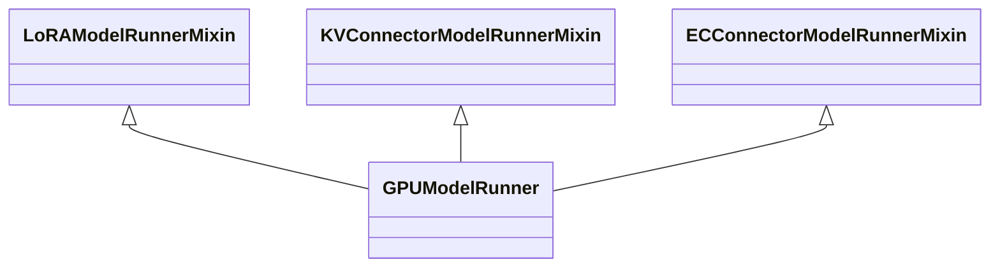
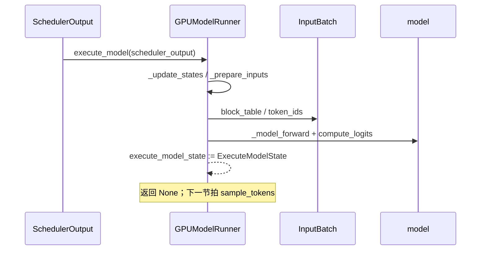

# `GPUModelRunner` (v1)

## Summary

[`GPUModelRunner`](d:\design\vllm\vllm\v1\worker\gpu_model_runner.py) 是 vLLM v1 GPU worker 上**单步 forward + 采样 +（可选）投机草稿**的编排中心：多重继承 [`LoRAModelRunnerMixin`](d:\design\vllm\vllm\v1\worker\lora_model_runner_mixin.py) / [`KVConnectorModelRunnerMixin`](d:\design\vllm\vllm\v1\worker\kv_connector_model_runner_mixin.py) / [`ECConnectorModelRunnerMixin`](d:\design\vllm\vllm\v1\worker\ec_connector_model_runner_mixin.py)，持有 `Sampler`、持久化 `InputBatch`、预分配 CUDA graph 用 token/position buffer，以及 `CudagraphDispatcher` 驱动的执行模式选择。主路径为 `execute_model` →（与 `sample_tokens` 配对的）`ExecuteModelState` 暂存 → `_sample` / `propose_draft_token_ids`。与新一代 **Model Runner V2**（`v1/worker/gpu/` 包）的关系见增量小节。

## Sources

- 主实现（整文件）：[`gpu_model_runner.py`](d:\design\vllm\vllm\v1\worker\gpu_model_runner.py)（8018 行）
- 输入批与块表：[`gpu_input_batch.py`](d:\design\vllm\vllm\v1\worker\gpu_input_batch.py)、[`block_table.py`](d:\design\vllm\vllm\v1\worker\block_table.py)
- Worker 侧内存画像与 warmup：`determine_available_memory` / `compile_or_warm_up_model` 在 [`gpu_worker.py`](d:\design\vllm\vllm\v1\worker\gpu_worker.py)（非本类方法，见 §3）
- 新版对照：[`v1/worker/gpu/model_runner.py`](d:\design\vllm\vllm\v1\worker\gpu\model_runner.py)（2020 行）、[`v1/worker/gpu/README.md`](d:\design\vllm\vllm\v1\worker\gpu\README.md)
- V2 切换判定：[d:\design\vllm\vllm\config\vllm.py:614-695](d:\design\vllm\vllm\config\vllm.py)

## 概览（10 节）

### 1. 类层次 + mixin

本文件除主类外还有：`AsyncGPUModelRunnerOutput`、`AsyncGPUPoolingModelRunnerOutput`、`ExecuteModelState`（[`gpu_model_runner.py:292-499`](d:\design\vllm\vllm\v1\worker\gpu_model_runner.py)）；主类定义在 [`gpu_model_runner.py:501`](d:\design\vllm\vllm\v1\worker\gpu_model_runner.py)。

### 2. 字段表（按功能分组）

| 分组 | 代表字段 | 锚点 |
|------|----------|------|
| 配置快照 | `vllm_config`、`model_config`、`cache_config`、`compilation_config`、`speculative_config` 等 | `__init__` 开头（[501+](d:\design\vllm\vllm\v1\worker\gpu_model_runner.py)） |
| KV | `kv_caches`、`kv_cache_config`、`attn_groups`、`shared_kv_cache_layers` | [614](d:\design\vllm\vllm\v1\worker\gpu_model_runner.py)、[7766-7905](d:\design\vllm\vllm\v1\worker\gpu_model_runner.py) |
| 输入批 | `input_batch: InputBatch`、`requests: dict[str, CachedRequestState]` | [727, 757](d:\design\vllm\vllm\v1\worker\gpu_model_runner.py) |
| 采样 | `sampler: Sampler`；投机时 `rejection_sampler: RejectionSampler` | [596, 707-708](d:\design\vllm\vllm\v1\worker\gpu_model_runner.py) |
| CUDA graph | `cudagraph_dispatcher`、`cudagraph_batch_sizes` | [917](d:\design\vllm\vllm\v1\worker\gpu_model_runner.py) |
| 投机解码 | `drafter`（多型）、`num_spec_tokens`、`use_async_spec_decode` | [635-704](d:\design\vllm\vllm\v1\worker\gpu_model_runner.py) |
| 多模态 / 池化 | `encoder_cache`、`mm_budget`；池化走 `_pool` | [623, 919](d:\design\vllm\vllm\v1\worker\gpu_model_runner.py) |
| 跨步暂存 | `execute_model_state: ExecuteModelState \| None`、`kv_connector_output` | [485-499, 996-997](d:\design\vllm\vllm\v1\worker\gpu_model_runner.py) |

### 3. `__init__` 与初始化顺序

构造阶段：缓存配置字段 → 投机分支构造 `drafter`/`rejection_sampler`（[635-708](d:\design\vllm\vllm\v1\worker\gpu_model_runner.py)）→ **尽早**构造 `InputBatch`（须在 `load_model` 之前，否则量化/卸载会失败，[757](d:\design\vllm\vllm\v1\worker\gpu_model_runner.py)）→ 预分配持久 buffer（`input_ids`、`positions`、各类 `CpuGpuBuffer`，[818-897](d:\design\vllm\vllm\v1\worker\gpu_model_runner.py)）→ `set_offloader(create_offloader(...))`。

**引擎级顺序**（本类只覆盖其中子集）：`GPUWorker` 先 `model_runner.load_model`，再 `determine_available_memory`（调用 `profile_run` 等），再 `initialize_kv_cache` → `compile_or_warm_up_model`（含 `capture_model`），见 [`gpu_worker.py:450-929`](d:\design\vllm\vllm\v1\worker\gpu_worker.py)。

### 4. `load_model` / 编译与 wrapper

`load_model(load_dummy_weights)`（[5419+](d:\design\vllm\vllm\v1\worker\gpu_model_runner.py)，本期签名新增 `load_dummy_weights`）：`get_model_loader` → `load_model`；可选 LoRA；存在 `drafter` 时 `drafter.load_model`；EPLB 与 `CUDAGraphWrapper` / `UBatchWrapper` 包装。

**`compile_or_warm_up_model` 不在本类**：由 `GPUWorker.compile_or_warm_up_model` 调用 `model_runner._dummy_run`、`kernel_warmup`、`model_runner.capture_model()`（[gpu_worker.py:694-929](d:\design\vllm\vllm\v1\worker\gpu_worker.py)）。

### 5. `determine_available_memory`（GPU profile）

**不在 `GPUModelRunner`**：显存画像与「KV 可用字节」计算在 `GPUWorker.determine_available_memory`（[gpu_worker.py:475-647](d:\design\vllm\vllm\v1\worker\gpu_worker.py)），内部调用 `self.model_runner.profile_run()`（本类 [6563+](d:\design\vllm\vllm\v1\worker\gpu_model_runner.py)）。

### 6. `initialize_kv_cache` / `get_kv_cache_spec`

- `get_kv_cache_spec`（[7906+](d:\design\vllm\vllm\v1\worker\gpu_model_runner.py)）：遍历 `AttentionLayerBase`，处理 `kv_sharing_target_layer_name` 记入 `shared_kv_cache_layers`，其余层 `get_kv_cache_spec` 填入 dict。
- `initialize_kv_cache`（[7766+](d:\design\vllm\vllm\v1\worker\gpu_model_runner.py)）：`deepcopy` 配置 → `initialize_attn_backend` → `may_reinitialize_input_batch`（[7380](d:\design\vllm\vllm\v1\worker\gpu_model_runner.py)）→ `initialize_kv_cache_tensors`（[7683](d:\design\vllm\vllm\v1\worker\gpu_model_runner.py)）→ `bind_kv_cache`；若启用 KV 传输则 `register_kv_caches` 等。

### 7. `_prepare_inputs`（scheduler_output → tensor）

`_prepare_inputs`（[2019+](d:\design\vllm\vllm\v1\worker\gpu_model_runner.py)）：`block_table.commit_block_table` → 计算 `req_indices`/`cu_num_tokens`/positions（[2043+](d:\design\vllm\vllm\v1\worker\gpu_model_runner.py)）→ `index_select` 填充 `input_ids`（及 prompt embeds 路径，[2083+](d:\design\vllm\vllm\v1\worker\gpu_model_runner.py)）→ `query_start_loc`、`seq_lens`、`num_computed_tokens` 等与投机/异步相关的 GPU 修正 → `_prepare_input_ids` → 返回 `logits_indices` 与可选 `spec_decode_metadata`。

### 8. `execute_model` 主流程

`execute_model`（[4294+](d:\design\vllm\vllm\v1\worker\gpu_model_runner.py)）要点：校验 `execute_model_state` 为空；`synchronize_input_prep` 包裹下 `_update_states`（[1246-1621](d:\design\vllm\vllm\v1\worker\gpu_model_runner.py)）→ `_prepare_inputs` → `_determine_batch_execution_and_padding`（[4060](d:\design\vllm\vllm\v1\worker\gpu_model_runner.py)）→ slot mapping + `_build_attention_metadata`（[2355](d:\design\vllm\vllm\v1\worker\gpu_model_runner.py)）→ `_preprocess`（[3618](d:\design\vllm\vllm\v1\worker\gpu_model_runner.py)）→ `set_forward_context` + `maybe_get_kv_connector_output` 内 `_model_forward`（[3962](d:\design\vllm\vllm\v1\worker\gpu_model_runner.py)）→ 末段 `compute_logits` 或池化/PP 分支 → 填充 `ExecuteModelState` 并 **`return None`**（与 `sample_tokens` [4673+](d:\design\vllm\vllm\v1\worker\gpu_model_runner.py) 拆分）。

### 9. CUDA graph capture / replay

- **捕获入口**：`capture_model`（[6954+](d:\design\vllm\vllm\v1\worker\gpu_model_runner.py)）：`set_cudagraph_capturing_enabled(True)` + `graph_capture` 上下文中按 `cudagraph_dispatcher.get_capture_descs()` 调用 `_capture_cudagraphs`，最后 `lock_workspace()`。
- **dummy 形状**：`_dummy_run`（[5945+](d:\design\vllm\vllm\v1\worker\gpu_model_runner.py)）用于 warmup/capture；运行时模式由 `_determine_batch_execution_and_padding`（[4060+](d:\design\vllm\vllm\v1\worker\gpu_model_runner.py)）+ `set_forward_context(..., cudagraph_runtime_mode=...)` 选择。

### 10. spec decode 集成（入口级）

- **构造期**：按 `speculative_config` 选择 `NgramProposer` / `DraftModelProposer` / `NgramProposerGPU` / `DFlashProposer` / `SuffixDecodingProposer` / `EagleProposer` / `MedusaProposer` / `ExtractHiddenStatesProposer` 之一；本期新增 `create_custom_proposer`（自定义 proposer 注册）、`Gemma4Proposer`、`Step3p5MTPProposer`（[635-704](d:\design\vllm\vllm\v1\worker\gpu_model_runner.py)）。
- **采样后**：`sample_tokens` 内根据条件立即或延后调用嵌套的 `propose_draft_token_ids`（[4731](d:\design\vllm\vllm\v1\worker\gpu_model_runner.py)，最终进方法级 `propose_draft_token_ids` [5126+](d:\design\vllm\vllm\v1\worker\gpu_model_runner.py)）。

各 proposer 内部算法、与 `SpecDecodeMetadata` 字段语义见 [vllm/topics/spec-decode-eagle.md](../topics/spec-decode-eagle.md)，本页不展开。

## `InputBatch` 数据结构与状态机

`InputBatch`（[gpu_input_batch.py](d:\design\vllm\vllm\v1\worker\gpu_input_batch.py)）：每请求 `token_ids_cpu`/`num_computed_tokens_cpu`/`MultiGroupBlockTable`、采样参数 GPU 镜像、`sampling_metadata`、投机相关缓冲等。与 `GPUModelRunner` 的契约：`__init__` 创建 [757](d:\design\vllm\vllm\v1\worker\gpu_model_runner.py)；`_update_states` 调用 `add_request`/`remove_request`/`condense`/`refresh_metadata` [1246-1621](d:\design\vllm\vllm\v1\worker\gpu_model_runner.py)；`_prepare_inputs` 读 `token_ids_cpu` 与 block table；`sample_tokens` 写回 `token_ids_cpu` 与 `prev_sampled_token_ids`。

块级布局见 [`block_table.py`](d:\design\vllm\vllm\v1\worker\block_table.py)（`MultiGroupBlockTable` 由 `InputBatch` 持有）。

## hidden state（§9）

| 类别 | 内容 | 锚点 |
|------|------|------|
| CUDA Stream | `async_output_copy_stream`（[789-794](d:\design\vllm\vllm\v1\worker\gpu_model_runner.py)）；投机 D2H：`draft_token_ids_copy_stream`（[967-974](d:\design\vllm\vllm\v1\worker\gpu_model_runner.py)）等 | — |
| CUDA Event | `prepare_inputs_event`（[792-797](d:\design\vllm\vllm\v1\worker\gpu_model_runner.py)）、`transfer_event`（[952](d:\design\vllm\vllm\v1\worker\gpu_model_runner.py)）、draft/accepted-token 相关 events | — |
| 线程 | `threading.Lock`：`_encoder_timing_lock` 保护 `encoder_timing_registry` | [815](d:\design\vllm\vllm\v1\worker\gpu_model_runner.py) |
| asyncio | 本文件**无** `asyncio` 引用（与 `execute_model`/`sample_tokens` 同步 API 一致） | — |
| 缓冲 / 缓存 | `input_ids`、`positions`、`kv_caches`、`encoder_cache`、`arange_np`、`execute_model_state` | [818-897](d:\design\vllm\vllm\v1\worker\gpu_model_runner.py)、[614-623](d:\design\vllm\vllm\v1\worker\gpu_model_runner.py)、[996-997](d:\design\vllm\vllm\v1\worker\gpu_model_runner.py) |
| 后台循环 | `load_model` 在 MoE+EPLB 异步模式下可 `eplb_state.start_async_loop()`（非通用路径） | — |
| weakref | 本文件**无** `weakref` 标识符（2026-04-18 结论，本期未重扫） | — |

## 与新版 ModelRunner v2（`v1/worker/gpu/model_runner.py`）的对比

`GPUWorker` 通过 `use_v2_model_runner` 在 **v1 `gpu_model_runner.GPUModelRunner`** 与 **v2 `gpu.model_runner.GPUModelRunner`** 间二选一（[gpu_worker.py:423-438](d:\design\vllm\vllm\v1\worker\gpu_worker.py)）。v2 目录说明见 [`gpu/README.md`](d:\design\vllm\vllm\v1\worker\gpu\README.md)。切换判定已从纯 env flag 演进为自动判定，见增量小节。

| 维度 | v1 `gpu_model_runner.GPUModelRunner` | v2 `gpu/model_runner.GPUModelRunner` |
|------|--------------------------------------|--------------------------------------|
| 体量 | 单文件 ~8k 行，全能编排 | 主文件 2020 行 + 26 个兄弟模块；注释要求「极简、通用」，[1-18](d:\design\vllm\vllm\v1\worker\gpu\model_runner.py) |
| 投机入口 | `__init__` 巨型 `if/elif` 选 `drafter` [635-704](d:\design\vllm\vllm\v1\worker\gpu_model_runner.py) | `init_speculator()`（[gpu/spec_decode/__init__.py:8](d:\design\vllm\vllm\v1\worker\gpu\spec_decode\__init__.py)），仅末 PP rank 构造 [243-248](d:\design\vllm\vllm\v1\worker\gpu\model_runner.py) |
| Input 状态 | `gpu_input_batch.InputBatch` | `gpu.input_batch.InputBuffers` + `gpu.states.RequestState` [281-291](d:\design\vllm\vllm\v1\worker\gpu\model_runner.py) |
| KV / Attention | 本类内 `initialize_attn_backend`、`_build_attention_metadata` 等 | `gpu.attn_utils.init_attn_backend` / `init_kv_cache` 等 import [82-87](d:\design\vllm\vllm\v1\worker\gpu\model_runner.py) |
| CUDA graph | `CudagraphDispatcher` + 本文件 `_dummy_run`/`capture_model` | `gpu.cudagraph_utils.ModelCudaGraphManager` [94-97](d:\design\vllm\vllm\v1\worker\gpu\model_runner.py) |
| RejectionSampler | `v1.sample.rejection_sampler`（旧） | `gpu.spec_decode.rejection_sampler` [140-145](d:\design\vllm\vllm\v1\worker\gpu\model_runner.py) |
| 继承 | 三 mixin 多重继承 | 仅 `LoRAModelRunnerMixin` [159](d:\design\vllm\vllm\v1\worker\gpu\model_runner.py)；KV/EC connector 走 `gpu.kv_connector` / `gpu.ec_connector` 组合 [112-116, 99](d:\design\vllm\vllm\v1\worker\gpu\model_runner.py) |
| 文档 | 分散在 `docs/design/cuda_graphs.md` 等 | `README.md` 标注 experimental [1-4](d:\design\vllm\vllm\v1\worker\gpu\README.md) |

**谁调谁**：工厂与 worker 选择逻辑在 [`gpu_worker.py:423-438`](d:\design\vllm\vllm\v1\worker\gpu_worker.py)；投机子系统细节见 [spec-decode-eagle.md](../topics/spec-decode-eagle.md)。

## §5 step 3 hidden cross-reference grep 结果

在 `d:\design\vllm` 仓库内检索（2026-04-18；本期未重跑统计，见 VERIFY），标识符 **`GPUModelRunner`**：

| # | 类别 | 结果 |
|---|------|------|
| 1 | 跨语言（`d:\design\vllm\csrc\` C++/CUDA 树） | `GPUModelRunner`：**0** 命中 |
| 2 | 协作伙伴（子目录 `*.py`） | `vllm\v1\worker\`：**22** 行级命中（分布在 `gpu_model_runner.py`、`gpu_worker.py`、`cpu_model_runner.py`、`xpu_model_runner.py`、`gpu/warmup.py`、`gpu/model_runner.py`、`gpu/kv_connector.py`、`workspace.py`、`lora_model_runner_mixin.py` 等）；`vllm\v1\attention\`：**0**；`vllm\v1\spec_decode\`：**0**；`vllm\v1\kv_offload\`：**0**；`tests\`：**61** 行级命中（**9** 个测试文件）；`benchmarks\`：**2** 命中（**1** 文件）。2026-08-18 抽查新增引用方：`sentinel/gpu_worker_sentinel.py`、`cpu/model_runner.py`、`model_executor/warmup/flashinfer_sparse_mla_warmup.py`（导入的是 **V2** `gpu.model_runner.GPUModelRunner`） |
| 3 | 配置 / IPC 共享类型 | `SchedulerOutput`：全树 `*.py` **≥70 文件**含该标识符（含 scheduler、executor、kv_connector、tests 等）；`ModelRunnerOutput`：**≥30 文件**；`ExecuteModelData`：**0** 命中（该名在当前树中不存在）；`SamplingMetadata` / `SpecDecodeMetadata`：多文件 |
| 4 | 测试 | 直接 `from ...gpu_model_runner import GPUModelRunner` 或方法级测试：[`tests/v1/worker/test_gpu_model_runner.py`](d:\design\vllm\tests\v1\worker\test_gpu_model_runner.py) 等（**v2** 相关文件名含 `test_gpu_model_runner_v2_*` 导入的是 **`gpu.model_runner.GPUModelRunner`**，勿混淆） |
| 5 | doc / config | `docs\`：**4** 行级命中，**3** 文件（[`docs/design/dbo.md`](d:\design\vllm\docs\design\dbo.md)、[`docs/design/cuda_graphs.md`](d:\design\vllm\docs\design\cuda_graphs.md)、[`docs/design/logits_processors.md`](d:\design\vllm\docs\design\logits_processors.md)）；`*.yaml`/`*.json`：**0** 命中 |

## Increment 2026-08-18 (vLLM 5f7fab88 → d29dc3ab)

本期 `gpu_model_runner.py` 6980 → 8018 行（129 个 commit，+1753/-715 量级为该文件净 diff 的一部分，全量 diff +2468 行级变更）；`v1/worker/gpu/` 包 223 个 commit、+12879/-2954。主锚点已重排；细粒度区间未逐一复核（见 VERIFY）。

### 1. 澄清：`worker/gpu/` 包**不是**本期新增

V2 包由 commit `30b44a1598` "GPU Model Runner V2 (#25266)"（2025-11-21）引入，**早于旧 pin 5f7fab88（2026-04-16）**——旧 pin worktree（/tmp/vllm-pin）中该包已有 24 个顶层条目、`model_runner.py` 1337 行，本页 2026-04-18 版对比表也已覆盖。本期是该包的**持续扩张**（24 → 27 个顶层条目，`model_runner.py` 1337 → 2020 行），不是"新出现一套架构"。

### 2. V1/V2 切换机制变更（本期核心结构性变化）

- 旧 pin：env `VLLM_USE_V2_MODEL_RUNNER` 默认 `0`，`gpu_worker.py` 直接读 env，V2 纯 opt-in。
- 现在：env 默认改为 `None`（[d:\design\vllm\vllm\envs.py:L294](d:\design\vllm\vllm\envs.py)、[L2030-2031](d:\design\vllm\vllm\envs.py)），判定收敛到 `VllmConfig.use_v2_model_runner` property（[d:\design\vllm\vllm\config\vllm.py:L614-660](d:\design\vllm\vllm\config\vllm.py)）：
  1. env 显式设置（0/1）时最高优先；
  2. **强制 V2** 的场景：PCP（prefill context parallel）>1（[L620-622](d:\design\vllm\vllm\config\vllm.py)）、投机方法 `dspark`（[L624-632](d:\design\vllm\vllm\config\vllm.py)）、DFlash draft 混合 sliding/full attention 需多 KV group（[L634-637](d:\design\vllm\vllm\config\vllm.py)）、diffusion 模型（[L639-640](d:\design\vllm\vllm\config\vllm.py)）；
  3. 否则查**默认 V2 架构白名单** `default_v2_model_runner_architectures()`（[d:\design\vllm\vllm\config\vllm.py:L84](d:\design\vllm\vllm\config\vllm.py)、`_is_default_v2_model_runner_model` [L674-695](d:\design\vllm\vllm\config\vllm.py)，仅 `runner_type == "generate"`）；
  4. 需要 Triton（[L645-649](d:\design\vllm\vllm\config\vllm.py)），且 `_get_v2_model_runner_unsupported_features`（[L2352](d:\design\vllm\vllm\config\vllm.py)）非空时回落 V1 并 warn；强制 V2 场景下不支持则由 `_validate_v2_model_runner`（[L2458](d:\design\vllm\vllm\config\vllm.py)）直接 raise。
- worker 侧从"读 env"改为读 `vllm_config.use_v2_model_runner`（[d:\design\vllm\vllm\v1\worker\gpu_worker.py:L185](d:\design\vllm\vllm\v1\worker\gpu_worker.py)，构造分支 [L423-438](d:\design\vllm\vllm\v1\worker\gpu_worker.py)）。`use_v2_model_runner` 现被 scheduler / async_scheduler / input_processor / flashinfer / kv-offload 等 **十余处**读取用于行为分叉（如 [d:\design\vllm\vllm\v1\core\sched\scheduler.py:L299](d:\design\vllm\vllm\v1\core\sched\scheduler.py)）。
- `synthesis:` V2 定位已从"实验性 opt-in"升级为"受支持架构上的默认 runner"；V1 仍是非白名单架构 / 缺 Triton / 含不支持特性配置的 fallback，且两者将长期共存（`gpu_worker.py` 同时保留两条构造路径，部分特性注明 "currently only supported by V1"，如 PP+SP [d:\design\vllm\vllm\v1\worker\gpu_worker.py:L1069-1075](d:\design\vllm\vllm\v1\worker\gpu_worker.py)；反向亦有 "V2 only" 特性如 DSpark、PCP）。

### 3. `worker/gpu/`（Model Runner V2）本期目录扩张

本期新增顶层文件：`ec_connector.py`（E/P/D 分离支持，commit `4f819f801b` 2026-08-04）、`pcp_manager.py`（MLA 虚拟批 PCP，commit `b6ff8a2f50` 2026-07-19）、`shutdown.py` + `shutdown()` 方法（commit `e6ff3e9c83`，V2 主类 [d:\design\vllm\vllm\v1\worker\gpu\model_runner.py:L1920](d:\design\vllm\vllm\v1\worker\gpu\model_runner.py)）。既有子包大幅扩张：

- `spec_decode/` 子包化：新增 `speculator.py`（369 行统一 `Speculator` 抽象）+ 按方法分目录 `autoregressive/` `dflash/` `dspark/` `eagle/` `gemma4/` `mtp/` `multi_module_mtp/`，`rejection_sampler_utils.py` 新增 1188 行；`adaptive_verification.py`（自适应验证）。
- `model_states/`：`default/encoder_decoder/encoder_only/mamba_hybrid/mm_pruning/prompt_embeds/recoverssm` 等模型态抽象（qwen35 / mamba hybrid 支持，commit `7a08b34fbf`）。
- `sample/`：`prompt_logprob.py`（多 prompt logprobs，commits `66cc3fa559` / `51295793a2`）、`gumbel/penalties/thinking_budget` 等。
- 功能面：DeepSeek V4（`4d51588e23`）、EPLB（`eplb_utils.EPLBController`）、pooling（`pool/pooling_runner.py`，不支持时提示 `VLLM_USE_V2_MODEL_RUNNER=0`）。

### 4. V1 本文件（`gpu_model_runner.py`）本期主要内部变化

- 新 proposer 接入：`create_custom_proposer` 注册机制、`Gemma4Proposer`、`Step3p5MTPProposer`（[d:\design\vllm\vllm\v1\worker\gpu_model_runner.py:L635-704](d:\design\vllm\vllm\v1\worker\gpu_model_runner.py)）。
- 性能：多轮 "Avoid GPU<->CPU syncs" 系列（如 commits `f97e502969`、`9b0afeb4f6`、`fe85a92e86`）；NaN-in-logits 异步检测（`12292d94b2` / `b1e12d142d`）。
- KV-Cache Layout Refactor 系列（`57bd0ed441`、`6700813f86`）：backend 发布 KV packing、Mamba cache 标准化。
- `load_model` 签名新增 `load_dummy_weights`（配合 draft 权重运行时更新，commit `fc1c548093`）；MoE legacy 代码移除（`373fe8b83e`）。

### 5. 是否为 V2 单独建页

`synthesis:` 需要——V2 已是 27 个顶层条目、约 1.2 万行、默认启用于白名单架构的独立子系统，且有独立叙事（`Speculator` 抽象、`model_states` 模型态、`InputBuffers`/`RequestState` 输入模型、独立 rejection sampler），本页对比表已承载不下；建议未来以 `vllm/modules/worker_gpu_v2.md`（模块页）+ 必要 entity 页形式 ingest，本次按任务约定**不建**。

## Notes / Caveats

> ~~[!warning] CONTRADICTION: **`determine_available_memory` / `compile_or_warm_up_model`** 属 `GPUWorker` / `WorkerBase` 协议，**不**属本类方法；早期 wiki 容易误标。~~
>
> **RESOLVED 2026-04-18**：源码确认无歧义——`GPUWorker.determine_available_memory`（内调 `self.model_runner.profile_run()`）与 `GPUWorker.compile_or_warm_up_model`（内调 `_dummy_run` / `kernel_warmup` / `capture_model()`）定义在 gpu_worker.py。`GPUModelRunner` 仅提供 `profile_run` / `capture_model` / `load_model` 等被 Worker 调用的能力。2026-08-18 复核仍成立（现行锚点：[gpu_worker.py:475-647, 694-929](d:\design\vllm\vllm\v1\worker\gpu_worker.py)）。

> ~~[!todo] VERIFY: **Prefix cache / BlockHash**：需 verify `new_block_ids_to_zero` 的生成时机与 KVCacheManager 的 `cache_blocks` 一致性。~~
>
> **RESOLVED 2026-04-18**：`new_block_ids_to_zero` 由 scheduler 在构造 `SchedulerOutput` 末尾抽取（`kv_cache_manager.take_new_block_ids()`）；`SingleTypeKVCacheManager` 在 `allocate_new_blocks` 路径累积 `new_block_ids`。`synthesis:` `take_new_block_ids` 与 `cache_blocks` 职责正交：前者是"物理新块 GPU 清零 bookkeeping"，后者是"prefix 侧块入池/哈希"。runner 侧 `_zero_block_ids` 仅消费前者（2026-08-18 复核：runner 侧消费点现于 [gpu_model_runner.py:1208, 1275-1276](d:\design\vllm\vllm\v1\worker\gpu_model_runner.py)，本 RESOLVED 块内其余行号为 2026-04-18 pin 快照）。

> ~~[!todo] VERIFY: **KV connector**：mixin 与 `execute_model` 中 `maybe_get_kv_connector_output` / `kv_connector_no_forward` 等见 [kv-connector.md](../topics/kv-connector.md)。~~
>
> **RESOLVED 2026-04-18**：三段调用顺序（`handle_preemptions` → 空 batch 早退 `kv_connector_no_forward` → `set_forward_context` + `maybe_get_kv_connector_output` 包裹 `_model_forward`）与 [kv-connector.md](../topics/kv-connector.md) 叙述一致，无矛盾。（块内行号为 2026-04-18 pin 快照，本期未逐点重排。）

> [!todo] VERIFY: 本页 2026-08-18 增量只重排了**方法/类定义起始行**级锚点（经 HEAD d29dc3ab grep 核实）与增量小节新锚点；以下范围未逐行复核：各小节的**区间终点**（如 `_prepare_inputs` / `execute_model` / `propose_draft_token_ids` 的结束行）、§hidden state 表中投机 D2H event 的完整清单、§hidden cross-reference 的全仓 grep 命中统计（沿用 2026-04-18 数据）、以及 RESOLVED 块内的 pin 快照行号。故本页标 `status: stale`，下轮 verify pass 应补齐。

## See also

- [vllm/entities/GPUWorker.md](GPUWorker.md)
- [vllm/entities/Scheduler.md](Scheduler.md)
- [vllm/entities/KVCacheManager.md](KVCacheManager.md)
- [vllm/topics/spec-decode-eagle.md](../topics/spec-decode-eagle.md)
- [vllm/topics/prefix-cache.md](../topics/prefix-cache.md)
- [vllm/topics/kv-connector.md](../topics/kv-connector.md)
- [d:\design\vllm\docs\design\cuda_graphs.md](d:\design\vllm\docs\design\cuda_graphs.md)
- [d:\design\vllm\vllm\v1\worker\gpu\README.md](d:\design\vllm\vllm\v1\worker\gpu\README.md)
