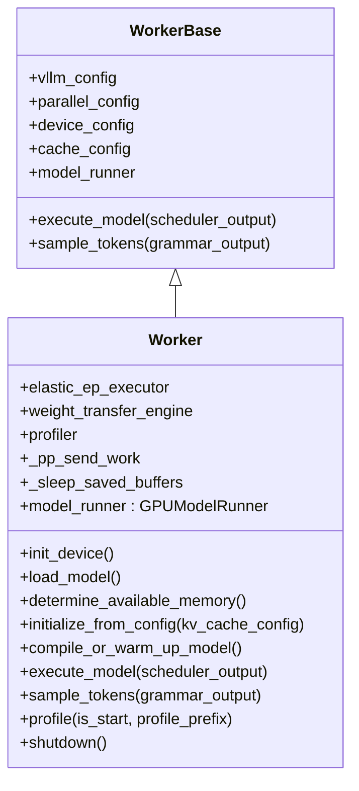

# `Worker` (v1 GPU worker)

## Summary
[`Worker`](d:\design\vllm\vllm\v1\worker\gpu_worker.py) 继承 [`WorkerBase`](d:\design\vllm\vllm\v1\worker\worker_base.py)，在单进程内持有 [`GPUModelRunner`](d:\design\vllm\vllm\v1\worker\gpu_model_runner.py)（V1/V2 由环境变量切换），负责 CUDA 设备与 `init_worker_distributed_environment`、KV 显存剖析、KV 分配与 warmup/CUDAGraph 捕获，并把调度器下发的 [`SchedulerOutput`](d:\design\vllm\vllm\v1\core\sched\output.py) 交给 `GPUModelRunner.execute_model` / `sample_tokens`。多进程场景下 **不**直接操作 [`MessageQueue`](d:\design\vllm\vllm\distributed\device_communicators\shm_broadcast.py)；IPC 由 [`MultiprocExecutor`](d:\design\vllm\vllm\v1\executor\multiproc_executor.py) 侧的 `WorkerProc` 在 busy loop 中 `dequeue` 后 `getattr(self.worker, method)` 调用（见 [multiproc_executor.py:953-979](d:\design\vllm\vllm\v1\executor\multiproc_executor.py)）。

## Sources
- 全文：[d:\design\vllm\vllm\v1\worker\gpu_worker.py](d:\design\vllm\vllm\v1\worker\gpu_worker.py)
- 基类：[d:\design\vllm\vllm\v1\worker\worker_base.py](d:\design\vllm\vllm\v1\worker\worker_base.py)
- `GPUModelRunner` 关键 API：[d:\design\vllm\vllm\v1\worker\gpu_model_runner.py](d:\design\vllm\vllm\v1\worker\gpu_model_runner.py) — `execute_model` [3761-3766](d:\design\vllm\vllm\v1\worker\gpu_model_runner.py)、`sample_tokens` [4114-4117](d:\design\vllm\vllm\v1\worker\gpu_model_runner.py)、`initialize_kv_cache` [6724-6728](d:\design\vllm\vllm\v1\worker\gpu_model_runner.py)、`get_kv_cache_spec` [6859-6866](d:\design\vllm\vllm\v1\worker\gpu_model_runner.py)
- Executor RPC 抽象：[d:\design\vllm\vllm\v1\executor\abstract.py](d:\design\vllm\vllm\v1\executor\abstract.py)
- 多进程 worker 进程与 busy loop：[d:\design\vllm\vllm\v1\executor\multiproc_executor.py](d:\design\vllm\vllm\v1\executor\multiproc_executor.py)

## 类层次（mermaid classDiagram）



| 字段 / 组件 | 说明 | 锚点 |
|-------------|------|------|
| `elastic_ep_executor` | `ElasticEPScalingExecutor`，`elastic_ep_execute` 委托入口 | [gpu_worker.py:126-128, 1016-1017](d:\design\vllm\vllm\v1\worker\gpu_worker.py) |
| `weight_transfer_engine` | 在线权重更新引擎，可为 `None` | [gpu_worker.py:133-141](d:\design\vllm\vllm\v1\worker\gpu_worker.py) |
| `profiler` | `TorchProfilerWrapper` / `CudaProfilerWrapper`，惰性创建 | [gpu_worker.py:143-151, 844-895](d:\design\vllm\vllm\v1\worker\gpu_worker.py) |
| `_pp_send_work` | PP 非最后 stage 时 `isend_tensor_dict` 返回的 `Handle` 列表，下一轮 `execute_model` 开头 `wait` | [gpu_worker.py:154-155, 754-758, 832-837](d:\design\vllm\vllm\v1\worker\gpu_worker.py) |
| `model_runner` | V1 [`GPUModelRunner`](d:\design\vllm\vllm\v1\worker\gpu_model_runner.py) 或 V2 [`gpu/model_runner.GPUModelRunner`](d:\design\vllm\vllm\v1\worker\gpu\model_runner.py)，由 `VLLM_USE_V2_MODEL_RUNNER` 决定 | [gpu_worker.py:153-154, 295-310](d:\design\vllm\vllm\v1\worker\gpu_worker.py) |

## __init__ 与设备初始化

- **基类状态**：`WorkerBase.__init__` 保存 `vllm_config` 及子配置引用，设置 `rank` / `local_rank` / `distributed_init_method`，`model_runner` 与 `device` 初值为 `None`（[worker_base.py:63-88](d:\design\vllm\vllm\v1\worker\worker_base.py)）。
- **精度与弹性 EP**：`torch.set_float32_matmul_precision`（[gpu_worker.py:122-128](d:\design\vllm\vllm\v1\worker\gpu_worker.py)）；构造 `ElasticEPScalingExecutor(self)`（[gpu_worker.py:126-128](d:\design\vllm\vllm\v1\worker\gpu_worker.py)）。
- **sleep 缓冲、权重传输、profiler 配置**：`_sleep_saved_buffers`（[gpu_worker.py:130-131](d:\design\vllm\vllm\v1\worker\gpu_worker.py)）；`WeightTransferEngineFactory`（[gpu_worker.py:133-141](d:\design\vllm\vllm\v1\worker\gpu_worker.py)）；`profiler` 占位与配置校验（[gpu_worker.py:143-151](d:\design\vllm\vllm\v1\worker\gpu_worker.py)）。
- **`init_device`（CUDA）**：清理 `NCCL_ASYNC_ERROR_HANDLING`（[gpu_worker.py:220-222](d:\design\vllm\vllm\v1\worker\gpu_worker.py)）；在单节点非 Ray 等条件下按 DP 调整 `local_rank`（[gpu_worker.py:223-252](d:\design\vllm\vllm\v1\worker\gpu_worker.py)）；`torch.device` 与 `set_device_index`（[gpu_worker.py:254-255](d:\design\vllm\vllm\v1\worker\gpu_worker.py)）；调用 `init_worker_distributed_environment`（内部再调 `init_distributed_environment`、`ensure_model_parallel_initialized`、`ensure_ec_transfer_initialized` 等）（[gpu_worker.py:257-269, 1020-1060](d:\design\vllm\vllm\v1\worker\gpu_worker.py)）；`set_random_seed`、`MemorySnapshot` 与 `request_memory`（[gpu_worker.py:274-287](d:\design\vllm\vllm\v1\worker\gpu_worker.py)）；`init_workspace_manager`（[gpu_worker.py:291-293](d:\design\vllm\vllm\v1\worker\gpu_worker.py)）；构造 `GPUModelRunner`（[gpu_worker.py:295-310](d:\design\vllm\vllm\v1\worker\gpu_worker.py)）；rank 0 时 `report_usage_stats`（[gpu_worker.py:312-314](d:\design\vllm\vllm\v1\worker\gpu_worker.py)）。

## execute_model 主流程

```mermaid
sequenceDiagram
    participant EC as EngineCore / Scheduler
    participant EX as MultiprocExecutor
    participant MQ as rpc_broadcast_mq
    participant WP as WorkerProc.worker_busy_loop
    participant WW as WorkerWrapperBase
    participant W as Worker
    participant MR as GPUModelRunner

    EC->>EX: execute_model(scheduler_output)
    EX->>MQ: enqueue execute_model
    MQ->>WP: dequeue
    WP->>WW: execute_model(scheduler_output)
    Note over WW: _apply_mm_cache 后转发
    WW->>W: execute_model(scheduler_output)
    W->>W: wait _pp_send_work; PP irecv
    W->>MR: execute_model(scheduler_output, intermediate_tensors)
    MR-->>W: ModelRunnerOutput | IntermediateTensors | None
    alt PP 非末段
        W->>W: isend_tensor_dict; return None
    else 末段或单卡
        W-->>WW: ModelRunnerOutput | AsyncModelRunnerOutput | None
    end
    WP->>EX: handle_output via response_mq
```

- **PP 与异步中间张量**：先 `wait` 上一轮 `_pp_send_work`（[gpu_worker.py:754-758](d:\design\vllm\vllm\v1\worker\gpu_worker.py)）；非首 PP rank 时 `irecv_tensor_dict` 包进 `AsyncIntermediateTensors`（[gpu_worker.py:796-808](d:\design\vllm\vllm\v1\worker\gpu_worker.py)）；`model_runner.execute_model`（[gpu_worker.py:810-813](d:\design\vllm\vllm\v1\worker\gpu_worker.py)）；若返回 `IntermediateTensors` 则非末段 PP `isend_tensor_dict` 并 `return None`（[gpu_worker.py:825-839](d:\design\vllm\vllm\v1\worker\gpu_worker.py)）。
- **Profiling 注解**：`annotate_profile` 包装迭代（[gpu_worker.py:718-742, 810-811](d:\design\vllm\vllm\v1\worker\gpu_worker.py)）。
- **返回**：与 `WorkerBase.execute_model` 约定一致，可为 `ModelRunnerOutput` / `AsyncModelRunnerOutput` / `None`（[worker_base.py:134-143](d:\design\vllm\vllm\v1\worker\worker_base.py)）；Executor 侧通过 `MultiprocExecutor.execute_model` 的 `unique_reply_rank` 只收输出 rank（[multiproc_executor.py:315-325](d:\design\vllm\vllm\v1\executor\multiproc_executor.py)）。

## KV cache 初始化与 profile

| 阶段 | 行为 | 锚点 |
|------|------|------|
| 可用显存 | `determine_available_memory`：`kv_cache_memory_bytes` 短路仍 `profile_run`；否则 `memory_profiling` + `profile_run` + 可选 CUDAGraph 显存估计 | [gpu_worker.py:331-482](d:\design\vllm\vllm\v1\worker\gpu_worker.py) |
| KV 规格 | `get_kv_cache_spec` 委托 `model_runner` | [gpu_worker.py:499-500](d:\design\vllm\vllm\v1\worker\gpu_worker.py) |
| 分配 | `initialize_from_config`：更新 `cache_config.num_gpu_blocks`、`ensure_kv_transfer_initialized`、`model_runner.initialize_kv_cache`、可选 routed experts、KV zero meta | [gpu_worker.py:514-547](d:\design\vllm\vllm\v1\worker\gpu_worker.py) |
| Warmup / 编译 | `compile_or_warm_up_model`：`CompilationMode.VLLM_COMPILE` 下 dummy run、`kernel_warmup`、`capture_model`、V2 `warmup_kernels` 或 V1 sampler/pooler dummy | [gpu_worker.py:549-695](d:\design\vllm\vllm\v1\worker\gpu_worker.py) |

Executor 在 `initialize_from_config` 中先 RPC `initialize_from_config` 再 RPC `compile_or_warm_up_model`（[abstract.py:118-137](d:\design\vllm\vllm\v1\executor\abstract.py)）。

## hidden state（§9）

| 类别 | 列表 | 行号（锚点） |
|------|------|----------------|
| CUDA Stream / Event | `Worker` 类体内 **无** 直接 `torch.cuda.Stream` / `Event`；异步 copy 流在 `GPUModelRunner` 的 `AsyncGPUModelRunnerOutput`（[gpu_model_runner.py:234-241](d:\design\vllm\vllm\v1\worker\gpu_model_runner.py)） | `gpu_worker.py` 内 grep `Stream`/`Event`：**0** |
| 后台线程 | **无**；多进程下异步输出线程在 `WorkerProc.__init__`（`async_output_copy_thread`）（[multiproc_executor.py:632-639](d:\design\vllm\vllm\v1\executor\multiproc_executor.py)），非 `Worker` 类 | — |
| 跨进程 IPC | `Worker` **不**持有 `MessageQueue`；子进程内为 `WorkerProc` 的 `rpc_broadcast_mq` / `worker_response_mq`（见 [MultiprocExecutor.md](MultiprocExecutor.md)） | [multiproc_executor.py:953-963](d:\design\vllm\vllm\v1\executor\multiproc_executor.py) |
| Profiler 对象 | `self.profiler`：`TorchProfilerWrapper` / `CudaProfilerWrapper` | [gpu_worker.py:146-151, 867-895, 1008-1011](d:\design\vllm\vllm\v1\worker\gpu_worker.py) |
| 分布式异步句柄 | `_pp_send_work: list[Handle]`（PP send） | [gpu_worker.py:154-155, 832-837](d:\design\vllm\vllm\v1\worker\gpu_worker.py) |
| Sleep 模式缓冲 | `_sleep_saved_buffers` | [gpu_worker.py:130-131, 163-193](d:\design\vllm\vllm\v1\worker\gpu_worker.py) |

## 与 MultiprocExecutor 的协议方法清单

`synthesis:` 下列字符串方法由 `Executor` / `MultiprocExecutor` 通过 `collective_rpc` 调度到 **worker 包装器**（`WorkerWrapperBase`），再落到 `Worker` 或其基类；`WorkerProc.worker_busy_loop` 用 `getattr(self.worker, method)` 解析字符串（[multiproc_executor.py:953-979](d:\design\vllm\vllm\v1\executor\multiproc_executor.py)）。

**`Executor` 抽象层常用 RPC（方法名字符串）**（[abstract.py:118-347](d:\design\vllm\vllm\v1\executor\abstract.py)）：`initialize_from_config`、`compile_or_warm_up_model`、`determine_available_memory`、`get_kv_cache_spec`、`get_kv_connector_handshake_metadata`、`execute_model`、`sample_tokens`、`execute_dummy_batch`、`take_draft_token_ids`、`profile`、`shutdown`、`get_supported_tasks`、`add_lora`、`remove_lora`、`pin_lora`、`list_loras`、`reset_mm_cache`、`reset_encoder_cache`、`sleep`、`wake_up`、`save_sharded_state`。

**`MultiprocExecutor` 显式覆盖**（[multiproc_executor.py:315-346, 480](d:\design\vllm\vllm\v1\executor\multiproc_executor.py)）：`execute_model`、`sample_tokens`、`execute_dummy_batch`、`take_draft_token_ids`、`check_health`。

**其它入口（经 `EngineCore` / `LLMEngine` / 工具链 RPC 到同一 worker）**：`update_max_model_len`（[core.py:269](d:\design\vllm\vllm\v1\engine\core.py)）；`apply_model`（[llm_engine.py:419](d:\design\vllm\vllm\v1\engine\llm_engine.py)）；`get_model_inspection`（[llm.py:1836](d:\design\vllm\vllm\entrypoints\llm.py)）；`get_encoder_timing_stats`（[benchmarks/mm_processor.py:81](d:\design\vllm\vllm\benchmarks\mm_processor.py)）；`init_weight_transfer_engine` / `update_weights`（[async_llm.py:1045-1065](d:\design\vllm\vllm\v1\engine\async_llm.py)）；`elastic_ep_execute`（[elastic_state.py:317-559](d:\design\vllm\vllm\distributed\elastic_ep\elastic_state.py) 等）。

**多进程子进程构造时直接调用（非 `collective_rpc`）**：`WorkerProc.__init__` 中 `wrapper.init_worker` → `init_device` → `load_model` 或 `elastic_ep_execute("load_model")`（[multiproc_executor.py:612-628](d:\design\vllm\vllm\v1\executor\multiproc_executor.py)）。

**`Worker` 已实现但非上述字符串清单的常见扩展**：`update_config`、`reload_weights`、`get_compilation_match_table`、`save_tensorized_model` 等（见 [gpu_worker.py:325-329, 709-712, 917-936](d:\design\vllm\vllm\v1\worker\gpu_worker.py)），供 Ray/其它路径或 `collective_rpc` 透传调用。

## 与 GPUModelRunner 的关系

- **归属**：`Worker.init_device` 构造 `self.model_runner`（[gpu_worker.py:295-310](d:\design\vllm\vllm\v1\worker\gpu_worker.py)）。
- **前向与采样**：`execute_model` / `sample_tokens` 委托 `GPUModelRunner`（[gpu_worker.py:744-748, 810-813](d:\design\vllm\vllm\v1\worker\gpu_worker.py)）；`GPUModelRunner.execute_model` 签名见 [gpu_model_runner.py:3761-3766](d:\design\vllm\vllm\v1\worker\gpu_model_runner.py)。

## §5 step 3 hidden cross-reference grep 结果

| # | 类别 | 结论 |
|---|------|------|
| 1 | 跨语言绑定 | `gpu_worker` / `GPUWorker` / `init_worker_distributed_environment`：在 `d:\design\vllm\csrc\` 全 C++/CUDA 树 grep **0** 命中（无针对 `Worker` 的 pybind 名）。 |
| 2 | 协作伙伴跨子系统 | `vllm.v1.worker.gpu_worker`：在 `d:\design\vllm\vllm\` 全 `*.py` 树 **13** 命中（10 个文件）；`d:\design\vllm\vllm\v1\executor\` 内对该模块路径 grep **0** 命中（Executor 经 `worker_cls` 字符串与 `WorkerWrapperBase` 动态构造 worker，见 [worker_base.py:241-305](d:\design\vllm\vllm\v1\worker\worker_base.py)）。`init_worker_distributed_environment`：在 `d:\design\vllm\vllm\` 全 `*.py` 树 **6** 命中（`gpu_worker` / `cpu_worker` / `xpu_worker`）。`d:\design\vllm\vllm\entrypoints\` 全树对上述模块路径 grep **0** 命中。`d:\design\vllm\benchmarks\` 全树 grep **0** 命中。 |
| 3 | 配置 / IPC 共享结构 | `ParallelConfig` / `SchedulerOutput` / `ModelRunnerOutput` / `KVCacheConfig` / `DeviceConfig`：在 `d:\design\vllm\vllm\` 全 `*.py` 树均为**大量**跨模块命中（数十至上百文件级，IDE 全局统计为准）；`gpu_worker.py` 内直接使用见导入与 `initialize_from_config` 等（[gpu_worker.py:50-55, 515-520](d:\design\vllm\vllm\v1\worker\gpu_worker.py)）。`MessageQueue`：在 `d:\design\vllm\vllm\v1\worker\` 全树 grep **0** 命中；worker 子进程收包在 `WorkerProc`（[multiproc_executor.py:953-963](d:\design\vllm\vllm\v1\executor\multiproc_executor.py)）。 |
| 4 | 测试覆盖 | `tests/v1/worker/test_gpu_worker.py`：**不存在**（glob 0）。导入 `vllm.v1.worker.gpu_worker` 的测试文件包括 [test_worker_memory_snapshot.py](d:\design\vllm\tests\v1\worker\test_worker_memory_snapshot.py)、[test_abort_final_step.py](d:\design\vllm\tests\v1\engine\test_abort_final_step.py)、[test_worker.py](d:\design\vllm\tests\lora\test_worker.py)、[test_weight_transfer_llm.py](d:\design\vllm\tests\entrypoints\weight_transfer\test_weight_transfer_llm.py)、[test_comm_ops.py](d:\design\vllm\tests\distributed\test_comm_ops.py)（`AsyncIntermediateTensors`）。 |
| 5 | doc / config | `gpu_worker.py` / `gpu_worker`：在 `d:\design\vllm\docs\` 全树 grep **1** 命中（[arch_overview.md:107](d:\design\vllm\docs\design\arch_overview.md)）。`multiproc_executor` / `WorkerProc` / `MessageQueue`：在 `d:\design\vllm\docs\` 有少量命中（如 [security.md](d:\design\vllm\docs\usage\security.md)、[sleep_mode.md](d:\design\vllm\docs\features\sleep_mode.md)、[arch_overview.md](d:\design\vllm\docs\design\arch_overview.md)）。 |

## Notes / Caveats

> [!todo] VERIFY: **`reset_prefix_cache`** 引擎与调度器侧 API（如 [core.py:598-601](d:\design\vllm\vllm\v1\engine\core.py)），**不是** `Worker` 上的 RPC；KV 块池在 scheduler / `kv_cache_manager` 重置（见 [scheduler.py:1867+](d:\design\vllm\vllm\v1\core\sched\scheduler.py)）。

> [!warning] CONTRADICTION: **Profiling API 名**对外为 `profile(is_start, profile_prefix)`（[gpu_worker.py:844-895](d:\design\vllm\vllm\v1\worker\gpu_worker.py)），Executor 亦 RPC `"profile"`（[abstract.py:260-261](d:\design\vllm\vllm\v1\executor\abstract.py)），与 `LLMEngine.start_profile` / `stop_profile` 字面名不一致；后者在 [llm_engine.py:328-332](d:\design\vllm\vllm\v1\engine\llm_engine.py) 是 client 侧高层 API，并非 worker 直接方法名。

> [!todo] VERIFY: **`get_cache_block_size_bytes`** 仅在 `WorkerBase` 声明为 `NotImplementedError`（[worker_base.py:151-155](d:\design\vllm\vllm\v1\worker\worker_base.py)），`gpu_worker.py` **未**覆盖。是否被实际调用需在 v1 路径上确认。

## See also

- [vllm/entities/MultiprocExecutor.md](MultiprocExecutor.md)
- [vllm/entities/GPUModelRunner.md](GPUModelRunner.md)
- [vllm/entities/OutputProcessor.md](OutputProcessor.md)
- [vllm/entities/EngineCore.md](EngineCore.md)
- [vllm/topics/multiproc-ipc.md](../topics/multiproc-ipc.md)
- [vllm/topics/request-lifecycle.md](../topics/request-lifecycle.md)
- [vllm/modules/executor.md](../modules/executor.md)
