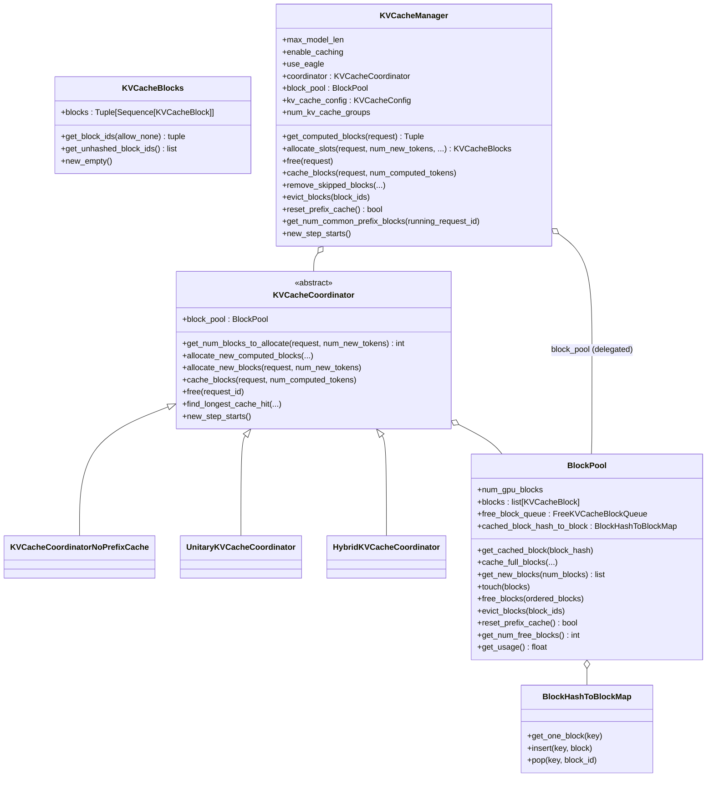
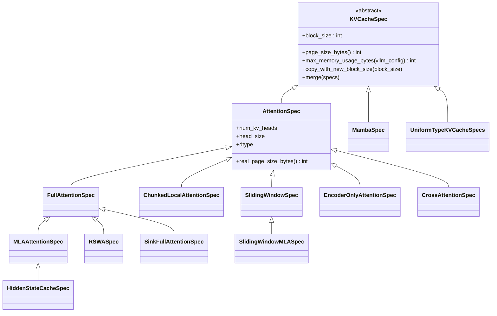
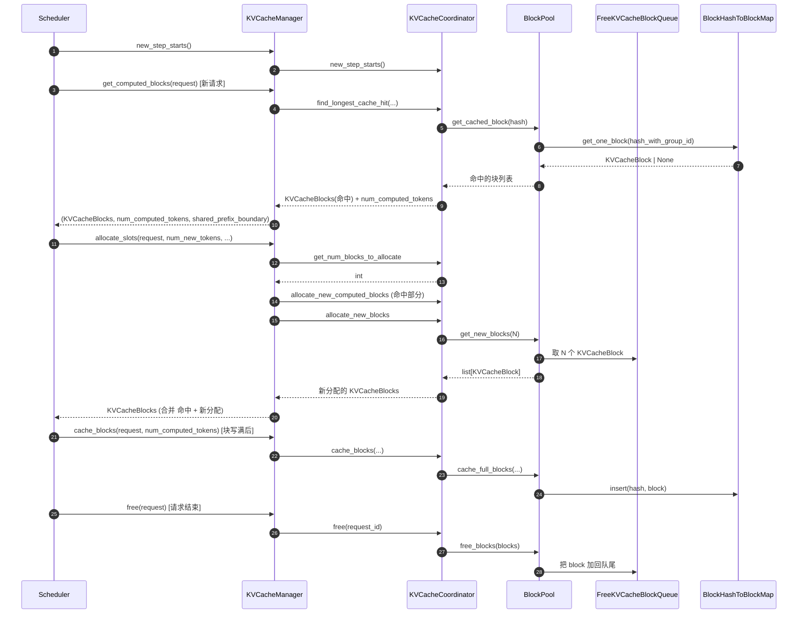

# `KVCacheManager` (and `BlockPool`, `KVCacheCoordinator`, `KVCacheBlocks`, `KVCacheSpec` 家族)

## Summary
`KVCacheManager` 是 vLLM v1 KV cache 的**唯一对外接口**——`Scheduler` 通过它做 `get_computed_blocks` (prefix cache 命中) / `allocate_slots` / `free` / `cache_blocks` / `evict_blocks`。内部分三层：(1) `KVCacheCoordinator` 抽象多种 cache 拓扑（Unitary / Hybrid / NoPrefixCache）；(2) `BlockPool` 持有自由块队列 `FreeKVCacheBlockQueue` 与 `BlockHashToBlockMap` (prefix cache hash 索引)；(3) `KVCacheBlock` 是块对象。架构上的关键设计是 **`KVCacheSpec` 多态**——把不同 attention 类型（FullAttention / SlidingWindow / ChunkedLocal / MLA / Mamba / Encoder / Cross / Sink）的 KV cache 需求建模为不同 spec，allocator 与 prefix cache 都按 spec 类型分组工作。

## Sources
- 主入口：[d:\design\vllm\vllm\v1\core\kv_cache_manager.py](d:\design\vllm\vllm\v1\core\kv_cache_manager.py)（887 行）
- 块池：[d:\design\vllm\vllm\v1\core\block_pool.py](d:\design\vllm\vllm\v1\core\block_pool.py)（831 行）
- 协调器：[d:\design\vllm\vllm\v1\core\kv_cache_coordinator.py](d:\design\vllm\vllm\v1\core\kv_cache_coordinator.py)（979 行）
- spec 体系：[d:\design\vllm\vllm\v1\kv_cache_interface.py](d:\design\vllm\vllm\v1\kv_cache_interface.py)（1007 行）
- 单类型管理器：[d:\design\vllm\vllm\v1\core\single_type_kv_cache_manager.py](d:\design\vllm\vllm\v1\core\single_type_kv_cache_manager.py)
- KV cache 工具：[d:\design\vllm\vllm\v1\core\kv_cache_utils.py](d:\design\vllm\vllm\v1\core\kv_cache_utils.py)
- encoder cache：[d:\design\vllm\vllm\v1\core\encoder_cache_manager.py](d:\design\vllm\vllm\v1\core\encoder_cache_manager.py)
- metrics：[d:\design\vllm\vllm\v1\core\kv_cache_metrics.py](d:\design\vllm\vllm\v1\core\kv_cache_metrics.py)

## 类层次



## `KVCacheManager.__init__` （[kv_cache_manager.py:119-196](d:\design\vllm\vllm\v1\core\kv_cache_manager.py)）

参数（较旧 pin 新增 `scheduler_block_size` / `max_in_flight_tokens` / `num_prefill_lookahead` / `watermark`）：

| 参数 | 类型 | 用途 |
|---|---|---|
| `kv_cache_config` | `KVCacheConfig` | 由 `EngineCore._initialize_kv_caches` 调 `get_kv_cache_configs` 算出（[engine/core.py:253, 307](d:\design\vllm\vllm\v1\engine\core.py)） |
| `max_model_len` | int | 单请求最大序列长度 |
| `scheduler_block_size` | int | scheduler 视角块大小（PR #44165 显式穿透到 Coordinator） |
| `hash_block_size` | int | hash 计算用的块大小 |
| `max_in_flight_tokens` | int \| None | 回收感知的 admission 上限；None 时退化为 `max_model_len`（[kv_cache_manager.py:137-142](d:\design\vllm\vllm\v1\core\kv_cache_manager.py)） |
| `enable_caching` | bool | 是否启 prefix cache |
| `use_eagle` | bool | spec decode Eagle 模式 |
| `num_prefill_lookahead` | int | PD 异步 KV load 的 lookahead（MTP spec decode，PR #46694） |
| `log_stats` | bool | 是否产 PrefixCacheStats |
| `enable_kv_cache_events` | bool | 是否发 KVCacheEvent |
| `dcp_world_size`, `pcp_world_size` | int | DCP / PCP 并行尺寸 |
| `metrics_collector` | KVCacheMetricsCollector | metrics 收集 |
| `watermark` | float | 保留空闲块比例，减少抢占（PR #44594，[kv_cache_manager.py:172-176](d:\design\vllm\vllm\v1\core\kv_cache_manager.py)） |

构造序列：

1. 存基本字段（[kv_cache_manager.py:136-151](d:\design\vllm\vllm\v1\core\kv_cache_manager.py)）
2. **创建 coordinator**：`get_kv_cache_coordinator(kv_cache_config, ...)` ([kv_cache_manager.py:153-166](d:\design\vllm\vllm\v1\core\kv_cache_manager.py))
3. 把 `block_pool` 从 coordinator 借过来（[kv_cache_manager.py:169](d:\design\vllm\vllm\v1\core\kv_cache_manager.py)）
4. `watermark_blocks` + 每 group 的 `kv_cache_event_metadata`（[kv_cache_manager.py:172-183](d:\design\vllm\vllm\v1\core\kv_cache_manager.py)）
5. 预构造空 `KVCacheBlocks` 复用，避免 GC 压力（[kv_cache_manager.py:184-191](d:\design\vllm\vllm\v1\core\kv_cache_manager.py) 注释）；partial-tail offload 的 `_partial_tail_pins`（[kv_cache_manager.py:193-195](d:\design\vllm\vllm\v1\core\kv_cache_manager.py)）

## `KVCacheManager` 主 API （Scheduler 真正调的）

| 方法 | 行号 | 角色 |
|---|---|---|
| `get_computed_blocks(request)` | [232-299](d:\design\vllm\vllm\v1\core\kv_cache_manager.py) | **prefix cache 命中查询**，返 3 元组 `(KVCacheBlocks, num_computed_tokens, shared_prefix_boundary)`——第 3 项是 Marconi 式 sparse-retention group（Mamba / SW）未缓存的共享前缀边界（PR #47782，见 §Increment） |
| ~~`can_fit_full_sequence(...)`~~ | — | **RESOLVED 2026-08-18**：该方法已删除；admission 上限改由 `max_in_flight_tokens` 回收感知 cap 表达（PR #41064 / #40946） |
| `get_computed_blocks_for_connector(request, ...)` | [300-346](d:\design\vllm\vllm\v1\core\kv_cache_manager.py) | **新增**：KV connector 视角的命中查询（hybrid per-group 分歧处理，PR #48425） |
| `allocate_slots(request, num_new_tokens, ...)` | [347-569](d:\design\vllm\vllm\v1\core\kv_cache_manager.py) | **核心**：分配本步要的 slots，被 `Scheduler.schedule()` 在 RUNNING 阶段 [v1/core/sched/scheduler.py:629-641](d:\design\vllm\vllm\v1\core\sched\scheduler.py) 与 WAITING 阶段 [scheduler.py:1033](d:\design\vllm\vllm\v1\core\sched\scheduler.py) 调 |
| `free(request)` | [570-582](d:\design\vllm\vllm\v1\core\kv_cache_manager.py) | 请求结束 / 抢占时释放 |
| `remove_skipped_blocks(...)` | [583-601](d:\design\vllm\vllm\v1\core\kv_cache_manager.py) | sliding window 等场景下的 skip block 释放（改为按 processed-token 基准，PR #47728） |
| `pop_blocks_for_free(request)` | [602-621](d:\design\vllm\vllm\v1\core\kv_cache_manager.py) | **新增**：取出待释放块但延迟归还（async scheduling + PD consumer 的 `defer_block_free`，PR #45357） |
| `evict_blocks(block_ids)` | [622-629](d:\design\vllm\vllm\v1\core\kv_cache_manager.py) | 强制 evict 特定 blocks（KV connector 用） |
| `reset_prefix_cache()` | [630-645](d:\design\vllm\vllm\v1\core\kv_cache_manager.py) | 清 prefix cache（权重热更新时） |
| `get_num_common_prefix_blocks(running_request_id)` | [646-679](d:\design\vllm\vllm\v1\core\kv_cache_manager.py) | 算与某个 running req 共享的前缀块数 |
| `take_events()` | [680-705](d:\design\vllm\vllm\v1\core\kv_cache_manager.py) | 取 KVCacheEvent 队列 |
| `estimate_cached_tokens(request)` | [734-762](d:\design\vllm\vllm\v1\core\kv_cache_manager.py) | **新增**：估计请求可命中的 cached token 数（`num_cache_creation_tokens` 前端指标，PR #48535） |
| `cache_blocks(request, num_computed_tokens)` | [763-773](d:\design\vllm\vllm\v1\core\kv_cache_manager.py) | 把已计算完成的块标记为可被 prefix cache 命中 |
| `take_new_block_ids()` | [805-811](d:\design\vllm\vllm\v1\core\kv_cache_manager.py) | scheduler 调，取本步新分配的 block id |
| `take_partial_tail_offloads()` | [857-884](d:\design\vllm\vllm\v1\core\kv_cache_manager.py) | **新增**：partial-tail KV offload 的 cow 块交接（PR #49502） |
| `new_step_starts()` | [885-887](d:\design\vllm\vllm\v1\core\kv_cache_manager.py) | 由 `Scheduler.schedule()` 在 step 开始时调 ([scheduler.py:515](d:\design\vllm\vllm\v1\core\sched\scheduler.py)) |

## `KVCacheBlocks` dataclass （[kv_cache_manager.py:33-117](d:\design\vllm\vllm\v1\core\kv_cache_manager.py)）

> Scheduler 与 KVCacheManager 之间的接口对象，**隐藏 KVCacheManager 内部数据结构**（[kv_cache_manager.py:35-39 注释](d:\design\vllm\vllm\v1\core\kv_cache_manager.py)）。

字段：

```python
blocks: tuple[Sequence[KVCacheBlock], ...]
# blocks[i][j] 指第 i 个 kv_cache_group 的第 j 个 token block
```

> [!warning] CONTRADICTION: 注释 [kv_cache_manager.py:42-48](d:\design\vllm\vllm\v1\core\kv_cache_manager.py)：当前所有 group 块数相同，但"will be broken if we want to give different block_size to different kv_cache_groups in the future"。

API：

| 方法 | 行号 | 用途 |
|---|---|---|
| `__add__(other)` | [56-64](d:\design\vllm\vllm\v1\core\kv_cache_manager.py) | 合并两个 KVCacheBlocks（用于 prefix hit 后 + 新分配） |
| `get_block_ids(allow_none)` | [66-93](d:\design\vllm\vllm\v1\core\kv_cache_manager.py) | 转 `tuple[list[int], ...]`（现有 `@overload` 双签名） |
| `get_unhashed_block_ids()` | [94-98](d:\design\vllm\vllm\v1\core\kv_cache_manager.py) | 取没 hash 的 block id（仅单 group） |
| `get_unhashed_block_ids_all_groups()` | [99-110](d:\design\vllm\vllm\v1\core\kv_cache_manager.py) | 全 group 版本，跳过 padding block |
| `new_empty()` | [111-117](d:\design\vllm\vllm\v1\core\kv_cache_manager.py) | 复用空 KVCacheBlocks |

## `BlockPool` （[block_pool.py:143-831](d:\design\vllm\vllm\v1\core\block_pool.py)）

`BlockPool` 是 KV blocks 的**底层池**，无 KV group 概念（每个 coordinator 持有一个或多个 block_pool，由 coordinator 决定怎么复用）。

| 方法 | 行号 | 角色 |
|---|---|---|
| `__init__` | [162-197](d:\design\vllm\vllm\v1\core\block_pool.py) | 创建 `num_gpu_blocks` 个 `KVCacheBlock` + `FreeKVCacheBlockQueue` + `BlockHashToBlockMap` |
| `get_cached_block(block_hash)` | [198-224](d:\design\vllm\vllm\v1\core\block_pool.py) | **prefix cache 命中查询**，按 BlockHashWithGroupId 找 |
| `cache_full_blocks(...)` | [225-343](d:\design\vllm\vllm\v1\core\block_pool.py) | 块写满后，算 hash 并插入 `BlockHashToBlockMap` |
| `cache_partial_block(...)` + `_get_partial_block_hash` | [445-570](d:\design\vllm\vllm\v1\core\block_pool.py) | **新增**：sub-block prompt 的 partial-tail 块缓存（KV offload，PR #49502） |
| `move_block_hashes(...)` | [629-646](d:\design\vllm\vllm\v1\core\block_pool.py) | **新增**：块间 hash 迁移（copy-on-write 交接用） |
| `get_new_blocks(num_blocks)` | [647-678](d:\design\vllm\vllm\v1\core\block_pool.py) | 从 free queue 拿 N 个 block；不够时触发 evict |
| `_maybe_evict_cached_block(block)` | [679-701](d:\design\vllm\vllm\v1\core\block_pool.py) | 把 cached block 从 hash map 摘除，让它可被新分配复用 |
| `touch(blocks)` | [702-718](d:\design\vllm\vllm\v1\core\block_pool.py) | 提升 block 在 free queue 的位置（LRU） |
| `free_blocks(ordered_blocks)` | [719-744](d:\design\vllm\vllm\v1\core\block_pool.py) | 显式释放 |
| `evict_blocks(block_ids)` | [745-763](d:\design\vllm\vllm\v1\core\block_pool.py) | 强制驱逐 |
| `reset_prefix_cache()` | [764-799](d:\design\vllm\vllm\v1\core\block_pool.py) | 清空 hash map + 把所有非 ref 的块返回 free |
| `get_num_free_blocks()` | [800-807](d:\design\vllm\vllm\v1\core\block_pool.py) | 自由块数 |
| `get_usage()` | [808-820](d:\design\vllm\vllm\v1\core\block_pool.py) | 利用率 |
| `take_events()` | [821-831](d:\design\vllm\vllm\v1\core\block_pool.py) | 取 KVCacheEvent 队列 |

### `BlockHashToBlockMap` （[block_pool.py:33-141](d:\design\vllm\vllm\v1\core\block_pool.py)）

prefix cache 的 hash 索引：`{BlockHashWithGroupId: KVCacheBlock | dict[block_id, KVCacheBlock]}`。

> [!todo] VERIFY: 注释 [block_pool.py:48-52](d:\design\vllm\vllm\v1\core\block_pool.py) 提到"We currently don't de-duplicate the blocks in the cache"——同 hash 的 block 不去重，是为了"块 ID 不变 + block table append-only"。

### `FreeKVCacheBlockQueue` （[kv_cache_utils.py](d:\design\vllm\vllm\v1\core\kv_cache_utils.py) — 待 ingest 时细化）

LRU 双向链表，保证常数时间的 `add_back / remove`。

## `KVCacheCoordinator` 抽象 （[kv_cache_coordinator.py:64-419](d:\design\vllm\vllm\v1\core\kv_cache_coordinator.py)）

3 个具体实现，由 `get_kv_cache_coordinator(...)` 工厂选择 ([kv_cache_coordinator.py:923-979](d:\design\vllm\vllm\v1\core\kv_cache_coordinator.py))：

| 实现 | 行号 | 适用场景 |
|---|---|---|
| `KVCacheCoordinatorNoPrefixCache` | [420-471](d:\design\vllm\vllm\v1\core\kv_cache_coordinator.py) | 关 prefix cache 时（最简，无 cache hit 查询） |
| `UnitaryKVCacheCoordinator` | [472-544](d:\design\vllm\vllm\v1\core\kv_cache_coordinator.py) | **单 cache group**（标准模型：FullAttention / SlidingWindow 或 MLA 单一类型） |
| `HybridKVCacheCoordinator` | [560-922](d:\design\vllm\vllm\v1\core\kv_cache_coordinator.py) | **多 cache group 混合**（hybrid 模型：full attention 层 + sliding window 层；或 attention 层 + Mamba 层）；辅助结构 `SpecGroup` NamedTuple ([545-558](d:\design\vllm\vllm\v1\core\kv_cache_coordinator.py)) |

抽象/基类方法（[kv_cache_coordinator.py:71-419](d:\design\vllm\vllm\v1\core\kv_cache_coordinator.py)）：

| 方法 | 行号 | 角色 |
|---|---|---|
| `get_num_blocks_to_allocate(request, num_new_tokens)` | [160-221](d:\design\vllm\vllm\v1\core\kv_cache_coordinator.py) | 算本步要分配几个 block |
| `allocate_new_computed_blocks(...)` | [222-267](d:\design\vllm\vllm\v1\core\kv_cache_coordinator.py) | 把 prefix cache 命中的 block 加到 request |
| `allocate_new_blocks(request, num_new_tokens)` | [268-302](d:\design\vllm\vllm\v1\core\kv_cache_coordinator.py) | 真正从 BlockPool 拿新 block |
| `cache_blocks(request, num_computed_tokens)` | [303-324](d:\design\vllm\vllm\v1\core\kv_cache_coordinator.py) | 块写满后调 `BlockPool.cache_full_blocks`（Hybrid 有覆盖版 [727-756](d:\design\vllm\vllm\v1\core\kv_cache_coordinator.py)） |
| `free(request_id)` | [325-334](d:\design\vllm\vllm\v1\core\kv_cache_coordinator.py) | 释放 |
| `pop_blocks_for_free(request_id)` | [335-353](d:\design\vllm\vllm\v1\core\kv_cache_coordinator.py) | **新增**：延迟释放路径（`defer_block_free`） |
| `get_num_common_prefix_blocks(running_request_id)` | [354-370](d:\design\vllm\vllm\v1\core\kv_cache_coordinator.py) | 公共前缀块数 |
| `find_longest_cache_hit(...)` | [404-413 (abstract), 461-471 (NoPrefix), 525-544 (Unitary), 757-890 (Hybrid)](d:\design\vllm\vllm\v1\core\kv_cache_coordinator.py) | **prefix cache 命中算法**（每个子类有不同实现；Hybrid 另有 `find_longest_cache_hit_per_group` [891-922](d:\design\vllm\vllm\v1\core\kv_cache_coordinator.py)，per-group 分歧命中，PR #46384 / #48425） |
| `new_step_starts()` | [414-419](d:\design\vllm\vllm\v1\core\kv_cache_coordinator.py) | step 开始钩子 |

`HybridKVCacheCoordinator.verify_and_split_kv_cache_groups()` ([kv_cache_coordinator.py:664-714](d:\design\vllm\vllm\v1\core\kv_cache_coordinator.py)) 处理 hybrid 模型不同 group 的对齐校验；`_cache_hit_alignment_tokens` / `_align_cacheable` ([655-663, 715-726](d:\design\vllm\vllm\v1\core\kv_cache_coordinator.py)) 处理对齐粒度。模块级 `_validate_prefix_cache_retention_interval` ([32-61](d:\design\vllm\vllm\v1\core\kv_cache_coordinator.py)) 校验 Marconi 式选择性 cache 保留间隔（PR #47782 / #52216）。

## `KVCacheSpec` 多态体系 （[kv_cache_interface.py](d:\design\vllm\vllm\v1\kv_cache_interface.py)）

vLLM 把每种 attention 类型的 KV cache 需求建模为**独立 spec class**，让 allocator 可以多态处理：



| Spec | 行号 | 适用场景 |
|---|---|---|
| `KVQuantMode` (enum) | [36](d:\design\vllm\vllm\v1\kv_cache_interface.py) | KV cache 量化模式（含 per-token-head） |
| `KVCacheSpecKind` (enum) | [128](d:\design\vllm\vllm\v1\kv_cache_interface.py) | **新增**：spec 种类枚举（KV events metadata 用） |
| `KVCacheSpec` | [141-142](d:\design\vllm\vllm\v1\kv_cache_interface.py) | 抽象基类 |
| `AttentionSpec` | [217-218](d:\design\vllm\vllm\v1\kv_cache_interface.py) | attention 类型基类 |
| `FullAttentionSpec` | [274-275](d:\design\vllm\vllm\v1\kv_cache_interface.py) | 标准 full attention |
| ~~`TQFullAttentionSpec`~~ | — | **RESOLVED 2026-08-18**：已在增量区间被移除（在 [d:\design\vllm\vllm\](d:\design\vllm\vllm) 全树 grep 0 命中） |
| `MLAAttentionSpec` | [381-382](d:\design\vllm\vllm\v1\kv_cache_interface.py) | DeepSeek MLA |
| `HiddenStateCacheSpec` | [447-448](d:\design\vllm\vllm\v1\kv_cache_interface.py) | **新增**：`extract_hidden_states` 用的 hidden-state cache 层标记（MLA 子类） |
| `RSWASpec` | [454-455](d:\design\vllm\vllm\v1\kv_cache_interface.py) | **新增**：Reference Sliding Window Attention（prefill token 全局可见，仅保留最近 `rswa_window` 个生成 token；FullAttention 子类） |
| `ChunkedLocalAttentionSpec` | [496-497](d:\design\vllm\vllm\v1\kv_cache_interface.py) | chunked local attention |
| `SlidingWindowSpec` | [536-537](d:\design\vllm\vllm\v1\kv_cache_interface.py) | sliding window |
| `SlidingWindowMLASpec` | [594-595](d:\design\vllm\vllm\v1\kv_cache_interface.py) | **新增**：sliding window + MLA 组合 |
| `MambaSpec` | [667-668](d:\design\vllm\vllm\v1\kv_cache_interface.py) | Mamba 状态 |
| `EncoderOnlyAttentionSpec` | [720-721](d:\design\vllm\vllm\v1\kv_cache_interface.py) | encoder-only |
| `CrossAttentionSpec` | [727-728](d:\design\vllm\vllm\v1\kv_cache_interface.py) | encoder-decoder cross attention |
| `SinkFullAttentionSpec` | [740-741](d:\design\vllm\vllm\v1\kv_cache_interface.py) | sink token full attention |
| `UniformTypeKVCacheSpecs` | [796-797](d:\design\vllm\vllm\v1\kv_cache_interface.py) | 多 layer 同类型时合并表示 |

数据容器：

| 类 | 行号 | 用途 |
|---|---|---|
| `KVCacheTensor` | [928-929](d:\design\vllm\vllm\v1\kv_cache_interface.py) | 实际 tensor 描述 |
| `KVCacheGroupSpec` | [940-941](d:\design\vllm\vllm\v1\kv_cache_interface.py) | 一组 spec + 对应的 layer ids |
| `KVCacheConfig` | [955-956](d:\design\vllm\vllm\v1\kv_cache_interface.py) | 顶层配置：含 `kv_cache_groups: list[KVCacheGroupSpec]`, `num_blocks` 等 |

`KVCacheConfig.has_mamba_layers()` / `needs_kv_cache_zeroing()` 是子系统级触发器（[kv_cache_interface.py:977, 999](d:\design\vllm\vllm\v1\kv_cache_interface.py)）。

## 与 `EncoderCacheManager` 的关系

[encoder_cache_manager.py](d:\design\vllm\vllm\v1\core\encoder_cache_manager.py) 是**完全独立**的多模态 encoder 输出缓存（vision tower 输出），**不归 `KVCacheManager` 管**。`Scheduler` 同时持有两者：

- `kv_cache_manager: KVCacheManager`（attention KV）
- `encoder_cache_manager: EncoderCacheManager` 或 `EncoderDecoderCacheManager`

详见 [scheduler.py:243-246](d:\design\vllm\vllm\v1\core\sched\scheduler.py) 构造（现经 `manager_cls_obj.create_manager(...)` 创建，可由 VllmConfig 配自定义 encoder cache manager 类，PR #51251）。

## 与 Scheduler 的协作链



锚点：[v1/core/sched/scheduler.py:515 (new_step_starts)](d:\design\vllm\vllm\v1\core\sched\scheduler.py), [scheduler.py:629-641 (allocate_slots in RUNNING)](d:\design\vllm\vllm\v1\core\sched\scheduler.py)。

## Increment 2026-08-18 (vLLM 5f7fab88 → d29dc3ab)

kv_cache_manager.py 4 个月共 22 commits（552 → 887 行；block_pool.py 509 → 831、kv_cache_coordinator.py 591 → 979、kv_cache_interface.py 585 → 1007）。本页锚点已按新 HEAD 修正。要点：

- **`get_computed_blocks` 返回值从 2 元组变 3 元组**：新增 `shared_prefix_boundary`——Marconi 式选择性 hybrid cache 保留（sparse-retention group 未缓存的共享前缀边界，PR #47782；[d:\design\vllm\vllm\v1\core\kv_cache_manager.py:232-299](d:\design\vllm\vllm\v1\core\kv_cache_manager.py)）。`prefix_cache_retention_interval` 已提升为正式参数、默认 0（PR #52216，校验在 [d:\design\vllm\vllm\v1\core\kv_cache_coordinator.py:32-61](d:\design\vllm\vllm\v1\core\kv_cache_coordinator.py)）。
- **`can_fit_full_sequence` 删除**：admission 上限改由 `max_in_flight_tokens` 回收感知 cap 表达（PR #41064 简化 `scheduler_reserve_full_isl`、#40946 SWA/chunked-local admission cap；[d:\design\vllm\vllm\v1\core\kv_cache_manager.py:124, 137-142](d:\design\vllm\vllm\v1\core\kv_cache_manager.py)）。
- **KV cache watermark**（PR #44594）：`watermark_blocks = watermark * num_blocks`，admit waiting/preempted 请求时保底空闲块、减少抢占（[d:\design\vllm\vllm\v1\core\kv_cache_manager.py:172-176](d:\design\vllm\vllm\v1\core\kv_cache_manager.py)）。
- **hybrid 模型 partial prefix cache hit**（PR #46384 / #48425 / #51843）：`HybridKVCacheCoordinator.find_longest_cache_hit` 重写（[d:\design\vllm\vllm\v1\core\kv_cache_coordinator.py:757-890](d:\design\vllm\vllm\v1\core\kv_cache_coordinator.py)），新增 `find_longest_cache_hit_per_group`（[891-922](d:\design\vllm\vllm\v1\core\kv_cache_coordinator.py)）与 `KVCacheManager.get_computed_blocks_for_connector`（per-group 分歧命中交给有能力的 connector，PR #50344；[d:\design\vllm\vllm\v1\core\kv_cache_manager.py:300-346](d:\design\vllm\vllm\v1\core\kv_cache_manager.py)）。
- **partial-tail KV offload**（PR #49502）：`BlockPool.cache_partial_block` 系列（[d:\design\vllm\vllm\v1\core\block_pool.py:445-570](d:\design\vllm\vllm\v1\core\block_pool.py)）+ `KVCacheManager.take_partial_tail_offloads` / `_partial_tail_pins`（cow 块 pin 到请求释放；[d:\design\vllm\vllm\v1\core\kv_cache_manager.py:857-884, 193-195](d:\design\vllm\vllm\v1\core\kv_cache_manager.py)）。
- **延迟释放路径**：`pop_blocks_for_free`（Manager [602-621](d:\design\vllm\vllm\v1\core\kv_cache_manager.py) / Coordinator [335-353](d:\design\vllm\vllm\v1\core\kv_cache_coordinator.py)）配合 Scheduler 侧 `defer_block_free`（async scheduling + PD consumer 竞态，PR #45357 / #48481）。
- **KV events 增强**：`kv_cache_event_metadata`（spec kind + sliding window 元数据随事件发出，PR #40984；[d:\design\vllm\vllm\v1\core\kv_cache_manager.py:177-183](d:\design\vllm\vllm\v1\core\kv_cache_manager.py)），full report 模式报告 prefix-cache-reused blocks（PR #45261，`BlockPool.emit_cached_block_events` [d:\design\vllm\vllm\v1\core\block_pool.py:373-444](d:\design\vllm\vllm\v1\core\block_pool.py)）。
- **spec 体系扩容**：新增 `KVCacheSpecKind` / `HiddenStateCacheSpec` / `RSWASpec` / `SlidingWindowMLASpec`，删除 `TQFullAttentionSpec`（见上表）。
- **zeroing 子系统**：`take_new_block_ids` 扩展出 `get_zeroing_block_ids_in_range` / `record_blocks_for_zeroing` / `take_kv_cache_block_copies`（[d:\design\vllm\vllm\v1\core\kv_cache_manager.py:805-856](d:\design\vllm\vllm\v1\core\kv_cache_manager.py)）。

## Notes / Caveats
> [!todo] VERIFY: `single_type_kv_cache_manager.py` 与本架构的关系（疑是 hybrid coordinator 的子组件）。
> [!todo] VERIFY: `kv_cache_utils.py` 中 `BlockHash` / `BlockHashList` / `generate_block_hash_extra_keys` / `get_request_block_hasher` 的具体实现（含 `extra_keys` 用于 LoRA / cache version 区隔）。
> [!todo] VERIFY: `KVCacheMetricsCollector` ([kv_cache_metrics.py](d:\design\vllm\vllm\v1\core\kv_cache_metrics.py)) 与 KVConnectorStats / SchedulerStats 的关系。
> [!warning] CONTRADICTION: `BlockHashToBlockMap` 不去重同 hash 的块（[block_pool.py:48-52](d:\design\vllm\vllm\v1\core\block_pool.py)），导致内存可能略浪费但保证 block table append-only 不变性——这是性能 vs 正确性的取舍。

## See also
- [entities/Scheduler.md](Scheduler.md)
- [topics/request-lifecycle.md](../topics/request-lifecycle.md)
- [topics/prefix-cache.md](../topics/prefix-cache.md) — prefix cache 主题页（含 hash 算法 / 3 Coordinator 拓扑 / 跨子系统引用 grep）
- [comparison/topics/kv-cache.md](../../comparison/topics/kv-cache.md)
