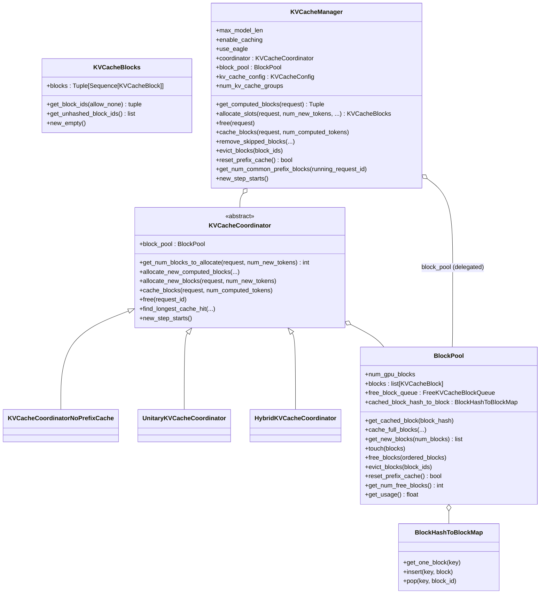
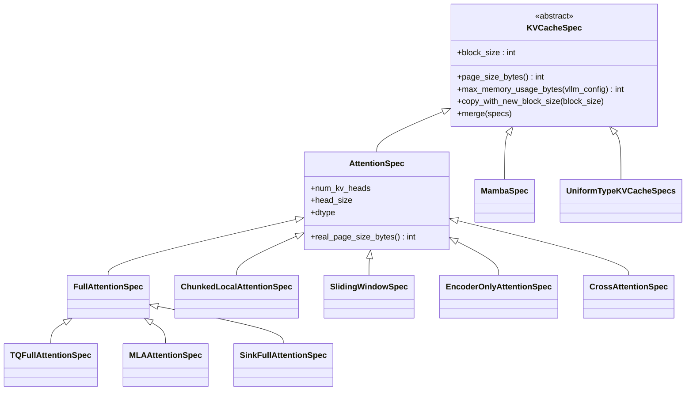
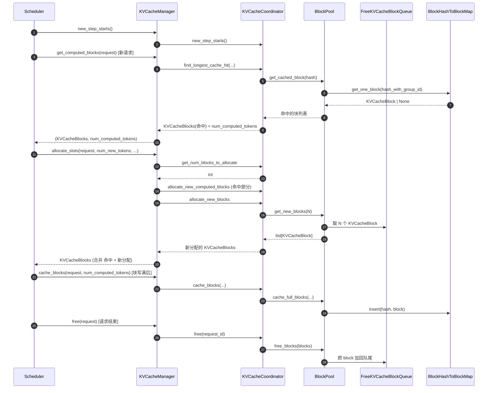

# `KVCacheManager` (and `BlockPool`, `KVCacheCoordinator`, `KVCacheBlocks`, `KVCacheSpec` 家族)

## Summary
`KVCacheManager` 是 vLLM v1 KV cache 的**唯一对外接口**——`Scheduler` 通过它做 `get_computed_blocks` (prefix cache 命中) / `allocate_slots` / `free` / `cache_blocks` / `evict_blocks`。内部分三层：(1) `KVCacheCoordinator` 抽象多种 cache 拓扑（Unitary / Hybrid / NoPrefixCache）；(2) `BlockPool` 持有自由块队列 `FreeKVCacheBlockQueue` 与 `BlockHashToBlockMap` (prefix cache hash 索引)；(3) `KVCacheBlock` 是块对象。架构上的关键设计是 **`KVCacheSpec` 多态**——把不同 attention 类型（FullAttention / SlidingWindow / ChunkedLocal / MLA / Mamba / Encoder / Cross / Sink）的 KV cache 需求建模为不同 spec，allocator 与 prefix cache 都按 spec 类型分组工作。

## Sources
- 主入口：[d:\design\vllm\vllm\v1\core\kv_cache_manager.py](d:\design\vllm\vllm\v1\core\kv_cache_manager.py)（约 555 行）
- 块池：[d:\design\vllm\vllm\v1\core\block_pool.py](d:\design\vllm\vllm\v1\core\block_pool.py)（约 510 行）
- 协调器：[d:\design\vllm\vllm\v1\core\kv_cache_coordinator.py](d:\design\vllm\vllm\v1\core\kv_cache_coordinator.py)（约 560 行）
- spec 体系：[d:\design\vllm\vllm\v1\kv_cache_interface.py](d:\design\vllm\vllm\v1\kv_cache_interface.py)（约 590 行）
- 单类型管理器：[d:\design\vllm\vllm\v1\core\single_type_kv_cache_manager.py](d:\design\vllm\vllm\v1\core\single_type_kv_cache_manager.py)
- KV cache 工具：[d:\design\vllm\vllm\v1\core\kv_cache_utils.py](d:\design\vllm\vllm\v1\core\kv_cache_utils.py)
- encoder cache：[d:\design\vllm\vllm\v1\core\encoder_cache_manager.py](d:\design\vllm\vllm\v1\core\encoder_cache_manager.py)
- metrics：[d:\design\vllm\vllm\v1\core\kv_cache_metrics.py](d:\design\vllm\vllm\v1\core\kv_cache_metrics.py)

## 类层次



## `KVCacheManager.__init__` （[kv_cache_manager.py:106-155](d:\design\vllm\vllm\v1\core\kv_cache_manager.py)）

8 个参数：

| 参数 | 类型 | 用途 |
|---|---|---|
| `kv_cache_config` | `KVCacheConfig` | 由 `EngineCore._initialize_kv_caches` 调 `get_kv_cache_configs` 算出（[engine/core.py:260-262](d:\design\vllm\vllm\v1\engine\core.py)） |
| `max_model_len` | int | 单请求最大序列长度 |
| `hash_block_size` | int | hash 计算用的块大小 |
| `enable_caching` | bool | 是否启 prefix cache |
| `use_eagle` | bool | spec decode Eagle 模式 |
| `log_stats` | bool | 是否产 PrefixCacheStats |
| `enable_kv_cache_events` | bool | 是否发 KVCacheEvent |
| `dcp_world_size`, `pcp_world_size` | int | DCP / PCP 并行尺寸 |
| `metrics_collector` | KVCacheMetricsCollector | metrics 收集 |

构造序列：

1. 存基本字段（[kv_cache_manager.py:120-130](d:\design\vllm\vllm\v1\core\kv_cache_manager.py)）
2. **创建 coordinator**：`get_kv_cache_coordinator(kv_cache_config, ...)` ([kv_cache_manager.py:131-141](d:\design\vllm\vllm\v1\core\kv_cache_manager.py))
3. 把 `block_pool` 从 coordinator 借过来（[kv_cache_manager.py:143](d:\design\vllm\vllm\v1\core\kv_cache_manager.py)）
4. 预构造空 `KVCacheBlocks` 复用，避免 GC 压力（[kv_cache_manager.py:146-155](d:\design\vllm\vllm\v1\core\kv_cache_manager.py) 注释）

## `KVCacheManager` 主 API （Scheduler 真正调的）

| 方法 | 行号 | 角色 |
|---|---|---|
| `get_computed_blocks(request)` | [176-217](d:\design\vllm\vllm\v1\core\kv_cache_manager.py) | **prefix cache 命中查询**，返 `(KVCacheBlocks, num_computed_tokens)` |
| `can_fit_full_sequence(...)` | [218-256](d:\design\vllm\vllm\v1\core\kv_cache_manager.py) | 判断能否一次装下整个序列 |
| `allocate_slots(request, num_new_tokens, ...)` | [257-428](d:\design\vllm\vllm\v1\core\kv_cache_manager.py) | **核心**：分配本步要的 slots，被 `Scheduler.schedule()` [v1/core/sched/scheduler.py:461-507](d:\design\vllm\vllm\v1\core\sched\scheduler.py) 在 RUNNING 阶段调 |
| `free(request)` | [429-438](d:\design\vllm\vllm\v1\core\kv_cache_manager.py) | 请求结束 / 抢占时释放 |
| `remove_skipped_blocks(...)` | [439-451](d:\design\vllm\vllm\v1\core\kv_cache_manager.py) | sliding window 等场景下的 skip block 释放 |
| `evict_blocks(block_ids)` | [452-459](d:\design\vllm\vllm\v1\core\kv_cache_manager.py) | 强制 evict 特定 blocks（KV connector 用） |
| `reset_prefix_cache()` | [460-475](d:\design\vllm\vllm\v1\core\kv_cache_manager.py) | 清 prefix cache（权重热更新时） |
| `get_num_common_prefix_blocks(running_request_id)` | [476-509](d:\design\vllm\vllm\v1\core\kv_cache_manager.py) | 算与某个 running req 共享的前缀块数 |
| `take_events()` | [510-517](d:\design\vllm\vllm\v1\core\kv_cache_manager.py) | 取 KVCacheEvent 队列 |
| `cache_blocks(request, num_computed_tokens)` | [526-536](d:\design\vllm\vllm\v1\core\kv_cache_manager.py) | 把已计算完成的块标记为可被 prefix cache 命中 |
| `take_new_block_ids()` | [543-549](d:\design\vllm\vllm\v1\core\kv_cache_manager.py) | scheduler 调，取本步新分配的 block id |
| `new_step_starts()` | [550-554](d:\design\vllm\vllm\v1\core\kv_cache_manager.py) | 由 `Scheduler.schedule()` 在 step 开始时调 ([scheduler.py:381](d:\design\vllm\vllm\v1\core\sched\scheduler.py)) |

## `KVCacheBlocks` dataclass （[kv_cache_manager.py:21-103](d:\design\vllm\vllm\v1\core\kv_cache_manager.py)）

> Scheduler 与 KVCacheManager 之间的接口对象，**隐藏 KVCacheManager 内部数据结构**（[kv_cache_manager.py:23-27 注释](d:\design\vllm\vllm\v1\core\kv_cache_manager.py)）。

字段：

```python
blocks: tuple[Sequence[KVCacheBlock], ...]
# blocks[i][j] 指第 i 个 kv_cache_group 的第 j 个 token block
```

> [!warning] CONTRADICTION: 注释 [kv_cache_manager.py:34-38](d:\design\vllm\vllm\v1\core\kv_cache_manager.py)：当前所有 group 块数相同，但"will be broken if we want to give different block_size to different kv_cache_groups in the future"。

API：

| 方法 | 行号 | 用途 |
|---|---|---|
| `__add__(other)` | [44-51](d:\design\vllm\vllm\v1\core\kv_cache_manager.py) | 合并两个 KVCacheBlocks（用于 prefix hit 后 + 新分配） |
| `get_block_ids(allow_none)` | [65-80](d:\design\vllm\vllm\v1\core\kv_cache_manager.py) | 转 `tuple[list[int], ...]` |
| `get_unhashed_block_ids()` | [82-85](d:\design\vllm\vllm\v1\core\kv_cache_manager.py) | 取没 hash 的 block id（仅单 group） |
| `get_unhashed_block_ids_all_groups()` | [87-97](d:\design\vllm\vllm\v1\core\kv_cache_manager.py) | 全 group 版本，跳过 padding block |
| `new_empty()` | [99-103](d:\design\vllm\vllm\v1\core\kv_cache_manager.py) | 复用空 KVCacheBlocks |

## `BlockPool` （[block_pool.py:130-509](d:\design\vllm\vllm\v1\core\block_pool.py)）

`BlockPool` 是 KV blocks 的**底层池**，无 KV group 概念（每个 coordinator 持有一个或多个 block_pool，由 coordinator 决定怎么复用）。

| 方法 | 行号 | 角色 |
|---|---|---|
| `__init__` | [149-183](d:\design\vllm\vllm\v1\core\block_pool.py) | 创建 `num_gpu_blocks` 个 `KVCacheBlock` + `FreeKVCacheBlockQueue` + `BlockHashToBlockMap` |
| `get_cached_block(block_hash)` | [184-210](d:\design\vllm\vllm\v1\core\block_pool.py) | **prefix cache 命中查询**，按 BlockHashWithGroupId 找 |
| `cache_full_blocks(...)` | [211-321](d:\design\vllm\vllm\v1\core\block_pool.py) | 块写满后，算 hash 并插入 `BlockHashToBlockMap` |
| `get_new_blocks(num_blocks)` | [322-353](d:\design\vllm\vllm\v1\core\block_pool.py) | 从 free queue 拿 N 个 block；不够时触发 evict |
| `_maybe_evict_cached_block(block)` | [354-390](d:\design\vllm\vllm\v1\core\block_pool.py) | 把 cached block 从 hash map 摘除，让它可被新分配复用 |
| `touch(blocks)` | [391-407](d:\design\vllm\vllm\v1\core\block_pool.py) | 提升 block 在 free queue 的位置（LRU） |
| `free_blocks(ordered_blocks)` | [408-423](d:\design\vllm\vllm\v1\core\block_pool.py) | 显式释放 |
| `evict_blocks(block_ids)` | [424-442](d:\design\vllm\vllm\v1\core\block_pool.py) | 强制驱逐 |
| `reset_prefix_cache()` | [443-477](d:\design\vllm\vllm\v1\core\block_pool.py) | 清空 hash map + 把所有非 ref 的块返回 free |
| `get_num_free_blocks()` | [478-485](d:\design\vllm\vllm\v1\core\block_pool.py) | 自由块数 |
| `get_usage()` | [486-498](d:\design\vllm\vllm\v1\core\block_pool.py) | 利用率 |
| `take_events()` | [499-509](d:\design\vllm\vllm\v1\core\block_pool.py) | 取 KVCacheEvent 队列 |

### `BlockHashToBlockMap` （[block_pool.py:34-128](d:\design\vllm\vllm\v1\core\block_pool.py)）

prefix cache 的 hash 索引：`{BlockHashWithGroupId: KVCacheBlock | dict[block_id, KVCacheBlock]}`。

> [!todo] VERIFY: 注释 [block_pool.py:48-52](d:\design\vllm\vllm\v1\core\block_pool.py) 提到"We currently don't de-duplicate the blocks in the cache"——同 hash 的 block 不去重，是为了"块 ID 不变 + block table append-only"。

### `FreeKVCacheBlockQueue` （[kv_cache_utils.py](d:\design\vllm\vllm\v1\core\kv_cache_utils.py) — 待 ingest 时细化）

LRU 双向链表，保证常数时间的 `add_back / remove`。

## `KVCacheCoordinator` 抽象 （[kv_cache_coordinator.py:28-254](d:\design\vllm\vllm\v1\core\kv_cache_coordinator.py)）

3 个具体实现，由 `get_kv_cache_coordinator(...)` 工厂选择 ([kv_cache_coordinator.py:547](d:\design\vllm\vllm\v1\core\kv_cache_coordinator.py))：

| 实现 | 行号 | 适用场景 |
|---|---|---|
| `KVCacheCoordinatorNoPrefixCache` | [256-300](d:\design\vllm\vllm\v1\core\kv_cache_coordinator.py) | 关 prefix cache 时（最简，无 cache hit 查询） |
| `UnitaryKVCacheCoordinator` | [302-366](d:\design\vllm\vllm\v1\core\kv_cache_coordinator.py) | **单 cache group**（标准模型：FullAttention / SlidingWindow 或 MLA 单一类型） |
| `HybridKVCacheCoordinator` | [368-545](d:\design\vllm\vllm\v1\core\kv_cache_coordinator.py) | **多 cache group 混合**（hybrid 模型：full attention 层 + sliding window 层；或 attention 层 + Mamba 层） |

抽象方法（[kv_cache_coordinator.py:71-254](d:\design\vllm\vllm\v1\core\kv_cache_coordinator.py)）：

| 方法 | 行号 | 角色 |
|---|---|---|
| `get_num_blocks_to_allocate(request, num_new_tokens)` | [71-116](d:\design\vllm\vllm\v1\core\kv_cache_coordinator.py) | 算本步要分配几个 block |
| `allocate_new_computed_blocks(...)` | [117-142](d:\design\vllm\vllm\v1\core\kv_cache_coordinator.py) | 把 prefix cache 命中的 block 加到 request |
| `allocate_new_blocks(request, num_new_tokens)` | [143-177](d:\design\vllm\vllm\v1\core\kv_cache_coordinator.py) | 真正从 BlockPool 拿新 block |
| `cache_blocks(request, num_computed_tokens)` | [178-190](d:\design\vllm\vllm\v1\core\kv_cache_coordinator.py) | 块写满后调 `BlockPool.cache_full_blocks` |
| `free(request_id)` | [191-200](d:\design\vllm\vllm\v1\core\kv_cache_coordinator.py) | 释放 |
| `get_num_common_prefix_blocks(running_request_id)` | [201-217](d:\design\vllm\vllm\v1\core\kv_cache_coordinator.py) | 公共前缀块数 |
| `find_longest_cache_hit(...)` | [243-249, 291-301, 349-475](d:\design\vllm\vllm\v1\core\kv_cache_coordinator.py) | **prefix cache 命中算法**（每个子类有不同实现） |
| `new_step_starts()` | [250-254](d:\design\vllm\vllm\v1\core\kv_cache_coordinator.py) | step 开始钩子 |

`HybridKVCacheCoordinator.verify_and_split_kv_cache_groups()` ([kv_cache_coordinator.py:410-452](d:\design\vllm\vllm\v1\core\kv_cache_coordinator.py)) 处理 hybrid 模型不同 group 的对齐校验。

## `KVCacheSpec` 多态体系 （[kv_cache_interface.py](d:\design\vllm\vllm\v1\kv_cache_interface.py)）

vLLM 把每种 attention 类型的 KV cache 需求建模为**独立 spec class**，让 allocator 可以多态处理：



| Spec | 行号 | 适用场景 |
|---|---|---|
| `KVQuantMode` (enum) | [30](d:\design\vllm\vllm\v1\kv_cache_interface.py) | KV cache 量化模式（含 per-token-head） |
| `KVCacheSpec` | [69](d:\design\vllm\vllm\v1\kv_cache_interface.py) | 抽象基类 |
| `AttentionSpec` | [114](d:\design\vllm\vllm\v1\kv_cache_interface.py) | attention 类型基类 |
| `FullAttentionSpec` | [148](d:\design\vllm\vllm\v1\kv_cache_interface.py) | 标准 full attention |
| `TQFullAttentionSpec` | [249](d:\design\vllm\vllm\v1\kv_cache_interface.py) | TQ full attention |
| `MLAAttentionSpec` | [275](d:\design\vllm\vllm\v1\kv_cache_interface.py) | DeepSeek MLA |
| `ChunkedLocalAttentionSpec` | [314](d:\design\vllm\vllm\v1\kv_cache_interface.py) | chunked local attention |
| `SlidingWindowSpec` | [333](d:\design\vllm\vllm\v1\kv_cache_interface.py) | sliding window |
| `MambaSpec` | [359](d:\design\vllm\vllm\v1\kv_cache_interface.py) | Mamba 状态 |
| `EncoderOnlyAttentionSpec` | [389](d:\design\vllm\vllm\v1\kv_cache_interface.py) | encoder-only |
| `CrossAttentionSpec` | [396](d:\design\vllm\vllm\v1\kv_cache_interface.py) | encoder-decoder cross attention |
| `SinkFullAttentionSpec` | [409](d:\design\vllm\vllm\v1\kv_cache_interface.py) | sink token full attention |
| `UniformTypeKVCacheSpecs` | [461](d:\design\vllm\vllm\v1\kv_cache_interface.py) | 多 layer 同类型时合并表示 |

数据容器：

| 类 | 行号 | 用途 |
|---|---|---|
| `KVCacheTensor` | [538](d:\design\vllm\vllm\v1\kv_cache_interface.py) | 实际 tensor 描述 |
| `KVCacheGroupSpec` | [548](d:\design\vllm\vllm\v1\kv_cache_interface.py) | 一组 spec + 对应的 layer ids |
| `KVCacheConfig` | [561](d:\design\vllm\vllm\v1\kv_cache_interface.py) | 顶层配置：含 `kv_cache_groups: list[KVCacheGroupSpec]`, `num_blocks` 等 |

`KVCacheConfig.has_mamba_layers()` / `needs_kv_cache_zeroing()` 是子系统级触发器（[kv_cache_interface.py:580-585](d:\design\vllm\vllm\v1\kv_cache_interface.py)）。

## 与 `EncoderCacheManager` 的关系

[encoder_cache_manager.py](d:\design\vllm\vllm\v1\core\encoder_cache_manager.py) 是**完全独立**的多模态 encoder 输出缓存（vision tower 输出），**不归 `KVCacheManager` 管**。`Scheduler` 同时持有两者：

- `kv_cache_manager: KVCacheManager`（attention KV）
- `encoder_cache_manager: EncoderCacheManager` 或 `EncoderDecoderCacheManager`

详见 [scheduler.py:35-38, 87-89](d:\design\vllm\vllm\v1\core\sched\scheduler.py) import 与构造。

## 与 Scheduler 的协作链



锚点：[v1/core/sched/scheduler.py:381 (new_step_starts)](d:\design\vllm\vllm\v1\core\sched\scheduler.py), [scheduler.py:461-507 (allocate_slots in RUNNING)](d:\design\vllm\vllm\v1\core\sched\scheduler.py)。

## Notes / Caveats
> [!todo] VERIFY: `single_type_kv_cache_manager.py` 与本架构的关系（疑是 hybrid coordinator 的子组件）。
> [!todo] VERIFY: `kv_cache_utils.py` 中 `BlockHash` / `BlockHashList` / `generate_block_hash_extra_keys` / `get_request_block_hasher` 的具体实现（含 `extra_keys` 用于 LoRA / cache version 区隔）。
> [!todo] VERIFY: `KVCacheMetricsCollector` ([kv_cache_metrics.py](d:\design\vllm\vllm\v1\core\kv_cache_metrics.py)) 与 KVConnectorStats / SchedulerStats 的关系。
> [!warning] CONTRADICTION: `BlockHashToBlockMap` 不去重同 hash 的块（[block_pool.py:48-52](d:\design\vllm\vllm\v1\core\block_pool.py)），导致内存可能略浪费但保证 block table append-only 不变性——这是性能 vs 正确性的取舍。

## See also
- [entities/Scheduler.md](Scheduler.md)
- [topics/request-lifecycle.md](../topics/request-lifecycle.md)
- [topics/prefix-cache.md](../topics/prefix-cache.md) — prefix cache 主题页（含 hash 算法 / 3 Coordinator 拓扑 / 跨子系统引用 grep）
- [comparison/topics/kv-cache.md](../../comparison/topics/kv-cache.md)
