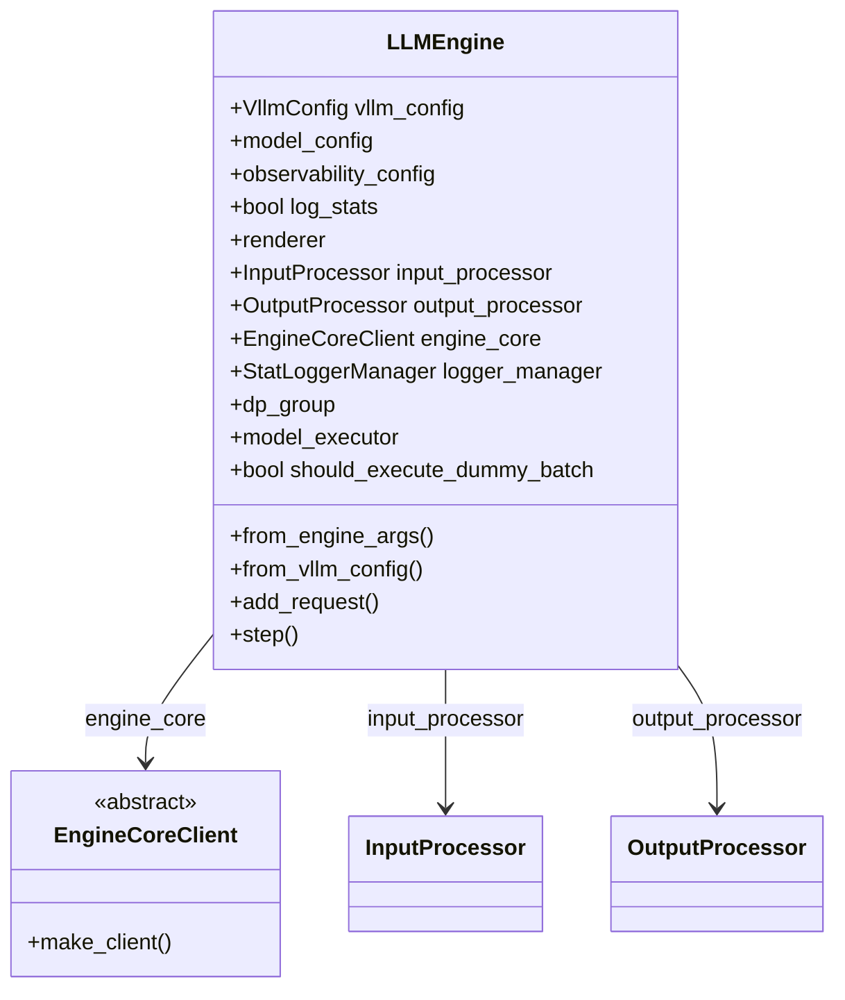
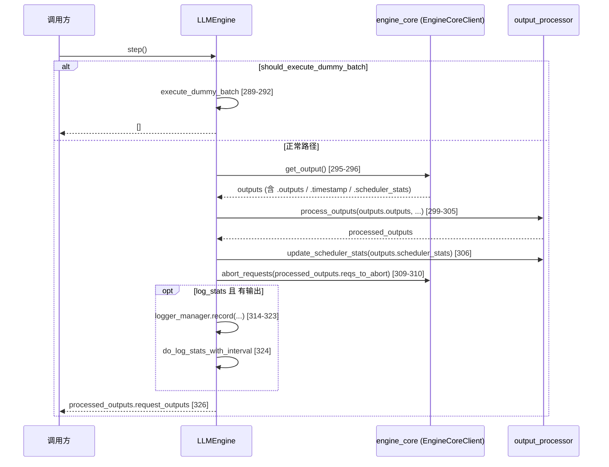

# `LLMEngine` (v1)

## Summary

[`LLMEngine`](d:\design\vllm\vllm\v1\engine\llm_engine.py) 是 v1 的**同步**顶层引擎入口：把 [`InputProcessor`](d:\design\vllm\vllm\v1\engine\input_processor.py)（`EngineInput` → [`EngineCoreRequest`](d:\design\vllm\vllm\v1\engine\__init__.py)）、[`EngineCoreClient`](d:\design\vllm\vllm\v1\engine\core_client.py)（与 [`EngineCore`](d:\design\vllm\vllm\v1\engine\core.py) 通信）与 [`OutputProcessor`](d:\design\vllm\vllm\v1\engine\output_processor.py)（[`EngineCoreOutputs`](d:\design\vllm\vllm\v1\engine\__init__.py) → `RequestOutput`）串在同一进程 API 中；公开文档称保留与旧版 API 兼容（[docstring 47-48](d:\design\vllm\vllm\v1\engine\llm_engine.py)）。公开包名 [`vllm.LLMEngine`](d:\design\vllm\vllm\__init__.py) 经 [`vllm/engine/llm_engine.py`](d:\design\vllm\vllm\engine\llm_engine.py) **别名**指向本类（[4-6](d:\design\vllm\vllm\engine\llm_engine.py)），与异步入口 [`AsyncLLM`](d:\design\vllm\vllm\v1\engine\async_llm.py)（[`AsyncLLMEngine`](d:\design\vllm\vllm\engine\async_llm_engine.py) 别名）并列。

## Sources

| 文件 | 区间 | 用途 |
|------|------|------|
| [d:\design\vllm\vllm\v1\engine\llm_engine.py](d:\design\vllm\vllm\v1\engine\llm_engine.py) | 全文 `1-425` | 本实体主源 |
| [d:\design\vllm\vllm\v1\engine\core_client.py](d:\design\vllm\vllm\v1\engine\core_client.py) | `69-103`（`EngineCoreClient` / `make_client`） | 与 core 的客户端抽象及 `asyncio_mode=False` 分支 |
| [d:\design\vllm\vllm\v1\engine\output_processor.py](d:\design\vllm\vllm\v1\engine\output_processor.py) | `572+`（`process_outputs` 定义行起） | 输出侧 detokenize / 组装 `RequestOutput` |
| [d:\design\vllm\vllm\v1\engine\input_processor.py](d:\design\vllm\vllm\v1\engine\input_processor.py) | 全文 | 输入侧 `process_inputs` |
| [d:\design\vllm\vllm\v1\engine\async_llm.py](d:\design\vllm\vllm\v1\engine\async_llm.py) | `134-155` | 与 `AsyncLLM` 的构造与同构字段对比 |
| [d:\design\vllm\vllm\engine\llm_engine.py](d:\design\vllm\vllm\engine\llm_engine.py) | `1-7` | 公开 `LLMEngine` 符号 → v1 别名 |
| [d:\design\vllm\vllm\__init__.py](d:\design\vllm\vllm\__init__.py) | `16-20` | `LLMEngine` 懒加载导出 |

## 类层次 / 与 v0 `LLMEngine` 的关系

- **继承**：[`LLMEngine`](d:\design\vllm\vllm\v1\engine\llm_engine.py) 无基类（`class LLMEngine:`，[47](d:\design\vllm\vllm\v1\engine\llm_engine.py)）。
- **v0 路径**：历史路径 `vllm.engine.llm_engine:LLMEngine` 现为 v1 类的别名（[4-6](d:\design\vllm\vllm\engine\llm_engine.py)），并非独立实现。
- **工厂**：[`from_vllm_config`](d:\design\vllm\vllm\v1\engine\llm_engine.py)（[136-150](d:\design\vllm\vllm\v1\engine\llm_engine.py)）、[`from_engine_args`](d:\design\vllm\vllm\v1\engine\llm_engine.py)（[152-178](d:\design\vllm\vllm\v1\engine\llm_engine.py)）。

## 主 API

| API | 行号 | 作用 |
|-----|------|------|
| `__init__(vllm_config, executor_class, log_stats, …)` | [50-133](d:\design\vllm\vllm\v1\engine\llm_engine.py) | 初始化 renderer、`InputProcessor`、`OutputProcessor`、[`EngineCoreClient.make_client(asyncio_mode=False)`](d:\design\vllm\vllm\v1\engine\llm_engine.py)、可选 `StatLoggerManager`、DP / `model_executor` 暴露 |
| `from_vllm_config` | [136-150](d:\design\vllm\vllm\v1\engine\llm_engine.py) | 由 `VllmConfig` + 默认 `Executor.get_class` 构造 |
| `from_engine_args` | [152-178](d:\design\vllm\vllm\v1\engine\llm_engine.py) | `EngineArgs.create_engine_config` 后构造；多进程由 `envs.VLLM_ENABLE_V1_MULTIPROCESSING` 与参数共同决定 |
| `get_num_unfinished_requests` | [180-181](d:\design\vllm\vllm\v1\engine\llm_engine.py) | 委托 `output_processor` |
| `has_unfinished_requests` / `has_unfinished_requests_dp` | [183-195](d:\design\vllm\vllm\v1\engine\llm_engine.py) | 结合 DP 与 `dp_engines_running`、`should_execute_dummy_batch` |
| `get_supported_tasks` | [197-202](d:\design\vllm\vllm\v1\engine\llm_engine.py) | 缓存 `engine_core.get_supported_tasks` |
| `abort_request` | [204-208](d:\design\vllm\vllm\v1\engine\llm_engine.py) | 先 `output_processor.abort_requests`，再 `engine_core.abort_requests` |
| `add_request` | [210-286](d:\design\vllm\vllm\v1\engine\llm_engine.py) | 输入处理、`n>1` 时 `ParentRequest` 扇出；`output_processor.add_request` + `engine_core.add_request` |
| `step` | [288-326](d:\design\vllm\vllm\v1\engine\llm_engine.py) | 同步一步：`get_output` → `process_outputs` → 可选 abort / 统计 → 返回 `request_outputs` |
| `start_profile` / `stop_profile` | [328-332](d:\design\vllm\vllm\v1\engine\llm_engine.py) | 委托 `engine_core.profile` |
| `reset_mm_cache` / `reset_prefix_cache` / `reset_encoder_cache` | [334-351](d:\design\vllm\vllm\v1\engine\llm_engine.py) | 委托 `renderer` / `engine_core` |
| `sleep` / `wake_up` / `is_sleeping` | [353-366](d:\design\vllm\vllm\v1\engine\llm_engine.py) | 委托 `engine_core`；sleep 时记录 logger |
| `get_metrics` | [368-370](d:\design\vllm\vllm\v1\engine\llm_engine.py) | 要求 `log_stats`；`get_metrics_snapshot` |
| `tokenizer` / `get_tokenizer` | [372-377](d:\design\vllm\vllm\v1\engine\llm_engine.py) | 来自 `renderer` |
| `do_log_stats` / `do_log_stats_with_interval` | [379-391](d:\design\vllm\vllm\v1\engine\llm_engine.py) | 与 `VLLM_LOG_STATS_INTERVAL` 配合 |
| LoRA：`add_lora` / `remove_lora` / `list_loras` / `pin_lora` | [393-407](d:\design\vllm\vllm\v1\engine\llm_engine.py) | 委托 `engine_core` |
| `collective_rpc` / `apply_model` | [409-419](d:\design\vllm\vllm\v1\engine\llm_engine.py) | 委托 `engine_core` |
| `__del__` | [421-425](d:\design\vllm\vllm\v1\engine\llm_engine.py) | 非 external_launcher DP 时销毁 `dp_group` |

## 调用链：单步 `step()`

锚点：[`step`](d:\design\vllm\vllm\v1\engine\llm_engine.py) [288-326](d:\design\vllm\vllm\v1\engine\llm_engine.py)；dummy batch [289-292](d:\design\vllm\vllm\v1\engine\llm_engine.py)；`get_output` [295-296](d:\design\vllm\vllm\v1\engine\llm_engine.py)；`process_outputs` [301-305](d:\design\vllm\vllm\v1\engine\llm_engine.py)。

## 调用链：`add_request()`

1. **校验** `request_id` 为 `str`（[222-224](d:\design\vllm\vllm\v1\engine\llm_engine.py)）。
2. **输入**：若已是 `EngineCoreRequest`，走废弃路径并可能改 ID（[227-240](d:\design\vllm\vllm\v1\engine\llm_engine.py)）；否则 `input_processor.process_inputs`（[242-252](d:\design\vllm\vllm\v1\engine\llm_engine.py)）与 `extract_prompt_components`（[253](d:\design\vllm\vllm\v1\engine\llm_engine.py)）。
3. `assign_request_id`（[255](d:\design\vllm\vllm\v1\engine\llm_engine.py)）。
4. **`n==1`**：`output_processor.add_request` → `engine_core.add_request`（[264-268](d:\design\vllm\vllm\v1\engine\llm_engine.py)）。
5. **`n>1`**：`ParentRequest` 循环子请求，各自 `output_processor.add_request` + `engine_core.add_request`（[271-284](d:\design\vllm\vllm\v1\engine\llm_engine.py)）。

## 与 `AsyncLLM` 的对比表

| 维度 | `LLMEngine`（sync） | `AsyncLLM`（async） |
|------|---------------------|---------------------|
| 核心客户端构造 | [`EngineCoreClient.make_client(..., asyncio_mode=False)`](d:\design\vllm\vllm\v1\engine\llm_engine.py) [105-108](d:\design\vllm\vllm\v1\engine\llm_engine.py) | [`EngineCoreClient.make_async_mp_client`](d:\design\vllm\vllm\v1\engine\async_llm.py) [147-155](d:\design\vllm\vllm\v1\engine\async_llm.py) |
| 主循环 | 调用方驱动 [`step()`](d:\design\vllm\vllm\v1\engine\llm_engine.py) [288](d:\design\vllm\vllm\v1\engine\llm_engine.py) | `get_output_async` 等 async API + 内部 `output_handler`（见 `async_llm.py:657+`） |
| 输入/输出处理对象 | 同样 `InputProcessor` / `OutputProcessor` [136-145](d:\design\vllm\vllm\v1\engine\async_llm.py) | 同左 |
| 多进程 | 构造参数 `multiprocess_mode` + `make_client` 分支 | 文档语义为后台进程 + async 客户端（[`async_llm.py:147` 注释](d:\design\vllm\vllm\v1\engine\async_llm.py)） |

`synthesis:` 二者在前后端数据类（`EngineCoreRequest` / `EngineCoreOutputs`）上对齐，差异主要在 **同步轮询 `step` vs 异步 `await` 管道** 与 **EngineCoreClient 具体子类**（[`make_client` 文档 74-77](d:\design\vllm\vllm\v1\engine\core_client.py)）。

## §5 step 3 hidden cross-reference grep 结果

以下为在 `d:\design\vllm\` 上执行的 **强论断**（路径按用户表格）。

| # | 类别 | 强论断 |
|---|------|--------|
| 1 | 跨语言绑定 | `LLMEngine`：在 `d:\design\vllm\csrc\` 全 C++/CUDA 树 grep **0 命中**。`EngineClass`：在 `d:\design\vllm\csrc\` 全树 grep **0 命中**。`synthesis:` vLLM 该实体为纯 Python 编排层，与 `csrc` 无直接符号绑定。 |
| 2 | 协作伙伴（`entrypoints/` / `examples/` / `benchmarks/` / `tests/`） | **`LLMEngine`**：`d:\design\vllm\vllm\entrypoints\` 全树 `*.py` **6 处**命中（3 文件：`run_batch.py`、`llm.py`、`cli/run_batch.py`）；`d:\design\vllm\examples\` **24 处**命中（4 文件，均为 `offline_inference/*`）；`d:\design\vllm\benchmarks\` 根目录 **0 命中**；`d:\design\vllm\vllm\benchmarks\` **4 处**命中（`mm_processor.py`）；`d:\design\vllm\tests\` **14 处**命中（7 文件）。**`EngineCoreClient`**：`entrypoints/` **0**、`examples/` **0**、`benchmarks/`（根与 `vllm\benchmarks`）**0**、`tests/` **13 处**（仅 `tests\v1\engine\test_engine_core_client.py`）。**`OutputProcessor`**：`entrypoints/` **0**、`examples/` **0**、`vllm\benchmarks` **0**、`tests/` **12 处**（`test_output_processor.py`、`test_nixl_connector.py`）。**`InputProcessor`**：`entrypoints/` **1 处**（`serve/disagg/protocol.py`）；`examples/` **0**；`tests/` **0**。 |
| 3 | 配置 / IPC 共享数据结构 | `EngineArgs` / `VllmConfig` / `EngineCoreRequest` / `EngineCoreOutputs` 在仓库 `*.py` 中**大量**跨模块出现：`EngineArgs` 单次列举 **≥80 文件**（检索分页截断）；`VllmConfig` 同理 **≥80 文件**；`EngineCoreRequest` **24 文件**有命中；`EngineCoreOutputs` **12 文件**有命中。`LLMEngine` 内直接耦合点：`VllmConfig` 构造与字段 [62-64](d:\design\vllm\vllm\v1\engine\llm_engine.py)；`from_engine_args` + `create_engine_config` [163](d:\design\vllm\vllm\v1\engine\llm_engine.py)；`step` 消费含 `EngineCoreOutputs` 语义的 `outputs`（[294-306](d:\design\vllm\vllm\v1\engine\llm_engine.py)）。 |
| 4 | 测试覆盖反查 | 在 `d:\design\vllm\tests\v1\engine\` 全树 `*.py` grep 符号 `\bLLMEngine\b`：**0 命中**（含 `test_llm_engine.py`：该文件通过 `from vllm import LLM` 间接测引擎，**不**直接引用 `LLMEngine` 类名）。其它目录直接引用 `LLMEngine` 的测试见上表（如 `tests\v1\executor\test_executor.py` 等）。 |
| 5 | doc / config 反查 | `docs/`：`LLMEngine` **20 处**命中（**7** 个文件：`arch_overview.md`、`api/README.md`、`contributing/README.md`、`design/metrics.md`、`design/multiprocessing.md`、`serving/offline_inference.md`、`training/async_rl.md`）。`examples/*.py`：见上表 **24 处**（**4** 文件）。`*.yaml` / `*.yml` / `*.json` / `*.toml` 全树 grep `LLMEngine`：**0 命中**。`synthesis:` [`docs/design/arch_overview.md`](d:\design\vllm\docs\design\arch_overview.md) 仍将源码链接写到 `vllm/engine/llm_engine.py`（[171](d:\design\vllm\docs\design\arch_overview.md) 一带），与当前「薄别名 → v1 实现」并存，见下方 **CONTRADICTION**。 |

## Notes / Caveats

> ~~[!todo] VERIFY: `usage_context` 传入 `__init__` [56](d:\design\vllm\vllm\v1\engine\llm_engine.py) 但实例体内未见 `self.usage_context`；仅 `from_engine_args` 中用于 `create_engine_config(usage_context)` [163](d:\design\vllm\vllm\v1\engine\llm_engine.py)。~~
>
> **RESOLVED 2026-04-18**：`usage_context` 在 [llm_engine.py:56](d:\design\vllm\vllm\v1\engine\llm_engine.py) 为形参但 `__init__` 未写入实例；`from_engine_args` 在 [llm_engine.py:163](d:\design\vllm\vllm\v1\engine\llm_engine.py) 用于 `create_engine_config` 后再传入 `cls`；`from_vllm_config` 传入见 [llm_engine.py:143-149](d:\design\vllm\vllm\v1\engine\llm_engine.py) 但构造体内仍不消费——**API 兼容占位**（dead parameter on the instance level；config 构建期已消费）。

> ~~[!todo] VERIFY: 构造参数 `use_cached_outputs` [59](d:\design\vllm\vllm\v1\engine\llm_engine.py) 在 `__init__` 体内未见使用。~~
>
> **RESOLVED 2026-04-18**：全仓库仅 [llm_engine.py:59](d:\design\vllm\vllm\v1\engine\llm_engine.py) 与 [async_llm.py:80](d:\design\vllm\vllm\v1\engine\async_llm.py) 签名/docstring 出现 `use_cached_outputs`，**无任何读取**；当前为 dead parameter（v0 兼容签名占位）。

> [!warning] CONTRADICTION: 上游文档 [`docs/design/arch_overview.md`](d:\design\vllm\docs\design\arch_overview.md) 描述「`LLMEngine` 代码位于 `vllm/engine/llm_engine.py`」（[arch_overview.md:171](d:\design\vllm\docs\design\arch_overview.md)，**verify 2026-04-18 仍为旧表述**）；该文件现为 v1 的别名（[engine/llm_engine.py:4-6](d:\design\vllm\vllm\engine\llm_engine.py)），主实现位于 [`vllm/v1/engine/llm_engine.py`](d:\design\vllm\vllm\v1\engine\llm_engine.py)。以源码为准；待上游 docs 修订后改 RESOLVED。

## See also

- [vllm/entities/EngineCore.md](EngineCore.md)
- [vllm/entities/EngineCoreClient.md](EngineCoreClient.md)
- [vllm/entities/AsyncLLM.md](AsyncLLM.md)
- [vllm/entities/OutputProcessor.md](OutputProcessor.md)（同批 P1 ingest）
- [vllm/topics/request-lifecycle.md](../topics/request-lifecycle.md)
- [vllm/topics/multiproc-ipc.md](../topics/multiproc-ipc.md)
- [vllm/modules/engine.md](../modules/engine.md)
- [comparison/topics/engine-architecture.md](../../comparison/topics/engine-architecture.md)
