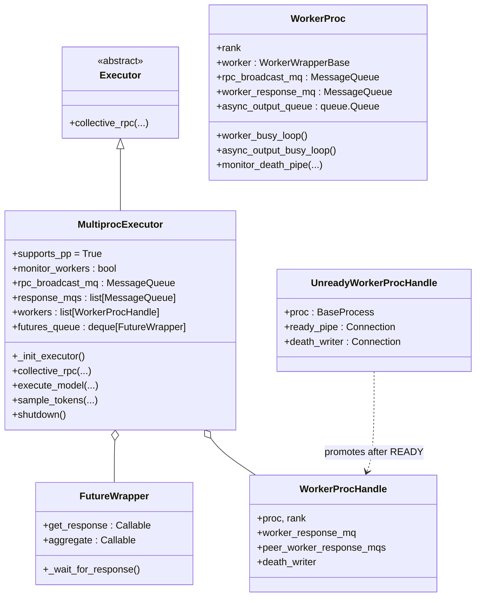
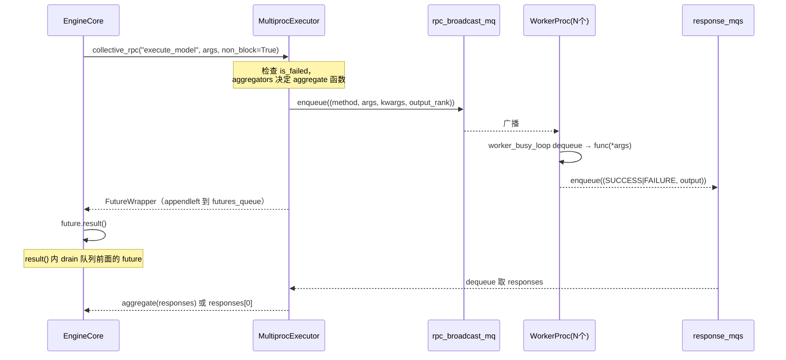

# `MultiprocExecutor` (and `WorkerProc`, `WorkerProcHandle`, `FutureWrapper`)

## Summary
`MultiprocExecutor` 是 vLLM v1 的多进程 worker 编排器（[multiproc_executor.py:111](d:\design\vllm\vllm\v1\executor\multiproc_executor.py)），**用 `multiprocessing` spawn 出 N=world_size 个 worker 子进程**，每个跑 `WorkerProc.worker_main`。主→worker 用 1 个共享内存广播队列（`MessageQueue`）下发 `SchedulerOutput`，worker→主用每 worker 一个 `MessageQueue` 回送 `ModelRunnerOutput`。生命周期管理用 `multiprocessing.Pipe` 做 ready 信号 + death 信号双通道。

## Sources
- 全文：[d:\design\vllm\vllm\v1\executor\multiproc_executor.py](d:\design\vllm\vllm\v1\executor\multiproc_executor.py)（1122 行）
- 父类：[d:\design\vllm\vllm\v1\executor\abstract.py:38](d:\design\vllm\vllm\v1\executor\abstract.py)
- 共享内存队列：[vllm/distributed/device_communicators/shm_broadcast.py](d:\design\vllm\vllm\distributed\device_communicators\shm_broadcast.py)（`MessageQueue`, `Handle`）

## 类层次



## `_init_executor` 启动流程（[multiproc_executor.py:118-266](d:\design\vllm\vllm\v1\executor\multiproc_executor.py)）

> **入口**：被 `Executor.__init__` 调用 ([abstract.py:110](d:\design\vllm\vllm\v1\executor\abstract.py))；`MultiprocExecutor.__init__` 本期新增 `monitor_workers: bool` 参数（headless 场景可关监控线程，[multiproc_executor.py:114-116](d:\design\vllm\vllm\v1\executor\multiproc_executor.py)）

1. **注册 finalizer** 保证退出时一定 shutdown ([multiproc_executor.py:121](d:\design\vllm\vllm\v1\executor\multiproc_executor.py))
2. **算 parallel sizes**：`tp_size * pp_size * pcp_size == world_size` ([multiproc_executor.py:125-131](d:\design\vllm\vllm\v1\executor\multiproc_executor.py))；`_get_parallel_sizes` 在 [multiproc_executor.py:279-290](d:\design\vllm\vllm\v1\executor\multiproc_executor.py)
3. `set_multiprocessing_worker_envs(num_local_procs)` — 按本地进程数分配 torch CPU 线程（不再固定 `OMP_NUM_THREADS=1`，本期变更）([multiproc_executor.py:133-136, 1093-1122](d:\design\vllm\vllm\v1\executor\multiproc_executor.py))
4. 算 distributed init method：默认 **`file://` store**（消除启动端口竞争，本期变更）；仅 AITER custom all-reduce 需要时回退 `tcp://<loopback>:<open_port>` ([multiproc_executor.py:138-143](d:\design\vllm\vllm\v1\executor\multiproc_executor.py))
5. **DP 主节点**才创建 `rpc_broadcast_mq` 并 `export_handle()`（[multiproc_executor.py:144-170](d:\design\vllm\vllm\v1\executor\multiproc_executor.py)）
6. 创建 `shared_worker_lock` ([multiproc_executor.py:172-173](d:\design\vllm\vllm\v1\executor\multiproc_executor.py))
7. **循环 spawn workers**：每个 local_rank 一个 `WorkerProc.make_worker_process(...)`，并计算 `is_driver_worker`（[multiproc_executor.py:189-208, 295-296](d:\design\vllm\vllm\v1\executor\multiproc_executor.py)）。CPU 平台套一层 `OMPProcessManager` ([multiproc_executor.py:188, 192-194](d:\design\vllm\vllm\v1\executor\multiproc_executor.py))
8. **fork 模式**特殊处理 inherited fds，用于让后续 worker 关闭已 inherit 但属于其它 worker 的 pipe fd ([multiproc_executor.py:180-185, 206-208](d:\design\vllm\vllm\v1\executor\multiproc_executor.py))
9. `WorkerProc.wait_for_ready(unready_workers)` 阻塞等所有 worker 通过 ready_pipe 发送 `READY` 字符串 ([multiproc_executor.py:214](d:\design\vllm\vllm\v1\executor\multiproc_executor.py))；随后 `set_torch_threads_for_runtime()`（executor 进程只调度，不留 intra-op 线程，本期新增 [multiproc_executor.py:216-220](d:\design\vllm\vllm\v1\executor\multiproc_executor.py)）
10. `monitor_workers=True` 时启动 worker 健康监控线程 `start_worker_monitor()` ([multiproc_executor.py:222-224](d:\design\vllm\vllm\v1\executor\multiproc_executor.py))
11. 装配 `response_mqs`：本地 worker 用 `worker_response_mq`，远端用 `peer_worker_response_mqs` ([multiproc_executor.py:226-239](d:\design\vllm\vllm\v1\executor\multiproc_executor.py))
12. **MQ 双向 wait_until_ready**（**有顺序依赖，颠倒会死锁**）：
    - 先 `rpc_broadcast_mq.wait_until_ready()` ([multiproc_executor.py:244-246](d:\design\vllm\vllm\v1\executor\multiproc_executor.py))
    - 再 `for response_mq in self.response_mqs: response_mq.wait_until_ready()` ([multiproc_executor.py:247-249](d:\design\vllm\vllm\v1\executor\multiproc_executor.py))
13. `futures_queue = deque[FutureWrapper]()`；`_post_init_executor()` 子类 hook（本期新增） ([multiproc_executor.py:251-253, 292-293](d:\design\vllm\vllm\v1\executor\multiproc_executor.py))
14. 失败回滚：关 death_writer 后 `_ensure_worker_termination` ([multiproc_executor.py:256-264](d:\design\vllm\vllm\v1\executor\multiproc_executor.py))
15. `output_rank = _get_output_rank()` — TP=0 + PP rank=-1（最后一个 PP stage 的 TP 0） ([multiproc_executor.py:266, 541-555](d:\design\vllm\vllm\v1\executor\multiproc_executor.py))

## `collective_rpc` 核心 RPC（[multiproc_executor.py:375-448](d:\design\vllm\vllm\v1\executor\multiproc_executor.py)）

签名：`collective_rpc(method, timeout, args, kwargs, non_block, unique_reply_rank, kv_output_aggregator, ec_output_aggregator)` → `Any`（本期新增 `ec_output_aggregator` 参数）



要点：

- **路径选择**（[multiproc_executor.py:397-414](d:\design\vllm\vllm\v1\executor\multiproc_executor.py)）：
  - 有 `kv_output_aggregator` / `ec_output_aggregator`（PD 分离 / EC 分离场景）：`output_rank=None`（收所有 ranks 的输出），本期改为**可链式聚合**——`_aggregate` 依次让每个 aggregator 在 `outputs[rank]` 上原位合并
  - 否则：`output_rank=unique_reply_rank`，`aggregate=identity`
- **方法序列化**（[multiproc_executor.py:416-420](d:\design\vllm\vllm\v1\executor\multiproc_executor.py)）：字符串方法名直接发；callable 用 `cloudpickle.dumps(method, protocol=HIGHEST_PROTOCOL)` 序列化（worker 端 [multiproc_executor.py:1039-1040](d:\design\vllm\vllm\v1\executor\multiproc_executor.py) 用 `cloudpickle.loads` 还原 + `partial(..., self.worker)`）
- **Future 队列保证顺序**（[multiproc_executor.py:78-108](d:\design\vllm\vllm\v1\executor\multiproc_executor.py)）：`FutureWrapper.result()` 会先 drain 队列里排在它前面的所有 future，避免乱序拿到响应
- 超时控制：`deadline = None if timeout is None else time.monotonic() + timeout` → 每次 `mq.dequeue(timeout=...)` 用剩余时间且 `max(0.0, ...)` 截断（本期修复 stale deadline 变成无限等待的 bug）([multiproc_executor.py:394, 429-431](d:\design\vllm\vllm\v1\executor\multiproc_executor.py))
- 任意 worker 返 `FAILURE` 立刻 raise `RuntimeError` ([multiproc_executor.py:436-440](d:\design\vllm\vllm\v1\executor\multiproc_executor.py))
- 必须在 leader 节点（DP 内）调，follower 调会断言 ([multiproc_executor.py:388-390](d:\design\vllm\vllm\v1\executor\multiproc_executor.py))

## 高层 API

| 方法 | 行号 | 实现 |
|---|---|---|
| `execute_model(scheduler_output, non_block)` | [340-351](d:\design\vllm\vllm\v1\executor\multiproc_executor.py) | `collective_rpc("execute_model", ..., unique_reply_rank=output_rank, timeout=VLLM_EXECUTE_MODEL_TIMEOUT_SECONDS, kv_output_aggregator=..., ec_output_aggregator=...)` |
| `sample_tokens(grammar_output, non_block)` | [353-364](d:\design\vllm\vllm\v1\executor\multiproc_executor.py) | 同上风格 |
| `execute_dummy_batch()` | [366-367](d:\design\vllm\vllm\v1\executor\multiproc_executor.py) | warmup 用 |
| `take_draft_token_ids()` | [369-373](d:\design\vllm\vllm\v1\executor\multiproc_executor.py) | spec decode 取 draft，**只从 output_rank 取**，注释明示是 OPTIMIZATION |
| `check_health()` | [537-539](d:\design\vllm\vllm\v1\executor\multiproc_executor.py) | `collective_rpc("check_health", timeout=10)` |
| `get_response_mqs(unique_reply_rank)` | [268-277](d:\design\vllm\vllm\v1\executor\multiproc_executor.py) | 本期新增：按 rank 取 response MQ 列表 |
| `supports_async_scheduling()` (classmethod) | [557-559](d:\design\vllm\vllm\v1\executor\multiproc_executor.py) | 返 True |
| `register_failure_callback(callback)` | [334-338](d:\design\vllm\vllm\v1\executor\multiproc_executor.py) | 失败已发生则立即调，否则存起来 |

~~`max_concurrent_batches` (cached_property)：`pp_size` if pp>1 else (`2` if `async_scheduling` else `1`)~~
**RESOLVED 2026-08-18**：该 property 已从 `MultiprocExecutor` / `Executor` 基类**移除**，迁移为 `VllmConfig.max_concurrent_batches`（[d:\design\vllm\vllm\config\vllm.py:L549-554](d:\design\vllm\vllm\config\vllm.py)，commit `cab5c9a2a9` "[Core] Move max_concurrent_batches to VllmConfig"），逻辑不变（PP 需 pp_size 个并发批；async scheduling 需 2）。

## Worker 监控（[multiproc_executor.py:298-332](d:\design\vllm\vllm\v1\executor\multiproc_executor.py)）

后台线程 `monitor_workers()`：

- `multiprocessing.connection.wait([h.proc.sentinel for h in workers])` 阻塞等任一 worker 进程结束 ([multiproc_executor.py:306-307](d:\design\vllm\vllm\v1\executor\multiproc_executor.py))
- 任意 worker 死 → `is_failed = True` + 记录死掉的进程名与 **exit code**（本期新增）+ 触发 `shutdown()` + 调 `failure_callback` ([multiproc_executor.py:308-324](d:\design\vllm\vllm\v1\executor\multiproc_executor.py))
- 支持 `inline=True` 同步跑（headless 用法，本期新增 [multiproc_executor.py:326-332](d:\design\vllm\vllm\v1\executor\multiproc_executor.py)）
- `failure_callback` 由 `EngineCoreProc` 注册成 "把 EXECUTOR_FAILED put 到 input_queue"（[engine/core.py:136, 1028-1029](d:\design\vllm\vllm\v1\engine\core.py)）

## 优雅关闭（[multiproc_executor.py:450-535](d:\design\vllm\vllm\v1\executor\multiproc_executor.py)）

`_ensure_worker_termination` 三段式：

1. 等 `VLLM_WORKER_SHUTDOWN_TIMEOUT_SECONDS`（默认 5s，本期由固定 4s 改为可配 env，[envs.py:242](d:\design\vllm\vllm\envs.py)）让 worker 自然退出（关 death_writer 后 worker 端 death_pipe.recv() 会 EOFError） ([multiproc_executor.py:471-480](d:\design\vllm\vllm\v1\executor\multiproc_executor.py))
2. 不行 → `proc.terminate()`（SIGTERM）等 4s ([multiproc_executor.py:482-491](d:\design\vllm\vllm\v1\executor\multiproc_executor.py))
3. 还不行 → `proc.kill()`（SIGKILL） ([multiproc_executor.py:492-500](d:\design\vllm\vllm\v1\executor\multiproc_executor.py))

`shutdown()` 序列（[multiproc_executor.py:502-535](d:\design\vllm\vllm\v1\executor\multiproc_executor.py)）：

1. 标 `shutting_down = True`（防重入） ([multiproc_executor.py:504-510](d:\design\vllm\vllm\v1\executor\multiproc_executor.py))
2. 关每个 worker 的 `death_writer` → 触发 worker 端 EOFError → graceful exit ([multiproc_executor.py:513-518](d:\design\vllm\vllm\v1\executor\multiproc_executor.py))
3. `_ensure_worker_termination` ([multiproc_executor.py:519](d:\design\vllm\vllm\v1\executor\multiproc_executor.py))
4. 关每个 `worker_response_mq` ([multiproc_executor.py:521-525](d:\design\vllm\vllm\v1\executor\multiproc_executor.py))
5. 关 `rpc_broadcast_mq` ([multiproc_executor.py:527-529](d:\design\vllm\vllm\v1\executor\multiproc_executor.py))
6. 关所有 `response_mqs` ([multiproc_executor.py:530-533](d:\design\vllm\vllm\v1\executor\multiproc_executor.py))

（本期各阶段加了结构化 `[shutdown]` 日志。）

## `WorkerProc` 子进程内（[multiproc_executor.py:600-1055](d:\design\vllm\vllm\v1\executor\multiproc_executor.py)）

### `make_worker_process` 静态工厂（[multiproc_executor.py:704-755](d:\design\vllm\vllm\v1\executor\multiproc_executor.py)）

- 创建 ready_pipe（duplex=False，子→父） ([multiproc_executor.py:717](d:\design\vllm\vllm\v1\executor\multiproc_executor.py))
- 创建 death_pipe（duplex=False，父→子） ([multiproc_executor.py:719](d:\design\vllm\vllm\v1\executor\multiproc_executor.py))
- `context.Process(target=WorkerProc.worker_main, kwargs=..., name=f"VllmWorker-{rank}", daemon=True)` ([multiproc_executor.py:737-742](d:\design\vllm\vllm\v1\executor\multiproc_executor.py))
- NUMA binding：`numa_utils.configure_subprocess(...)` 上下文内启动 ([multiproc_executor.py:744-748](d:\design\vllm\vllm\v1\executor\multiproc_executor.py))
- 父端关 child 端，保持 death_writer 在父进程开着 — 父退出 → death_pipe 的 reader 在 child 触发 EOFError ([multiproc_executor.py:750-755](d:\design\vllm\vllm\v1\executor\multiproc_executor.py))

### `worker_main` 子进程入口（[multiproc_executor.py:852-976](d:\design\vllm\vllm\v1\executor\multiproc_executor.py)）

1. 安装 SIGTERM/SIGINT signal handler，`shutdown_requested.set() + raise SystemExit` ([multiproc_executor.py:860-873](d:\design\vllm\vllm\v1\executor\multiproc_executor.py))
2. 发布 `assigned_physical_gpu_ids` 映射 + `set_worker_net_device`（`VLLM_GPU_NIC_PCIE_MAPPING` 时按 GPU 选 RDMA NIC，本期新增，实现于 [vllm_net_devices.py](d:\design\vllm\vllm\v1\executor\vllm_net_devices.py)）([multiproc_executor.py:875-886](d:\design\vllm\vllm\v1\executor\multiproc_executor.py))
3. 关 inherited fds（防止 fork 模式残留） ([multiproc_executor.py:892-900](d:\design\vllm\vllm\v1\executor\multiproc_executor.py))
4. 初始化 tracer ([multiproc_executor.py:902-909](d:\design\vllm\vllm\v1\executor\multiproc_executor.py))
5. 实例化 `WorkerProc(*args, **kwargs)` — 在 `__init__` 内：init_worker + init_device + load_model + async output thread + 按 attention backend 定 block_size + `_init_message_queues` ([multiproc_executor.py:639-702](d:\design\vllm\vllm\v1\executor\multiproc_executor.py))
6. 启 `monitor_death_pipe` 线程：父进程退出 → recv EOFError → shutdown 所有 MQ ([multiproc_executor.py:827-850, 916](d:\design\vllm\vllm\v1\executor\multiproc_executor.py))
7. **送 READY** 给父进程：`ready_writer.send({"status": "READY", "handle": ..., "peer_response_handles": ...})` ([multiproc_executor.py:918-925](d:\design\vllm\vllm\v1\executor\multiproc_executor.py))
8. 双 MQ wait_until_ready（必须与 Executor 端**同序**） ([multiproc_executor.py:927-931](d:\design\vllm\vllm\v1\executor\multiproc_executor.py))
9. 进入 `worker.worker_busy_loop()` ([multiproc_executor.py:935](d:\design\vllm\vllm\v1\executor\multiproc_executor.py))
10. 异常处理：失败时 `shutdown_requested.set()` 防止 `__del__` 时再次抛异常引发 zmq 异常 ([multiproc_executor.py:937-967](d:\design\vllm\vllm\v1\executor\multiproc_executor.py))

### `worker_busy_loop` （[multiproc_executor.py:1029-1054](d:\design\vllm\vllm\v1\executor\multiproc_executor.py)）

```python
while True:
    method, args, kwargs, output_rank = self.rpc_broadcast_mq.dequeue(indefinite=True)
    try:
        if isinstance(method, str):
            func = getattr(self.worker, method)
        elif isinstance(method, bytes):
            func = partial(cloudpickle.loads(method), self.worker)
        output = func(*args, **kwargs)
        if output_rank is None or self.rank == output_rank:
            self.handle_output(output)
    except Exception as e:
        if hasattr(e, "add_note"): e.add_note(traceback.format_exc())
        if output_rank is None or self.rank == output_rank:
            self.handle_output(e)   # 异常作 FAILURE 回送
```

要点：

- `output_rank=None` → **所有 rank 都回送**（KV/EC connector 聚合场景）
- `output_rank=int` → 只该 rank 回送（默认场景，省带宽）
- 字节串方法走 `cloudpickle.loads`，让前端能传任意 callable

### Async output（[multiproc_executor.py:982-1027](d:\design\vllm\vllm\v1\executor\multiproc_executor.py)）

- 当 `scheduler_config.async_scheduling=True` 时，构造时启 `async_output_copy_thread`（[multiproc_executor.py:682-691](d:\design\vllm\vllm\v1\executor\multiproc_executor.py)）
- `handle_output` 把 output put 到 `async_output_queue`，由 thread 取出后 `enqueue_output` 到 MQ（[multiproc_executor.py:1001-1027](d:\design\vllm\vllm\v1\executor\multiproc_executor.py)）
- 本期变更：`enqueue_output` 统一负责把 `AsyncModelRunnerOutput.get_output()` 解包（异常转 FAILURE），简化 MRV2 异步输出路径（[multiproc_executor.py:982-999](d:\design\vllm\vllm\v1\executor\multiproc_executor.py)）
- 线程内 `current_platform.set_device(...)` 确保 cuda context 与主线程一致（避免新建 cuda context 占内存） ([multiproc_executor.py:1011-1023](d:\design\vllm\vllm\v1\executor\multiproc_executor.py))

### `_init_message_queues` （[multiproc_executor.py:607-637](d:\design\vllm\vllm\v1\executor\multiproc_executor.py)）

- 单节点（`nnodes_within_dp == 1`）：直接用 `MessageQueue.create_from_handle(input_shm_handle, rank)` 创建本地接收端
- 多节点：通过 `get_inner_dp_world_group().create_mq_broadcaster(...)` 跨节点 MQ；用 `create_single_reader_mq_broadcasters` 给所有 ranks 暴露给 driver worker 的 `peer_response_handles`

## `setup_proc_title_and_log_prefix` （[multiproc_executor.py:1057-1092](d:\design\vllm\vllm\v1\executor\multiproc_executor.py)）

进程名按并行模式拼：`Worker_DP{r}_PP{r}_PCP{r}_TP{r}_DCP{r}_EP{r}`，方便 `ps` / 日志区分。

## Increment 2026-08-18 (vLLM 5f7fab88 → d29dc3ab)

本期 `multiproc_executor.py` 1047 → 1122 行（17 个 commit，+153/-78），全页锚点已重排。结构性/行为变化：

- **`max_concurrent_batches` 移除**：迁移到 `VllmConfig`（见上方 RESOLVED，[d:\design\vllm\vllm\config\vllm.py:L549-554](d:\design\vllm\vllm\config\vllm.py)）。
- **rendezvous 改 `file://` store**：单节点默认用 `get_file_store_init_method()`（[d:\design\vllm\vllm\utils\network_utils.py:L135](d:\design\vllm\vllm\utils\network_utils.py)）替代 `tcp://loopback:port`，消除启动端口竞争；AITER custom all-reduce 场景例外（[d:\design\vllm\vllm\v1\executor\multiproc_executor.py:L138-143](d:\design\vllm\vllm\v1\executor\multiproc_executor.py)）。
- **collective_rpc**：新增 `ec_output_aggregator`（EC/encoder 分离）且 KV/EC aggregator 可链式合并（[d:\design\vllm\vllm\v1\executor\multiproc_executor.py:L397-414](d:\design\vllm\vllm\v1\executor\multiproc_executor.py)）；修复 stale deadline 变无限等待（`max(0.0, deadline - now)`，[L429-431](d:\design\vllm\vllm\v1\executor\multiproc_executor.py)）。
- **CPU 线程管理**：`set_multiprocessing_worker_envs(local_world_size)` 按本地进程数分配 torch 线程；executor 进程 `set_torch_threads_for_runtime()`（[d:\design\vllm\vllm\v1\executor\multiproc_executor.py:L133-136](d:\design\vllm\vllm\v1\executor\multiproc_executor.py)、[L216-220](d:\design\vllm\vllm\v1\executor\multiproc_executor.py)、[L1093-1122](d:\design\vllm\vllm\v1\executor\multiproc_executor.py)）。
- **RDMA NIC 选择**：新文件 [d:\design\vllm\vllm\v1\executor\vllm_net_devices.py](d:\design\vllm\vllm\v1\executor\vllm_net_devices.py)（243 行），`worker_main` 早期按 `VLLM_GPU_NIC_PCIE_MAPPING` 为每个 worker 设 NIC env（[d:\design\vllm\vllm\v1\executor\multiproc_executor.py:L885-886](d:\design\vllm\vllm\v1\executor\multiproc_executor.py)）。
- **headless / 子类扩展**：`__init__(monitor_workers)`（[L114-116](d:\design\vllm\vllm\v1\executor\multiproc_executor.py)）、`start_worker_monitor(inline)`（[L298-332](d:\design\vllm\vllm\v1\executor\multiproc_executor.py)）、`_post_init_executor()` hook（[L292-293](d:\design\vllm\vllm\v1\executor\multiproc_executor.py)）、`get_response_mqs()`（[L268-277](d:\design\vllm\vllm\v1\executor\multiproc_executor.py)）。
- **可观测性 / 关闭路径**：worker 意外死亡记录 exit code（[L313-319](d:\design\vllm\vllm\v1\executor\multiproc_executor.py)）；graceful 等待时间改 env `VLLM_WORKER_SHUTDOWN_TIMEOUT_SECONDS`（[d:\design\vllm\vllm\envs.py:L242](d:\design\vllm\vllm\envs.py)）；`[shutdown]` 结构化日志。
- **MRV2 异步输出简化**：`enqueue_output` 统一解包 `AsyncModelRunnerOutput`（[L982-999](d:\design\vllm\vllm\v1\executor\multiproc_executor.py)，commit `cf027b86af`）。

## Notes / Caveats
> [!todo] VERIFY: `MessageQueue` 内部实现（共享内存环形 buffer 的具体协议） — 在 [vllm/distributed/device_communicators/shm_broadcast.py](d:\design\vllm\vllm\distributed\device_communicators\shm_broadcast.py)，待 ingest。
> [!todo] VERIFY: 多节点 DP 时 `create_mq_broadcaster` / `create_single_reader_mq_broadcasters` 的协议（涉及 `inner_dp_world_group`）。
> [!warning] CONTRADICTION: [multiproc_executor.py:652](d:\design\vllm\vllm\v1\executor\multiproc_executor.py) 注释 `# TODO: move \`init_worker\` to executor level as a collective rpc call` 表明当前 init_worker 在 worker 进程构造时就跑（而非通过 RPC），后续可能重构（2026-08-18 复核：注释仍在）。
> [!todo] VERIFY: `_get_output_rank` 公式 `world_size - tp_size * pcp_size` 在 PP=1 + PCP>1 场景下是否正确（[multiproc_executor.py:541-555](d:\design\vllm\vllm\v1\executor\multiproc_executor.py)）。

## See also
- [modules/executor.md](../modules/executor.md)
- [entities/EngineCore.md](EngineCore.md)
- [topics/multiproc-ipc.md](../topics/multiproc-ipc.md) — 详解 MQ + Pipe + Signal 三类 IPC
- [topics/request-lifecycle.md](../topics/request-lifecycle.md) — 看 collective_rpc 在端到端中的位置
