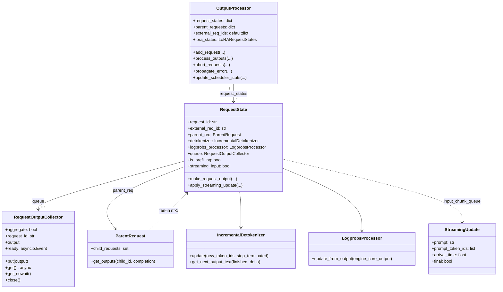
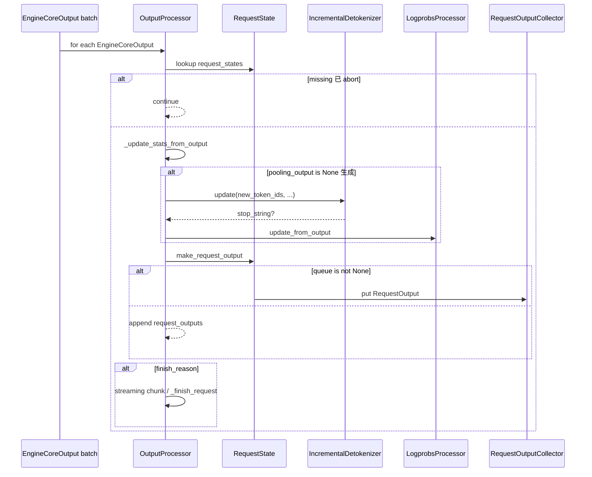

# `OutputProcessor` (and `RequestState` / `RequestOutputCollector`)

## Summary

`OutputProcessor` 将 [`EngineCoreOutput`](d:\design\vllm\vllm\v1\engine\__init__.py) 批次转为面向用户的 [`RequestOutput`](d:\design\vllm\vllm\outputs.py) / [`PoolingRequestOutput`](d:\design\vllm\vllm\outputs.py)，并在 `process_outputs` 的**唯一全批次循环**中完成统计、增量 detokenize、logprobs 与完成/中止处理（[output_processor.py:572-687](d:\design\vllm\vllm\v1\engine\output_processor.py)）。`AsyncLLM` 路径下每请求挂一个 `RequestOutputCollector`，由后台 output handler 调用 `put`、[`generate`](d:\design\vllm\vllm\v1\engine\async_llm.py) 协程 `get`/`get_nowait` 消费（分工见下文）；`LLMEngine` 路径无 queue，则把结果收集到返回列表（[output_processor.py:655-660](d:\design\vllm\vllm\v1\engine\output_processor.py)）。

## Sources

- 全文：[d:\design\vllm\vllm\v1\engine\output_processor.py](d:\design\vllm\vllm\v1\engine\output_processor.py)（约 812 行）
- 全文：[d:\design\vllm\vllm\v1\engine\detokenizer.py](d:\design\vllm\vllm\v1\engine\detokenizer.py)
- 全文：[d:\design\vllm\vllm\v1\engine\logprobs.py](d:\design\vllm\vllm\v1\engine\logprobs.py)
- 全文：[d:\design\vllm\vllm\v1\engine\parallel_sampling.py](d:\design\vllm\vllm\v1\engine\parallel_sampling.py)
- 聚合引用：[d:\design\vllm\vllm\v1\engine\llm_engine.py:96-326](d:\design\vllm\vllm\v1\engine\llm_engine.py)
- 聚合引用：[d:\design\vllm\vllm\v1\engine\async_llm.py:139-715](d:\design\vllm\vllm\v1\engine\async_llm.py)

## 类层次（mermaid classDiagram）

## OutputProcessor 主 API

| API | 行号 | 作用 |
|-----|------|------|
| `__init__(tokenizer, log_stats=, stream_interval=, tracing_enabled=)` | [416-431](d:\design\vllm\vllm\v1\engine\output_processor.py) | 初始化 per-request 表、`parent_requests`、`external_req_ids` 映射与 LoRA 统计状态 |
| `get_num_unfinished_requests` / `has_unfinished_requests` | [433-437](d:\design\vllm\vllm\v1\engine\output_processor.py) | 未完成请求计数 |
| `propagate_error(e)` | [439-444](d:\design\vllm\vllm\v1\engine\output_processor.py) | 向所有未完成请求的 `queue` 注入异常（AsyncLLM output_handler 失败路径） |
| `abort_requests(request_ids, internal)` | [446-506](d:\design\vllm\vllm\v1\engine\output_processor.py) | 按外部/内部 ID 解析、移除状态、必要时对子请求递归中止，并产出 `FinishReason.ABORT` 的最终输出 |
| `add_request(request, prompt, parent_req=, request_index=, queue=)` | [508-537](d:\design\vllm\vllm\v1\engine\output_processor.py) | 新建或更新（流式输入）`RequestState`，登记父子与 external→internal 映射 |
| `_update_streaming_request_state` | [539-570](d:\design\vllm\vllm\v1\engine\output_processor.py) | 流式输入：排队 `StreamingUpdate` 或收尾（`STREAM_FINISHED`） |
| `process_outputs(engine_core_outputs, ...)` | [572-687](d:\design\vllm\vllm\v1\engine\output_processor.py) | 核心：统计 → detokenize/logprobs → 组装输出 → 清理；返回 `OutputProcessorOutput` |
| `_finish_request` | [689-701](d:\design\vllm\vllm\v1\engine\output_processor.py) | 从各映射中移除已完成请求 |
| `update_scheduler_stats` | [703-704](d:\design\vllm\vllm\v1\engine\output_processor.py) | 转发 LoRA 调度统计 |
| `do_tracing` / `_update_stats_from_output` / `_update_stats_from_finished` | [706-812](d:\design\vllm\vllm\v1\engine\output_processor.py) | 可观测性与迭代统计 |

## RequestState 字段表与状态机

- **未完成（生成中）**：仍在 `OutputProcessor.request_states` 中（[427](d:\design\vllm\vllm\v1\engine\output_processor.py)）；首次 decode 前 `is_prefilling` 为 True（[172](d:\design\vllm\vllm\v1\engine\output_processor.py)），在收到第一条含 `EngineCore` 输出后置 False（[621-626](d:\design\vllm\vllm\v1\engine\output_processor.py)）。
- **finished**：`finish_reason is not None` 时 `_finish_request` 移除状态（[663-672](d:\design\vllm\vllm\v1\engine\output_processor.py)、[689-691](d:\design\vllm\vllm\v1\engine\output_processor.py)）；若 detokenizer 判停而 core 仍标记未 finish，则返回 `reqs_to_abort` 供上层中止 core（[672-675](d:\design\vllm\vllm\v1\engine\output_processor.py)）。
- **aborted**：`abort_requests` 中弹出状态并构造 `FinishReason.ABORT` 输出（[479-498](d:\design\vllm\vllm\v1\engine\output_processor.py)）。
- **流式输入**：`streaming_input` 与 `input_chunk_queue` 控制是否在 finish 后合并下一段 prompt（[182-186](d:\design\vllm\vllm\v1\engine\output_processor.py)、[663-669](d:\design\vllm\vllm\v1\engine\output_processor.py)）；未完成多段时强制 `request_output.finished = False`（[652-653](d:\design\vllm\vllm\v1\engine\output_processor.py)）。

构造子与依赖见 `RequestState.__init__` 与 `from_new_request`（[129-267](d:\design\vllm\vllm\v1\engine\output_processor.py)）：无 `sampling_params` 时为 pooling，仅 `pooling_params.output_kind`（[235-243](d:\design\vllm\vllm\v1\engine\output_processor.py)）。

## RequestOutputCollector

- **设计**：`asyncio.Event` `ready` + 单槽 `output`（[54-58](d:\design\vllm\vllm\v1\engine\output_processor.py)）；`put` 非阻塞（[62-76](d:\design\vllm\vllm\v1\engine\output_processor.py)），`get` 在 `output` 为空前等待（[78-86](d:\design\vllm\vllm\v1\engine\output_processor.py)）。
- **与 AsyncLLM.generate 的分工**：`AsyncLLM._add_request` 把同一 `queue` 交给 `OutputProcessor.add_request`（[async_llm.py:407-408](d:\design\vllm\vllm\v1\engine\async_llm.py)）；后台 `output_handler` 调用 `process_outputs` 后断言同步路径不返回列表（`assert not processed_outputs.request_outputs`，[async_llm.py:672-676](d:\design\vllm\vllm\v1\engine\async_llm.py)）；`generate` 从 `q` 拉取并 `yield`（[async_llm.py:570-583](d:\design\vllm\vllm\v1\engine\async_llm.py)）。消费侧细节以 [`AsyncLLM.md`](AsyncLLM.md) 为准。
- **synthesis: 为何不是无界 `asyncio.Queue`**：源码仅保证「单槽 + 可合并」——`DELTA` 时在 `put` 内对已存在的 `RequestOutput.add(..., aggregate=True)`（[67-72](d:\design\vllm\vllm\v1\engine\output_processor.py)），类文档说明生产者快于消费者时合并流式增量（[45-52](d:\design\vllm\vllm\v1\engine\output_processor.py)），从而避免为每个 step 堆积独立消息。

## process_outputs 完整流程

分节（锚点均在 [output_processor.py:572-687](d:\design\vllm\vllm\v1\engine\output_processor.py)）：

1. **统计**：`_update_stats_from_output`（[609-612](d:\design\vllm\vllm\v1\engine\output_processor.py)）。
2. **增量 detokenize**：若 `pooling_output is None`，`detokenizer.update`（[628-637](d:\design\vllm\vllm\v1\engine\output_processor.py)）；停词命中则覆盖 `finish_reason`/`stop_reason`（[635-637](d:\design\vllm\vllm\v1\engine\output_processor.py)）。
3. **logprobs**：`logprobs_processor.update_from_output`（[639-641](d:\design\vllm\vllm\v1\engine\output_processor.py)）。
4. **组装与输出**：`make_request_output`（[644-660](d:\design\vllm\vllm\v1\engine\output_processor.py)）。
5. **finish / 流式下一段**：`finish_reason is not None` 分支（[663-682](d:\design\vllm\vllm\v1\engine\output_processor.py)）。

## ParentRequest（n>1 / best_of）协作

- 子请求 ID 形如 `{index}_{parent_id}`（[parallel_sampling.py:92-94](d:\design\vllm\vllm\v1\engine\parallel_sampling.py)）；`ParentRequest.get_outputs` 在流式模式下每步返回当前子 completion（[parallel_sampling.py:115-119](d:\design\vllm\vllm\v1\engine\parallel_sampling.py)），`FINAL_ONLY` 时聚齐 `n` 份后一次性返回（[parallel_sampling.py:121-123](d:\design\vllm\vllm\v1\engine\parallel_sampling.py)）。
- `RequestState.make_request_output` 在 `parent_req is not None` 时委托 `get_outputs` 并改用父级 `external_req_id`（[321-330](d:\design\vllm\vllm\v1\engine\output_processor.py)）。
- `OutputProcessor.add_request` 登记 `parent_requests[parent_req.request_id]`（[533-534](d:\design\vllm\vllm\v1\engine\output_processor.py)）；`abort_requests` 可通过父 ID 递归中止子请求（[499-504](d:\design\vllm\vllm\v1\engine\output_processor.py)）。
- 统计侧 `ParentRequest.observe_finished_request` 在 `_update_stats_from_finished` 末尾调用（[output_processor.py:810-812](d:\design\vllm\vllm\v1\engine\output_processor.py)）。

## Detokenizer / Logprobs 协作要点

- **Detokenizer**：`IncrementalDetokenizer.from_new_request` 在 `detokenize=False` 时退回空操作实现（[detokenizer.py:56-58](d:\design\vllm\vllm\v1\engine\detokenizer.py)）；Fast/Slow 路径见 [detokenizer.py:60-65](d:\design\vllm\vllm\v1\engine\detokenizer.py)。`_new_completion_output` 中 `get_next_output_text` 与 `DELTA` 下 token 切片（[output_processor.py:376-406](d:\design\vllm\vllm\v1\engine\output_processor.py)）。**`stream_interval > 1`** 时按 detokenizer 计数以降低输出频率（[285-306](d:\design\vllm\vllm\v1\engine\output_processor.py)）。
- **Logprobs**：`LogprobsProcessor.update_from_output` 聚合采样与 prompt logprobs（[logprobs.py:348-352](d:\design\vllm\vllm\v1\engine\logprobs.py)）；`DELTA` 模式下 `pop_prompt_logprobs` 在组装 `RequestOutput` 时清空 prompt 侧缓存（[output_processor.py:357-361](d:\design\vllm\vllm\v1\engine\output_processor.py)）。

## RequestOutput vs PoolingRequestOutput 分发

- **Pooling**：`pooling_output is not None` 时跳过 detokenize/logprobs 更新（[628-641](d:\design\vllm\vllm\v1\engine\output_processor.py)），`make_request_output` 走 `PoolingRequestOutput` 分支（[310-315](d:\design\vllm\vllm\v1\engine\output_processor.py)、[346-355](d:\design\vllm\vllm\v1\engine\output_processor.py)）。
- **生成**：构造 `CompletionOutput` 与 `RequestOutput`（[317-374](d:\design\vllm\vllm\v1\engine\output_processor.py)）。

## structured output / reasoning 相关说明

`OutputProcessor` 与 `RequestState` **未**出现 `structured` / `reasoning` 字段或分支（在 [output_processor.py](d:\design\vllm\vllm\v1\engine\output_processor.py) 内 grep 0 处）。`reasoning_ended` 由 `AsyncLLM.add_request` 写入 `EngineCoreRequest`（[async_llm.py:364-365](d:\design\vllm\vllm\v1\engine\async_llm.py)），属输入/调度侧；本层仍按普通 token 流做 detokenize 与 logprobs。

## abort / finish / error propagation 路径

- **Abort**：见 `abort_requests`（[446-506](d:\design\vllm\vllm\v1\engine\output_processor.py)）；生成路径用 `pooling_output=None`，中止 pooling 请求时用占位 `EMPTY_CPU_TENSOR` 进入 pooling 分支（[41-42](d:\design\vllm\vllm\v1\engine\output_processor.py)、[485-492](d:\design\vllm\vllm\v1\engine\output_processor.py)）。
- **流式输入结束**：`STREAM_FINISHED` 入队（[551](d:\design\vllm\vllm\v1\engine\output_processor.py)）。
- **全局错误**：`propagate_error`（[439-444](d:\design\vllm\vllm\v1\engine\output_processor.py)），由 `async_llm.output_handler` except 路径调用（[async_llm.py:700-702](d:\design\vllm\vllm\v1\engine\async_llm.py)）。

## hidden state（§9）

| 状态 | 位置 | 说明 |
|------|------|------|
| `request_states` | [427](d:\design\vllm\vllm\v1\engine\output_processor.py) | 每内部请求 ID 一条 `RequestState` |
| `parent_requests` / `external_req_ids` | [428-429](d:\design\vllm\vllm\v1\engine\output_processor.py) | 并行采样与外部 ID 映射 |
| Detokenizer 缓冲 | [detokenizer.py](d:\design\vllm\vllm\v1\engine\detokenizer.py)（如 `output_text`、`token_ids`、Fast 路径 `DecodeStream`） | 增量解码与停词缓冲 |
| Logprobs 累积 | [logprobs.py](d:\design\vllm\vllm\v1\engine\logprobs.py) | `logprobs` / `prompt_logprobs` / `cumulative_logprob` |
| `RequestOutputCollector.output` | [57-58](d:\design\vllm\vllm\v1\engine\output_processor.py) | 单槽 + Event，与 AsyncLLM 协程交接 |

## §5 step 3 hidden cross-reference grep 结果

| # | 类别 | 结果 |
|---|------|------|
| 1 | 跨语言绑定 | `OutputProcessor`：在 `d:\design\vllm\csrc\` 全树 grep **0** 命中 |
| 2 | 协作伙伴跨子系统引用 | `OutputProcessor` / `RequestOutputCollector` / `IncrementalDetokenizer` / `LogprobsProcessor` 联合模式：在 `d:\design\vllm\vllm\entrypoints\` 全树 grep **0** 命中；在 `d:\design\vllm\tests\` 全树 grep **51** 命中（分布于 11 个文件）；在 `d:\design\vllm\benchmarks\` 全树 grep **0** 命中；在 `d:\design\vllm\examples\` 全树 grep **0** 命中 |
| 3 | 配置 / IPC 共享数据结构 | `EngineCoreOutputs`：在 `d:\design\vllm\` 下 `*.py` grep **62** 命中；`EngineCoreOutput`：**79** 命中；`PoolingRequestOutput`：**109** 命中；`SchedulerStats`：**39** 命中（均为跨模块工程内引用总量） |
| 4 | 测试覆盖反查 | [`test_output_processor.py`](d:\design\vllm\tests\v1\engine\test_output_processor.py) 存在；**不存在** `tests/v1/engine/test_detokenizer.py`（在 `d:\design\vllm\tests\` glob `test_detokenizer*.py` **0** 文件）。Detokenizer 相关见 [`tests\tokenizers_\test_detokenize.py`](d:\design\vllm\tests\tokenizers_\test_detokenize.py)、[`tests\v1\engine\test_fast_incdec_prefix_err.py`](d:\design\vllm\tests\v1\engine\test_fast_incdec_prefix_err.py)、[`tests\detokenizer\`](d:\design\vllm\tests\detokenizer) 等 |
| 5 | doc / config 反查 | `OutputProcessor`：在 `d:\design\vllm\docs\` 全树 grep **0** 命中；`detokeniz`（大小写不敏感）：**5** 命中（4 个文件）；`logprob`（大小写不敏感）：**36** 命中（12 个文件）；`output process` / `OutputProcessing`（大小写不敏感）：**7** 命中（5 个文件）。设计向概述见 [arch_overview.md](d:\design\vllm\docs\design\arch_overview.md)、[model_runner_v2.md](d:\design\vllm\docs\design\model_runner_v2.md) |

## Notes / Caveats

> [!todo] VERIFY: **单批次循环约束** —— `process_outputs` 注释要求 V1 仅此一处遍历整批 `EngineCoreOutput`（[590-597](d:\design\vllm\vllm\v1\engine\output_processor.py)）。需 verify 全代码库无第二处全批次遍历（grep `for output in engine_core_outputs` 等模式）。

> [!todo] VERIFY: **AsyncLLM 分块** —— `VLLM_V1_OUTPUT_PROC_CHUNK_SIZE` 仅切片循环，不改变单切片内处理语义（[async_llm.py:664-674](d:\design\vllm\vllm\v1\engine\async_llm.py)）；分块大小默认值与运维语义需对照 envs.py。

## See also

- [vllm/entities/EngineCore.md](EngineCore.md)
- [vllm/entities/LLMEngine.md](LLMEngine.md)
- [vllm/entities/AsyncLLM.md](AsyncLLM.md)
- [vllm/topics/request-lifecycle.md](../topics/request-lifecycle.md)
- [vllm/modules/engine.md](../modules/engine.md)
