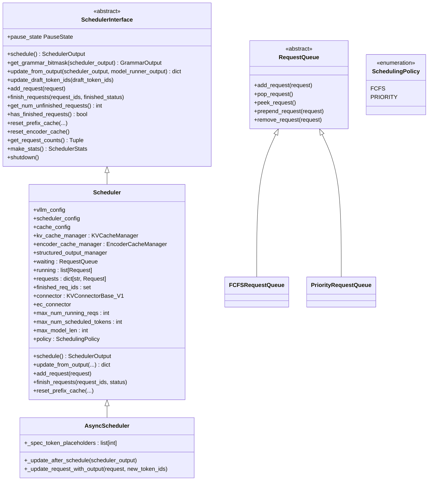
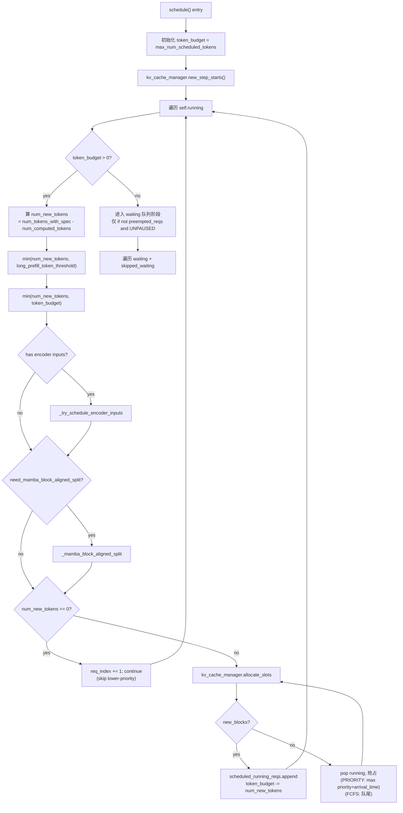
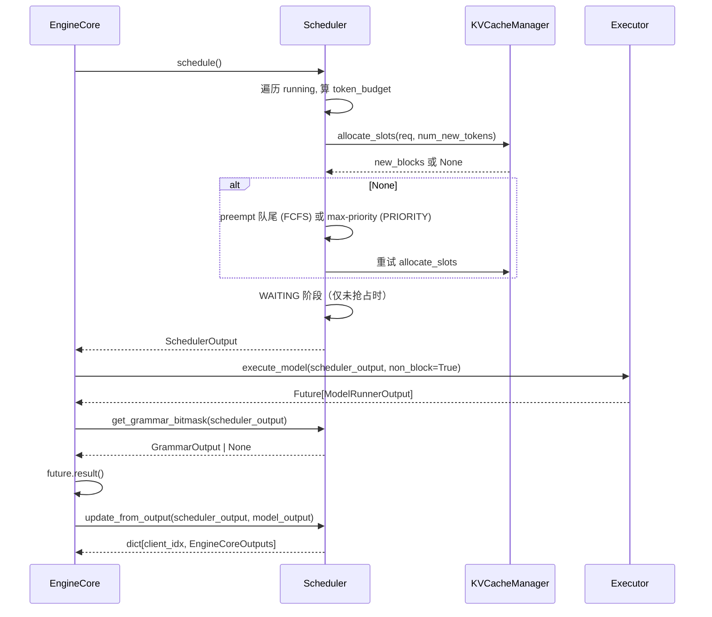

# `Scheduler` (and `AsyncScheduler`, `SchedulerInterface`, `RequestQueue`)

## Summary
`Scheduler` 是 vLLM v1 的**核心调度器**，由 `EngineCore` 在初始化时实例化（[v1/engine/core.py:148-170](d:\design\vllm\vllm\v1\engine\core.py)，经 `scheduler_config.get_scheduler_cls()` 解析类）。调度的核心抽象——**没有 prefill/decode 阶段之分**，每个请求只有 `num_computed_tokens` 与 `num_tokens_with_spec` 两个数（[scheduler.py:478-487](d:\design\vllm\vllm\v1\core\sched\scheduler.py) 注释明示），调度的目标是让前者追上后者。这让 chunked prefill / prefix caching / spec decoding / continuous batching 全都用同一套代码处理。子类 `AsyncScheduler` 在它之上把"放占位 token + 等异步结果"拆开做 GPU/CPU overlap。

## Sources
- 接口定义：[d:\design\vllm\vllm\v1\core\sched\interface.py](d:\design\vllm\vllm\v1\core\sched\interface.py)（262 行）
- 主实现：[d:\design\vllm\vllm\v1\core\sched\scheduler.py](d:\design\vllm\vllm\v1\core\sched\scheduler.py)（3003 行）
- 异步实现：[d:\design\vllm\vllm\v1\core\sched\async_scheduler.py](d:\design\vllm\vllm\v1\core\sched\async_scheduler.py)（70 行）
- 队列：[d:\design\vllm\vllm\v1\core\sched\request_queue.py](d:\design\vllm\vllm\v1\core\sched\request_queue.py)（208 行，5f7fab88→d29dc3ab 无变化）
- 输出 dataclass：[d:\design\vllm\vllm\v1\core\sched\output.py](d:\design\vllm\vllm\v1\core\sched\output.py)
- 工具：[d:\design\vllm\vllm\v1\core\sched\utils.py](d:\design\vllm\vllm\v1\core\sched\utils.py)

## 类层次

## `SchedulerInterface` 抽象 （[interface.py:38-262](d:\design\vllm\vllm\v1\core\sched\interface.py)）

接口定义 9 个抽象方法 + 6 个具体方法。摘要：

| 方法 | 行号 | 角色 |
|---|---|---|
| `schedule(throttle_prefills=False)` | [54-84](d:\design\vllm\vllm\v1\core\sched\interface.py) | **核心**：选 batch + 算 token 数（"a dictionary of {req_id: num_tokens}"）；新增 `throttle_prefills` 参数（DP prefill 均衡节流，见 §Increment） |
| `update_from_output(scheduler_output, model_runner_output)` | [92-110](d:\design\vllm\vllm\v1\core\sched\interface.py) | 把 worker 输出回写到 scheduler 状态 |
| `update_draft_token_ids(draft_token_ids)` | [112-120](d:\design\vllm\vllm\v1\core\sched\interface.py) | spec decode draft token 更新 |
| `update_draft_token_ids_in_output(...)` | [122-134](d:\design\vllm\vllm\v1\core\sched\interface.py) | structured output + spec 的 deferred sampling 用 |
| `add_request(request)` | [136-143](d:\design\vllm\vllm\v1\core\sched\interface.py) | 入队 |
| `finish_requests(request_ids, finished_status)` | [145-167](d:\design\vllm\vllm\v1\core\sched\interface.py) | abort / 检测 stop string 时调 |
| `get_num_unfinished_requests()` | [169-177](d:\design\vllm\vllm\v1\core\sched\interface.py) | 状态查询 |
| `has_finished_requests()` | [179-192](d:\design\vllm\vllm\v1\core\sched\interface.py) | DP attention 用 |
| `pause_state` (property + setter) | [199-207](d:\design\vllm\vllm\v1\core\sched\interface.py) | UNPAUSED / PAUSED_NEW / PAUSED_ALL 三状态 |
| `reset_prefix_cache(reset_running_requests, reset_connector)` | [209-223](d:\design\vllm\vllm\v1\core\sched\interface.py) | 模型权重 live-update 时调 |
| `reset_encoder_cache()` | [225-232](d:\design\vllm\vllm\v1\core\sched\interface.py) | 多模态权重更新时调 |
| `get_request_counts()` | [234-237](d:\design\vllm\vllm\v1\core\sched\interface.py) | `(num_running_reqs, num_waiting_reqs)` |
| `make_stats()` | [243-249](d:\design\vllm\vllm\v1\core\sched\interface.py) | 每步生成 SchedulerStats |
| `get_grammar_bitmask(scheduler_output)` | [86-90](d:\design\vllm\vllm\v1\core\sched\interface.py) | structured output bitmask |
| `get_kv_connector()` | [255-261](d:\design\vllm\vllm\v1\core\sched\interface.py) | 默认返 None，PD 分离时返 KVConnectorBase_V1 |

`PauseState` 枚举 ([interface.py:24-35](d:\design\vllm\vllm\v1\core\sched\interface.py))：

| 值 | 语义 |
|---|---|
| UNPAUSED | 正常调度 |
| PAUSED_NEW | 不接新请求，已 RUNNING 的继续跑 |
| PAUSED_ALL | 全停 |

## `Scheduler.__init__` （[scheduler.py:70-364](d:\design\vllm\vllm\v1\core\sched\scheduler.py)）

构造时绑入：

| 字段 | 来源 | 行号 |
|---|---|---|
| `vllm_config / scheduler_config / cache_config / parallel_config / lora_config / kv_cache_config / kv_events_config / observability_config` | 入参 | [81-89](d:\design\vllm\vllm\v1\core\sched\scheduler.py) |
| `kv_metrics_collector: KVCacheMetricsCollector \| None` | 受 `observability_config.kv_cache_metrics` 控制 | [90-94](d:\design\vllm\vllm\v1\core\sched\scheduler.py) |
| `structured_output_manager` | 入参 | [95](d:\design\vllm\vllm\v1\core\sched\scheduler.py) |
| `is_encoder_decoder` / `is_encoder_only` | 模型配置 | [96-97](d:\design\vllm\vllm\v1\core\sched\scheduler.py) |
| `finished_req_ids_dict: dict[client_idx, set[req_id]] \| None` | 仅 `include_finished_set=True` 时 | [103-105](d:\design\vllm\vllm\v1\core\sched\scheduler.py) |
| `prev_step_scheduled_req_ids: set[str]` | 跨 step 跟踪上一 step 调过的 req（MRV1-only） | [107](d:\design\vllm\vllm\v1\core\sched\scheduler.py) |
| `max_num_running_reqs = scheduler_config.max_num_seqs` | 配置 | [110](d:\design\vllm\vllm\v1\core\sched\scheduler.py) |
| `max_num_scheduled_tokens` | `max_num_scheduled_tokens` 或 `max_num_batched_tokens` | [111-115](d:\design\vllm\vllm\v1\core\sched\scheduler.py) |
| `max_model_len` | 模型配置 | [116](d:\design\vllm\vllm\v1\core\sched\scheduler.py) |
| `enable_kv_cache_events` | KV events 配置 | [117-120](d:\design\vllm\vllm\v1\core\sched\scheduler.py) |
| `num_sampled_tokens_per_step` | diffusion 模型为 0，其余 1 | [121-124](d:\design\vllm\vllm\v1\core\sched\scheduler.py) |
| `connector: KVConnectorBase_V1 \| None` + `defer_block_free` / `requires_kv_delivery` / `recompute_kv_load_failures` | 由 `KVConnectorFactory` 创建（PD 分离） | [129-159](d:\design\vllm\vllm\v1\core\sched\scheduler.py) |
| `ec_connector` | Encoder-Cache connector（多模态 encoder 输出跨实例传输） | [165-169](d:\design\vllm\vllm\v1\core\sched\scheduler.py) |
| `encoder_cache_manager` | `manager_cls_obj.create_manager(...)`（可由 VllmConfig 配自定义类） | [243-246](d:\design\vllm\vllm\v1\core\sched\scheduler.py) |
| `kv_cache_manager : KVCacheManager` | 内部创建 | [277-287](d:\design\vllm\vllm\v1\core\sched\scheduler.py) |
| `waiting / skipped_waiting : RequestQueue` | 通过 `create_request_queue(policy)` 创建 | [188-190](d:\design\vllm\vllm\v1\core\sched\scheduler.py) |
| `running : list[Request]` | 空 list 起步 | [191](d:\design\vllm\vllm\v1\core\sched\scheduler.py) |
| `requests : dict[str, Request]` | rid → Request 全表 | [179](d:\design\vllm\vllm\v1\core\sched\scheduler.py) |
| `current_step` / `prefill_capacity_bound` / `use_v2_model_runner` | step 计数 / prefill 饱和标志 / MRV2 开关 | [299-306](d:\design\vllm\vllm\v1\core\sched\scheduler.py) |

## `Scheduler.schedule()` 主算法 （[scheduler.py:476-1315](d:\design\vllm\vllm\v1\core\sched\scheduler.py)）

**关键设计**（[scheduler.py:478-487](d:\design\vllm\vllm\v1\core\sched\scheduler.py) 注释）：

> There's no "decoding phase" nor "prefill phase" in the scheduler. Each request just has `num_computed_tokens` and `num_tokens_with_spec`. ... `num_tokens_with_spec = len(prompt_token_ids) + len(output_token_ids) + len(spec_token_ids)`. At each step, the scheduler tries to assign tokens to the requests so that each request's `num_computed_tokens` can catch up its `num_tokens_with_spec`. This is general enough to cover **chunked prefills, prefix caching, speculative decoding, and the "jump decoding" optimization in the future**.

主循环结构：

**RUNNING 阶段**（[scheduler.py:502-733](d:\design\vllm\vllm\v1\core\sched\scheduler.py)）：

- **不严格 FCFS**：注释 [scheduler.py:622-624](d:\design\vllm\vllm\v1\core\sched\scheduler.py)："Here, by doing `continue` instead of `break`, we do not strictly follow the FCFS scheduling policy and allow the lower-priority requests to be scheduled."
- 抢占在两种 policy 下行为不同：
  - PRIORITY ([scheduler.py:643-676](d:\design\vllm\vllm\v1\core\sched\scheduler.py))：`max(self.running, key=lambda r: (r.priority, r.arrival_time))` 选择被抢占的；如果该 req 已经在本步被调度，要回退 token_budget / input_budget 与 encoder budget。新增 `victim_index` 修正循环游标（issue #49206：victim 在当前遍历位置之前时 `req_index -= 1`，防止静默跳过后续请求，[scheduler.py:649-656](d:\design\vllm\vllm\v1\core\sched\scheduler.py)）
  - FCFS ([scheduler.py:677-678](d:\design\vllm\vllm\v1\core\sched\scheduler.py))：`self.running.pop()` 直接砍队尾
- `_preempt_request(preempted_req, scheduled_timestamp, drop_stale_output=...)` ([scheduler.py:680-685 调用, 1336-1377 定义](d:\design\vllm\vllm\v1\core\sched\scheduler.py))

**WAITING 阶段**（[scheduler.py:748-1162](d:\design\vllm\vllm\v1\core\sched\scheduler.py)）：

- 仅当本步**没发生抢占**且 `pause_state == UNPAUSED` 才进 ([scheduler.py:748](d:\design\vllm\vllm\v1\core\sched\scheduler.py))
- 同时遍历 `self.waiting` 与 `self.skipped_waiting`（被跳过的低优先级队列）；本步内新 skip 的先进局部 `step_skipped_waiting`，步末 `prepend_requests` 回 `skipped_waiting`（[scheduler.py:749, 1161-1162](d:\design\vllm\vllm\v1\core\sched\scheduler.py)），队列选取由 `_select_waiting_queue_for_scheduling` 决定（[scheduler.py:2146-2162](d:\design\vllm\vllm\v1\core\sched\scheduler.py)）
- 每个 waiting req 都尝试 `_try_promote_blocked_waiting_request`（[scheduler.py:2766-2830](d:\design\vllm\vllm\v1\core\sched\scheduler.py)）— 处理 PD 分离场景下"等远端 KV"的状态

## `update_from_output` （[scheduler.py:1733-2299](d:\design\vllm\vllm\v1\core\sched\scheduler.py)）

把 worker 的 `ModelRunnerOutput` 回写到 scheduler 状态：

- 累加 `num_computed_tokens`
- 处理 finished requests（按 client_idx 分组成 `dict[int, EngineCoreOutputs]` 返回）
- 更新 `kv_connector` 的状态（如果启了 PD）
- 处理 ec connector 的状态

返回的 `dict[int, EngineCoreOutputs]` 由 `EngineCore.step` 转入 `output_queue` 给 `EngineCoreProc.process_output_sockets` 发给 client（详见 [vllm/topics/request-lifecycle.md](../topics/request-lifecycle.md)）。

## `RequestQueue` 抽象 与两种实现 （[request_queue.py](d:\design\vllm\vllm\v1\core\sched\request_queue.py)）

`SchedulingPolicy` 枚举 ([request_queue.py:13-17](d:\design\vllm\vllm\v1\core\sched\request_queue.py))：`FCFS` / `PRIORITY`。

`RequestQueue(ABC)` ([request_queue.py:20-72](d:\design\vllm\vllm\v1\core\sched\request_queue.py)) 8 个抽象方法：`add_request` / `pop_request` / `peek_request` / `prepend_request` / `prepend_requests` / `remove_request` / `remove_requests` / `__bool__` / `__len__` / `__iter__`。

| 实现 | 行号 | 数据结构 | 复杂度 |
|---|---|---|---|
| `FCFSRequestQueue` | [75-128](d:\design\vllm\vllm\v1\core\sched\request_queue.py) | `deque` 子类 | add: O(1), pop: O(1), remove: O(N) |
| `PriorityRequestQueue` | [131-198](d:\design\vllm\vllm\v1\core\sched\request_queue.py) | `heapq` (`list` + heap invariant) | add: O(log N), pop: O(log N), remove: O(N) + heapify O(N) |

工厂：`create_request_queue(policy: SchedulingPolicy) -> RequestQueue` ([request_queue.py:201-208](d:\design\vllm\vllm\v1\core\sched\request_queue.py))。

> [!todo] VERIFY: `prepend_request` 在 `PriorityRequestQueue` 里被解释为 "fall back to add_request"（[request_queue.py:160-165](d:\design\vllm\vllm\v1\core\sched\request_queue.py)），意味着抢占恢复时**优先级队列下高 priority 旧请求不一定回到队首**——这是个语义陷阱。

## `AsyncScheduler` （[async_scheduler.py:12-70](d:\design\vllm\vllm\v1\core\sched\async_scheduler.py)）

继承 `Scheduler`，新增 `__init__`（预构造可复用的 `_spec_token_placeholders` 只读列表 + 记 `pp_size`，[async_scheduler.py:13-17](d:\design\vllm\vllm\v1\core\sched\async_scheduler.py)），覆盖两个方法：

### `_update_after_schedule(scheduler_output)` （[async_scheduler.py:19-49](d:\design\vllm\vllm\v1\core\sched\async_scheduler.py)）

每次 `schedule` 完成后调用（先 `super()` 调基类 [scheduler.py:1379](d:\design\vllm\vllm\v1\core\sched\scheduler.py) 的同名方法）。**关键**：

- 提前给每个被调度的 req 加 `num_output_placeholders += num_sampled_tokens_per_step + cur_num_spec_tokens`（diffusion 模型 `num_sampled_tokens_per_step=0`，[async_scheduler.py:38-41](d:\design\vllm\vllm\v1\core\sched\async_scheduler.py)）
- 把 `request.spec_token_ids` 设为 placeholder list `[-1] * num_spec_tokens_to_schedule`（[async_scheduler.py:23-25, 45](d:\design\vllm\vllm\v1\core\sched\async_scheduler.py)）
- 实际 spec token 由 worker 进程在执行时 in-place 更新
- MRV2（`use_v2_model_runner`）时设 `request.next_decode_eligible_step = current_step + pp_size`——PP microbatching 的 decode 资格步（[async_scheduler.py:47-49](d:\design\vllm\vllm\v1\core\sched\async_scheduler.py)）

> synthesis: 这个 placeholder 机制让 scheduler 可以**在 worker 还没产出本 step token 时**，就开始为下一 step 计算 budget，从而 GPU 与 CPU overlap。

### `_update_request_with_output(request, new_token_ids, is_stale=False)` （[async_scheduler.py:51-70](d:\design\vllm\vllm\v1\core\sched\async_scheduler.py)）

- ~~抢占场景的清理：`discard_latest_async_tokens=True` 时丢掉最新 async token~~ **RESOLVED 2026-08-18**：`discard_latest_async_tokens` 参数已不存在；改为 `is_stale` 参数——placeholder 在抢占时已被清零，stale delivery 不再重复减 placeholder（否则 underflow，见 #48245 / #46066；[async_scheduler.py:60-64](d:\design\vllm\vllm\v1\core\sched\async_scheduler.py)）
- 减 `num_output_placeholders -= len(new_token_ids)`（仅 `not is_stale` 时，带 `>= 0` assert，[async_scheduler.py:62-64](d:\design\vllm\vllm\v1\core\sched\async_scheduler.py)）
- 调 `kv_cache_manager.cache_blocks` 真正缓存（仅更新前状态为 RUNNING 时，[async_scheduler.py:66-70](d:\design\vllm\vllm\v1\core\sched\async_scheduler.py)）

## 与 EngineCore 的协作链

锚点：[v1/engine/core.py:583-622](d:\design\vllm\vllm\v1\engine\core.py)（`EngineCore.step` 调 `schedule` / `execute_model(non_block=True)` / `update_from_output`）。

## 与 KV connector / PD 分离的关系

调度器层面感知 PD 分离的 3 个钩子：

1. `connector: KVConnectorBase_V1 | None` — 由 `KVConnectorFactory` 创建（[scheduler.py:129-159](d:\design\vllm\vllm\v1\core\sched\scheduler.py)），暴露给 `EngineCore`（`EngineCore.scheduler.get_kv_connector()`）
2. `_try_promote_blocked_waiting_request` ([scheduler.py:2766-2830](d:\design\vllm\vllm\v1\core\sched\scheduler.py)) — 处理"等远端 KV 完成"状态的 waiting req
3. `_update_waiting_for_remote_kv` ([scheduler.py:2723-2765](d:\design\vllm\vllm\v1\core\sched\scheduler.py)) — 把 NIXL/connector 推回的 KV 完成事件应用到 waiting req

## Increment 2026-08-18 (vLLM 5f7fab88 → d29dc3ab)

scheduler 子树 4 个月共 77 commits（[scheduler.py](d:\design\vllm\vllm\v1\core\sched\scheduler.py) 2304 → 3003 行）。本页所有 `[file:line]` 锚点已按新 HEAD 修正；`request_queue.py` 在此区间**无任何变化**（锚点原样有效）。新增/变化要点：

- **`schedule(throttle_prefills=False)` 新参数**：DP prefill 均衡节流——被节流步（非 cadence-aligned）在非饱和（`prefill_capacity_bound=False`）时推迟全部 prefill 计算（[d:\design\vllm\vllm\v1\core\sched\scheduler.py:476, 518-522](d:\design\vllm\vllm\v1\core\sched\scheduler.py)、[interface.py:54](d:\design\vllm\vllm\v1\core\sched\interface.py)）。
- **自适应 spec token 预算**（PR #51725）：新增 `input_budget = max_num_batched_tokens` 与 `draft_slots = spec.max_num_new_slots_for_drafting`，RUNNING / WAITING 两阶段都在 `input_budget <= draft_slots` 时截断（[d:\design\vllm\vllm\v1\core\sched\scheduler.py:497-499, 528-529, 752-753, 927](d:\design\vllm\vllm\v1\core\sched\scheduler.py)）。
- **PRIORITY 抢占游标修复**（PR #49206）：victim 位于当前遍历位置前时 `req_index -= 1`，修复静默跳过请求（[d:\design\vllm\vllm\v1\core\sched\scheduler.py:649-656](d:\design\vllm\vllm\v1\core\sched\scheduler.py)）。
- **AsyncScheduler 重构**：新增 `__init__`；`_update_request_with_output` 换 `is_stale` 语义（防 `num_output_placeholders` underflow，PR #48245 / #46066）；MRV2 下 `next_decode_eligible_step` 支持 PP microbatching（详见上文 §AsyncScheduler，[d:\design\vllm\vllm\v1\core\sched\async_scheduler.py](d:\design\vllm\vllm\v1\core\sched\async_scheduler.py)）。
- **EC (Encoder-Cache) connector 接入**：`__init__` 新增 `ec_connector`（[d:\design\vllm\vllm\v1\core\sched\scheduler.py:165-169](d:\design\vllm\vllm\v1\core\sched\scheduler.py)），schedule 中 `ec_connector.update_state_after_alloc`（[d:\design\vllm\vllm\v1\core\sched\scheduler.py:735](d:\design\vllm\vllm\v1\core\sched\scheduler.py)），多模态 encoder 输出可跨实例传输（PR #42433 / #49579 / #49582）。
- **KV connector race 防护**：`defer_block_free`（async scheduling / PP 下 consumer 端延迟释放块，[d:\design\vllm\vllm\v1\core\sched\scheduler.py:151-157](d:\design\vllm\vllm\v1\core\sched\scheduler.py)）、`requires_kv_delivery`（抢占请求 in-flight 输出丢弃，PR #50297）、`recompute_kv_load_failures`（KV load 失败策略，[d:\design\vllm\vllm\v1\core\sched\scheduler.py:148-149](d:\design\vllm\vllm\v1\core\sched\scheduler.py)）。
- **Mask Replay / routed experts**（PR #49577）：`enable_return_routed_experts` 时构造 `RoutedExpertsManager`，schedule 时快照 block-ID 防 async 释放竞态（[d:\design\vllm\vllm\v1\core\sched\scheduler.py:340-358](d:\design\vllm\vllm\v1\core\sched\scheduler.py)）。
- **diffusion 模型支持**：`num_sampled_tokens_per_step = 0`（denoising step 可不采样 token，[d:\design\vllm\vllm\v1\core\sched\scheduler.py:121-124](d:\design\vllm\vllm\v1\core\sched\scheduler.py)）。
- **`_mamba_block_aligned_split` 提为独立方法**（[d:\design\vllm\vllm\v1\core\sched\scheduler.py:366-475](d:\design\vllm\vllm\v1\core\sched\scheduler.py)），且 Mamba 对齐在 encoder caps 之前应用（PR #51603）。
- **streaming input**：新增 `num_waiting_for_streaming_input` 计数（占 model-runner slot 但不在 running，[d:\design\vllm\vllm\v1\core\sched\scheduler.py:202-204, 757-759](d:\design\vllm\vllm\v1\core\sched\scheduler.py)）。

## Notes / Caveats
> [!todo] VERIFY: `get_grammar_bitmask` 与 structured output 的具体实现（在 [v1/structured_output/](d:\design\vllm\vllm\v1\structured_output)）。
> [!todo] VERIFY: `_handle_invalid_blocks` ([scheduler.py:2934-3003](d:\design\vllm\vllm\v1\core\sched\scheduler.py)) 与 `_update_requests_with_invalid_blocks` ([scheduler.py:2831-2933](d:\design\vllm\vllm\v1\core\sched\scheduler.py)) 处理什么场景。
> [!warning] CONTRADICTION: `Scheduler.running` 是 `list[Request]`（线性结构），抢占时 `pop()` / `remove()` 都是 O(N)；而 `waiting` 是 `RequestQueue`。这种异构设计在大 batch_size 下可能成为瓶颈，需要 ingest performance 分析时关注。

## See also
- [entities/EngineCore.md](EngineCore.md)
- [topics/request-lifecycle.md](../topics/request-lifecycle.md)
- [comparison/topics/scheduler.md](../../comparison/topics/scheduler.md)
- [modules/engine.md](../modules/engine.md)
