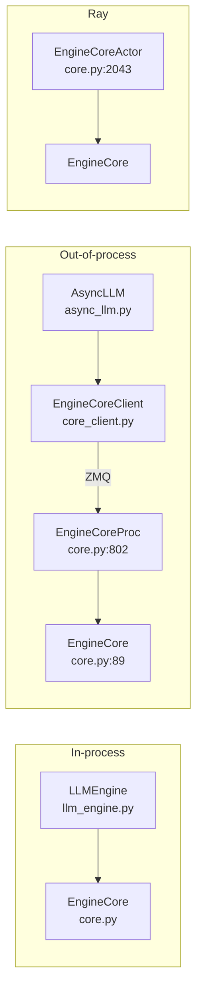

# `v1/engine` — Engine module

## Summary
`v1/engine` 是 vLLM v1 的引擎层，负责**接收前端请求 → 维护调度 + executor → 输出 token**。核心是 `EngineCore`（事件循环本体）和 `EngineCoreProc`（把 `EngineCore` 跑在独立进程并用 ZMQ 与前端通信的包装）。前端有同步 `LLMEngine` 与异步 `AsyncLLM` 两套 API，跨进程时通过 `EngineCoreClient` 连接 `EngineCoreProc`。

## Sources
- 模块目录：[d:\design\vllm\vllm\v1\engine\](d:\design\vllm\vllm\v1\engine)（14 个 .py）
- 主类：[core.py](d:\design\vllm\vllm\v1\engine\core.py)（2072 行）
- 同步 API：[llm_engine.py](d:\design\vllm\vllm\v1\engine\llm_engine.py)
- 异步 API：[async_llm.py](d:\design\vllm\vllm\v1\engine\async_llm.py)
- 客户端：[core_client.py](d:\design\vllm\vllm\v1\engine\core_client.py)
- DP 协调器：[coordinator.py](d:\design\vllm\vllm\v1\engine\coordinator.py)
- 输入预处理：[input_processor.py](d:\design\vllm\vllm\v1\engine\input_processor.py)
- 输出处理：[output_processor.py](d:\design\vllm\vllm\v1\engine\output_processor.py)
- 反 tokenize：[detokenizer.py](d:\design\vllm\vllm\v1\engine\detokenizer.py)
- Tensor IPC：[tensor_ipc.py](d:\design\vllm\vllm\v1\engine\tensor_ipc.py)
- 工具：[utils.py](d:\design\vllm\vllm\v1\engine\utils.py)
- 异常：[exceptions.py](d:\design\vllm\vllm\v1\engine\exceptions.py)
- 并行采样：[parallel_sampling.py](d:\design\vllm\vllm\v1\engine\parallel_sampling.py)
- logprobs：[logprobs.py](d:\design\vllm\vllm\v1\engine\logprobs.py)

## 文件清单与角色

| 文件 | 角色 |
|---|---|
| `core.py` | `EngineCore` (基类) + `EngineCoreProc` (ZMQ 包装) + `DPEngineCoreProc` (DP 多 engine) + `EngineCoreActor` (Ray actor 包装)；详见 [entities/EngineCore.md](../entities/EngineCore.md) |
| `llm_engine.py` | 同步 API `LLMEngine` |
| `async_llm.py` | 异步 API `AsyncLLM`（OpenAI server 用） |
| `core_client.py` | `EngineCoreClient`：前端到 `EngineCoreProc` 的客户端封装（含同步/异步两种） |
| `coordinator.py` | DP（Data Parallel）多 engine 的协调器 |
| `input_processor.py` | 输入预处理（tokenize → `EngineCoreRequest`） |
| `output_processor.py` | 输出后处理（聚合 + 流式发回客户端） |
| `detokenizer.py` | 增量 detokenize |
| `tensor_ipc.py` | 多模态 tensor 通过共享内存的 IPC 通道 |
| `parallel_sampling.py` | 并行采样（n>1 / beam search） |
| `logprobs.py` | logprob 处理 |
| `exceptions.py` | engine 层异常 |
| `utils.py` | 含 `EngineHandshakeMetadata`, `EngineZmqAddresses`, `SignalCallback` 等 |
| `__init__.py` | 暴露 `EngineCoreRequest` / `EngineCoreOutputs` / `EngineCoreRequestType` 等 msgspec.Struct 数据契约（参见 [core.py:50-64](d:\design\vllm\vllm\v1\engine\core.py)） |

## 三种部署形态（synthesis）

`EngineCore` 本体是纯 Python 类，但通过包装，可以跑在三种位置：

- **In-process**：`LLMEngine` 直接 `step()` → 适合 offline batch（[llm_engine.py](d:\design\vllm\vllm\v1\engine\llm_engine.py)）。
- **Out-of-process**：`AsyncLLM` 通过 ZMQ 连 `EngineCoreProc` → 适合 server。`EngineCoreProc` 在 [core.py:802-915](d:\design\vllm\vllm\v1\engine\core.py)，把 `EngineCore.__init__` 包在 ZMQ handshake + IO 线程里。
- **Ray**：`EngineCoreActor` / `DPMoEEngineCoreActor`（[core.py:2020-2071](d:\design\vllm\vllm\v1\engine\core.py)）— 用于 Ray 集群。

## 核心数据契约

定义在 [v1/engine/__init__.py](d:\design\vllm\vllm\v1\engine\__init__.py)，被 `core.py` 在 [core.py:50-64](d:\design\vllm\vllm\v1\engine\core.py) 导入：

| 名称 | 用途 |
|---|---|
| `EngineCoreRequest` | 前端 → engine 的请求 |
| `EngineCoreRequestType` | 请求类型枚举：`ADD` / `ABORT` / `UTILITY` / `EXECUTOR_FAILED` / `WAKEUP`（参见 [core.py:1262-1295](d:\design\vllm\vllm\v1\engine\core.py)） |
| `EngineCoreOutputs` / `EngineCoreOutput` | engine → 前端的输出（含 token / logprobs / finish 信息） |
| `EngineCoreReadyResponse` | engine 启动后回复给前端的 ready 消息（含 `max_model_len`、`num_gpu_blocks`，[core.py:1409-1413](d:\design\vllm\vllm\v1\engine\core.py)） |
| `UtilityOutput` / `UtilityResult` | 异步 utility 调用结果 |
| `ReconfigureDistributedRequest` | 动态调整分布式拓扑（弹性 EP） |
| `EEPNotificationType` | Elastic EP 通知 |

## 与其它模块的关系

- 上游（被谁调用）：[entrypoints/](d:\design\vllm\vllm\entrypoints)（OpenAI server、offline LLM API）
- 下游（调用谁）：
  - [v1/executor/](d:\design\vllm\vllm\v1\executor) → [modules/executor.md](executor.md)
  - [v1/core/sched/](d:\design\vllm\vllm\v1\core\sched) → 调度器
  - [v1/core/](d:\design\vllm\vllm\v1\core) → KV cache
  - [v1/structured_output/](d:\design\vllm\vllm\v1\structured_output) → grammar manager
  - [v1/metrics/](d:\design\vllm\vllm\v1\metrics) → 统计

## See also
- [entities/EngineCore.md](../entities/EngineCore.md) — `EngineCore` / `EngineCoreProc` 详解
- [modules/executor.md](executor.md)
- [topics/request-lifecycle.md](../topics/request-lifecycle.md) — 一次请求的端到端流程
- [topics/multiproc-ipc.md](../topics/multiproc-ipc.md) — 进程间 IPC 细节
- [vllm/overview.md](../overview.md)
