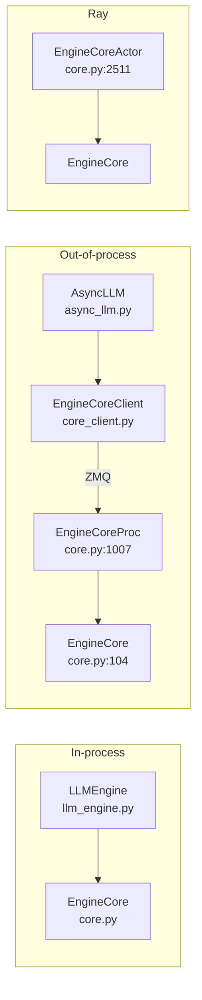

# `v1/engine` — Engine module

## Summary
`v1/engine` 是 vLLM v1 的引擎层，负责**接收前端请求 → 维护调度 + executor → 输出 token**。核心是 `EngineCore`（事件循环本体）和 `EngineCoreProc`（把 `EngineCore` 跑在独立进程并用 ZMQ 与前端通信的包装）。前端有同步 `LLMEngine` 与异步 `AsyncLLM` 两套 API，跨进程时通过 `EngineCoreClient` 连接 `EngineCoreProc`。

## Sources
- 模块目录：[d:\design\vllm\vllm\v1\engine\](d:\design\vllm\vllm\v1\engine)（14 个 .py，本期无增删）
- 主类：[core.py](d:\design\vllm\vllm\v1\engine\core.py)（2536 行）
- 同步 API：[llm_engine.py](d:\design\vllm\vllm\v1\engine\llm_engine.py)
- 异步 API：[async_llm.py](d:\design\vllm\vllm\v1\engine\async_llm.py)
- 客户端：[core_client.py](d:\design\vllm\vllm\v1\engine\core_client.py)
- DP 协调器：[coordinator.py](d:\design\vllm\vllm\v1\engine\coordinator.py)
- 输入预处理：[input_processor.py](d:\design\vllm\vllm\v1\engine\input_processor.py)
- 输出处理：[output_processor.py](d:\design\vllm\vllm\v1\engine\output_processor.py)
- 反 tokenize：[detokenizer.py](d:\design\vllm\vllm\v1\engine\detokenizer.py)
- Tensor IPC：[tensor_ipc.py](d:\design\vllm\vllm\v1\engine\tensor_ipc.py)
- 工具：[utils.py](d:\design\vllm\vllm\v1\engine\utils.py)
- 异常：[exceptions.py](d:\design\vllm\vllm\v1\engine\exceptions.py)
- 并行采样：[parallel_sampling.py](d:\design\vllm\vllm\v1\engine\parallel_sampling.py)
- logprobs：[logprobs.py](d:\design\vllm\vllm\v1\engine\logprobs.py)

## 文件清单与角色

| 文件 | 行数 (2026-08-18) | 角色 |
|---|---|---|
| `core.py` | 2536 | `EngineCore` (基类) + `EngineCoreProc` (ZMQ 包装) + `DPEngineCoreProc` (DP 多 engine) + `EngineCoreActor` (Ray actor 包装)；详见 [entities/EngineCore.md](../entities/EngineCore.md) |
| `llm_engine.py` | 457 | 同步 API `LLMEngine` |
| `async_llm.py` | 1166 | 异步 API `AsyncLLM`（OpenAI server 用） |
| `core_client.py` | 1874 | `EngineCoreClient`：前端到 `EngineCoreProc` 的客户端封装（含同步/异步两种） |
| `coordinator.py` | 473 | DP（Data Parallel）多 engine 的协调器 |
| `input_processor.py` | 521 | 输入预处理（tokenize → `EngineCoreRequest`），主类 `InputProcessor`（[input_processor.py:38](d:\design\vllm\vllm\v1\engine\input_processor.py)） |
| `output_processor.py` | 849 | 输出后处理（聚合 + 流式发回客户端） |
| `detokenizer.py` | 362 | 增量 detokenize |
| `tensor_ipc.py` | 178 | 多模态 tensor 通过共享内存的 IPC 通道（本期无变化） |
| `parallel_sampling.py` | 150 | 并行采样（n>1 / beam search）（本期无变化） |
| `logprobs.py` | 352 | logprob 处理 |
| `exceptions.py` | 21 | engine 层异常 |
| `utils.py` | 1384 | 含 `EngineZmqAddresses`（[utils.py:62](d:\design\vllm\vllm\v1\engine\utils.py)）、`EngineHandshakeMetadata`（[utils.py:78](d:\design\vllm\vllm\v1\engine\utils.py)）、`SignalCallback`（[utils.py:253](d:\design\vllm\vllm\v1\engine\utils.py)）等 |
| `__init__.py` | 313 | 暴露 `EngineCoreRequest` / `EngineCoreOutputs` / `EngineCoreRequestType` 等 msgspec.Struct 数据契约（core.py 导入见 [core.py:59-73](d:\design\vllm\vllm\v1\engine\core.py)） |

## 三种部署形态（synthesis）

`EngineCore` 本体是纯 Python 类，但通过包装，可以跑在三种位置：

- **In-process**：`LLMEngine` 直接 `step()` → 适合 offline batch（[llm_engine.py](d:\design\vllm\vllm\v1\engine\llm_engine.py)）。
- **Out-of-process**：`AsyncLLM` 通过 ZMQ 连 `EngineCoreProc` → 适合 server。`EngineCoreProc` 在 [core.py:1007-1128](d:\design\vllm\vllm\v1\engine\core.py)（`__init__` 自 [core.py:1014](d:\design\vllm\vllm\v1\engine\core.py) 起），把 `EngineCore.__init__` 包在 ZMQ handshake + IO 线程里。
- **Ray**：`EngineCoreActorMixin`（[core.py:2356](d:\design\vllm\vllm\v1\engine\core.py)）+ `DPMoEEngineCoreActor` / `EngineCoreActor`（[core.py:2488-2536](d:\design\vllm\vllm\v1\engine\core.py)）— 用于 Ray 集群。

## 核心数据契约

定义在 [v1/engine/__init__.py](d:\design\vllm\vllm\v1\engine\__init__.py)，被 `core.py` 在 [core.py:59-73](d:\design\vllm\vllm\v1\engine\core.py) 导入：

| 名称 | 用途 |
|---|---|
| `EngineCoreRequest` | 前端 → engine 的请求（[__init__.py:102](d:\design\vllm\vllm\v1\engine\__init__.py)） |
| `EngineCoreRequestType` | 请求类型枚举：`ADD` / `ABORT` / `START_DP_WAVE` / `UTILITY` / `EXECUTOR_FAILED` / `WAKEUP`（[__init__.py:275-288](d:\design\vllm\vllm\v1\engine\__init__.py)；core 侧分派见 [core.py:1509-1533](d:\design\vllm\vllm\v1\engine\core.py)） |
| `EngineCoreOutputs` / `EngineCoreOutput` | engine → 前端的输出（含 token / logprobs / finish 信息，[__init__.py:191](d:\design\vllm\vllm\v1\engine\__init__.py)、[__init__.py:244](d:\design\vllm\vllm\v1\engine\__init__.py)） |
| `EngineCoreReadyResponse` | engine 启动后回复给前端的 ready 消息（[__init__.py:69](d:\design\vllm\vllm\v1\engine\__init__.py)）；本期字段扩容：除 `max_model_len`、`num_gpu_blocks` 外新增 `block_size`、`kv_cache_size_tokens`、`kv_cache_max_concurrency`、`world_size`/`dp`/`tp` 尺寸与 `vllm_version` 等（构造见 [core.py:1616-1638](d:\design\vllm\vllm\v1\engine\core.py)） |
| `UtilityOutput` / `UtilityResult` | 异步 utility 调用结果（`UtilityOutput` 在 [__init__.py:232](d:\design\vllm\vllm\v1\engine\__init__.py)；`UtilityResult` 本期迁至 [v1/serial_utils.py](d:\design\vllm\vllm\v1\serial_utils.py)，`__init__.py` 仅转导入，[__init__.py:21](d:\design\vllm\vllm\v1\engine\__init__.py)） |
| `ReconfigureDistributedRequest` | 动态调整分布式拓扑（弹性 EP，[__init__.py:291](d:\design\vllm\vllm\v1\engine\__init__.py)） |
| `EEPNotificationType` | Elastic EP 通知（[__init__.py:38](d:\design\vllm\vllm\v1\engine\__init__.py)） |

## 与其它模块的关系

- 上游（被谁调用）：[entrypoints/](d:\design\vllm\vllm\entrypoints)（OpenAI server、offline LLM API）
- 下游（调用谁）：
  - [v1/executor/](d:\design\vllm\vllm\v1\executor) → [modules/executor.md](executor.md)
  - [v1/core/sched/](d:\design\vllm\vllm\v1\core\sched) → 调度器
  - [v1/core/](d:\design\vllm\vllm\v1\core) → KV cache
  - [v1/structured_output/](d:\design\vllm\vllm\v1\structured_output) → grammar manager
  - [v1/metrics/](d:\design\vllm\vllm\v1\metrics) → 统计

## Increment 2026-08-18 (vLLM 5f7fab88 → d29dc3ab)

模块结构层面：14 个 .py **无增删**，总行数约 9.3k → 10.6k。各文件本期 diff 规模：core.py +640/-175、core_client.py +381/-202、utils.py +396（相对增幅最大）、async_llm.py +159/-59、input_processor.py +105、coordinator.py +92、detokenizer.py +57、__init__.py +59、output_processor.py +45/-8、llm_engine.py +41/-8、exceptions.py +7、tensor_ipc.py / parallel_sampling.py / logprobs.py 基本不变。

跨文件的本期主线（细节见各 entity 页增量小节）：

- **Fault tolerance 框架**：`EngineCoreSentinel` 挂进 `EngineCoreProc.__init__`（[core.py:1082-1089](d:\design\vllm\vllm\v1\engine\core.py)），前端经 `handle_fault`/`get_status` 下发（详见 [entities/EngineCoreClient.md](../entities/EngineCoreClient.md)、[entities/AsyncLLM.md](../entities/AsyncLLM.md)）。
- **优雅 shutdown 状态机**：`EngineShutdownState` + `shutdown(timeout)` 全链路穿透 AsyncLLM → client → EngineCoreProc（[core.py:1001-1004](d:\design\vllm\vllm\v1\engine\core.py)，详见 [entities/EngineCore.md](../entities/EngineCore.md)）。
- **EEP 两阶段扩缩容**：`scale_elastic_ep` 拆为 `prepare_elastic_ep` / `commit_elastic_ep`，EEP 通知处理逻辑从 core.py 迁到 `core_client.py` 的 `eep_process_engine_core_notification`（[core_client.py:1545](d:\design\vllm\vllm\v1\engine\core_client.py)）。
- **两阶段 pause / sleep 语义**：`pause_scheduler`/`resume_scheduler` + `PauseMode`（[core.py:828-865](d:\design\vllm\vllm\v1\engine\core.py)）。
- **DP 内部 LB 重写**：`get_core_engine_for_request` 引入 in-flight 计数与 KV 压力惩罚（[core_client.py:1471](d:\design\vllm\vllm\v1\engine\core_client.py)）。
- **ready handshake 扩容**：`EngineCoreReadyResponse` 回传 `block_size`/KV 容量等，前端据此回写配置（见上表；client 侧 `_apply_ready_response` [core_client.py:740](d:\design\vllm\vllm\v1\engine\core_client.py)）。
- **输出侧信息扩容**：`RequestOutput` 新增 routed experts 累积、sampling mask、`num_cache_creation_tokens`、`ec_transfer_params`（详见 [entities/OutputProcessor.md](../entities/OutputProcessor.md)）。

synthesis: 本页三种部署形态（in-process / out-of-process / Ray）与"数据契约经 `__init__.py` msgspec.Struct 定义"的模块骨架在本期 4273 commits 后完全保持；变化集中在**运维/弹性能力**（fault tolerance、graceful shutdown、EEP 两阶段、pause/sleep）与**握手/输出数据面扩容**，无文件级重组。本期新增的 `vllm/v1/worker/gpu/` 新一代 model runner 属 worker 层，engine 层对 executor 的调用接口未变，本页论断不受影响。

## See also
- [entities/EngineCore.md](../entities/EngineCore.md) — `EngineCore` / `EngineCoreProc` 详解
- [modules/executor.md](executor.md)
- [topics/request-lifecycle.md](../topics/request-lifecycle.md) — 一次请求的端到端流程
- [topics/multiproc-ipc.md](../topics/multiproc-ipc.md) — 进程间 IPC 细节
- [vllm/overview.md](../overview.md)
