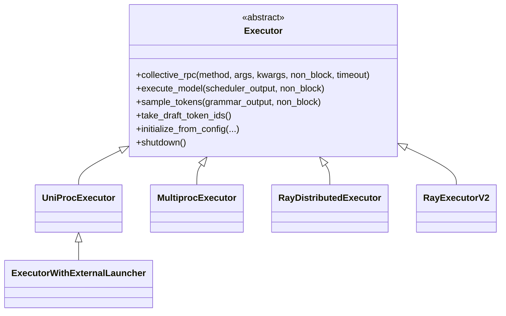

# `v1/executor` — Executor module

## Summary
`v1/executor` 抽象出 vLLM 的"**worker 进程编排**"层。`Executor` 是基类（[abstract.py:37](d:\design\vllm\vllm\v1\executor\abstract.py)），通过 `collective_rpc` 把方法调用广播到所有 worker。具体实现 4 种：`UniProcExecutor` / `MultiprocExecutor` / `RayDistributedExecutor` / `RayExecutorV2`，由配置 `distributed_executor_backend` 选择（[abstract.py:47-92](d:\design\vllm\vllm\v1\executor\abstract.py)）。

## Sources
- 模块目录：[d:\design\vllm\vllm\v1\executor\](d:\design\vllm\vllm\v1\executor)（8 个 .py）
- 抽象基类：[abstract.py](d:\design\vllm\vllm\v1\executor\abstract.py)（385 行）
- 单进程：[uniproc_executor.py](d:\design\vllm\vllm\v1\executor\uniproc_executor.py)
- 多进程：[multiproc_executor.py](d:\design\vllm\vllm\v1\executor\multiproc_executor.py)（1048 行，本 demo 重点）
- Ray v1：[ray_executor.py](d:\design\vllm\vllm\v1\executor\ray_executor.py)
- Ray v2：[ray_executor_v2.py](d:\design\vllm\vllm\v1\executor\ray_executor_v2.py)
- Ray 工具：[ray_utils.py](d:\design\vllm\vllm\v1\executor\ray_utils.py), [ray_env_utils.py](d:\design\vllm\vllm\v1\executor\ray_env_utils.py)

## 4 种实现的选择

`Executor.get_class()` 根据 `parallel_config.distributed_executor_backend` 字符串选实现（[abstract.py:47-92](d:\design\vllm\vllm\v1\executor\abstract.py)）：

| backend 字符串 | 实现 | 锚点 |
|---|---|---|
| `"uni"` | `UniProcExecutor` | [abstract.py:73-76](d:\design\vllm\vllm\v1\executor\abstract.py), [uniproc_executor.py](d:\design\vllm\vllm\v1\executor\uniproc_executor.py) |
| `"mp"` | `MultiprocExecutor` | [abstract.py:69-72](d:\design\vllm\vllm\v1\executor\abstract.py), [multiproc_executor.py](d:\design\vllm\vllm\v1\executor\multiproc_executor.py) |
| `"ray"` (default) | `RayDistributedExecutor` | [abstract.py:65-68](d:\design\vllm\vllm\v1\executor\abstract.py), [ray_executor.py](d:\design\vllm\vllm\v1\executor\ray_executor.py) |
| `"ray"` + env `VLLM_USE_RAY_V2_EXECUTOR_BACKEND=1` | `RayExecutorV2` | [abstract.py:60-64](d:\design\vllm\vllm\v1\executor\abstract.py), [ray_executor_v2.py](d:\design\vllm\vllm\v1\executor\ray_executor_v2.py) |
| `"external_launcher"` | `ExecutorWithExternalLauncher`（在 uniproc_executor.py 中） | [abstract.py:77-80](d:\design\vllm\vllm\v1\executor\abstract.py) |
| 自定义 qualname / 类对象 | 通过 `resolve_obj_by_qualname` 加载 | [abstract.py:53-87](d:\design\vllm\vllm\v1\executor\abstract.py) |

## 核心 API（基类约定）

定义在 [abstract.py](d:\design\vllm\vllm\v1\executor\abstract.py)：

| 方法 | 行号 | 说明 |
|---|---|---|
| `_init_executor()` | [115](d:\design\vllm\vllm\v1\executor\abstract.py) | 抽象方法，子类实现 worker 启动逻辑 |
| `collective_rpc(method, args, kwargs, non_block, timeout)` | [152-202](d:\design\vllm\vllm\v1\executor\abstract.py) | 抽象方法，把 `method` 广播到所有 worker；`non_block=True` 返 `Future` |
| `execute_model(scheduler_output, non_block)` | [221-227](d:\design\vllm\vllm\v1\executor\abstract.py) | 默认实现：`collective_rpc("execute_model", ...)` 取 `output[0]` |
| `sample_tokens(grammar_output, non_block)` | [241-247](d:\design\vllm\vllm\v1\executor\abstract.py) | 类似 execute_model |
| `take_draft_token_ids()` | [252-254](d:\design\vllm\vllm\v1\executor\abstract.py) | speculative decoding 用 |
| `initialize_from_config(kv_cache_configs)` | [118-137](d:\design\vllm\vllm\v1\executor\abstract.py) | 创建 KV cache + 触发 `compile_or_warm_up_model` |
| `determine_available_memory()` | [146-147](d:\design\vllm\vllm\v1\executor\abstract.py) | 让 workers profile 显存 |
| `get_kv_cache_specs()` | [149-150](d:\design\vllm\vllm\v1\executor\abstract.py) | 收集 worker 的 KV cache 规格 |
| `get_kv_connector_handshake_metadata()` | [204-207](d:\design\vllm\vllm\v1\executor\abstract.py) | KV connector（PD 分离）handshake |
| `init_kv_output_aggregator(connector)` | [284-288](d:\design\vllm\vllm\v1\executor\abstract.py) | 初始化 KV 输出聚合器 |
| `register_failure_callback(callback)` | [139-144](d:\design\vllm\vllm\v1\executor\abstract.py) | 注册失败回调（base 是 no-op） |
| `check_health()` | [274-278](d:\design\vllm\vllm\v1\executor\abstract.py) | 抽象方法 |
| `shutdown()` | [280-282](d:\design\vllm\vllm\v1\executor\abstract.py) | 默认实现：广播 `shutdown` |
| `add_lora` / `remove_lora` / `pin_lora` / `list_loras` | [296-312](d:\design\vllm\vllm\v1\executor\abstract.py) | LoRA 管理 |
| `sleep(level)` / `wake_up(tags)` | [322-360](d:\design\vllm\vllm\v1\executor\abstract.py) | sleep/wake 模式（offline 时省内存） |
| `reinitialize_distributed(...)` | [362-365](d:\design\vllm\vllm\v1\executor\abstract.py) | 弹性 EP / 动态拓扑（base 抛 NotImplementedError） |
| `supports_async_scheduling()` (classmethod) | [367-372](d:\design\vllm\vllm\v1\executor\abstract.py) | 默认 False |
| `max_concurrent_batches` (property) | [256-258](d:\design\vllm\vllm\v1\executor\abstract.py) | 默认 1，PP 时由子类覆盖 |

## 类层次（synthesis）

## 与其它模块的关系

- 被 [v1/engine/core.py](d:\design\vllm\vllm\v1\engine\core.py) 在 `EngineCore.__init__` 中实例化：[core.py:116](d:\design\vllm\vllm\v1\engine\core.py) — `self.model_executor = executor_class(vllm_config)`
- 调用对象：worker 类在 [v1/worker/](d:\design\vllm\vllm\v1\worker)，每个 `MultiprocExecutor` 进程内 `WorkerProc.worker_main` 跑 `worker_busy_loop`（[multiproc_executor.py:953-979](d:\design\vllm\vllm\v1\executor\multiproc_executor.py)）
- KV connector 集成：`init_kv_output_aggregator` ([abstract.py:284](d:\design\vllm\vllm\v1\executor\abstract.py)) 把 KV 传输 connector 接入 RPC 输出聚合

## See also
- [entities/MultiprocExecutor.md](../entities/MultiprocExecutor.md) — 多进程实现详解
- [modules/engine.md](engine.md)
- [topics/request-lifecycle.md](../topics/request-lifecycle.md)
- [topics/multiproc-ipc.md](../topics/multiproc-ipc.md)
- `comparison/topics/executor-worker.md`（待建）
