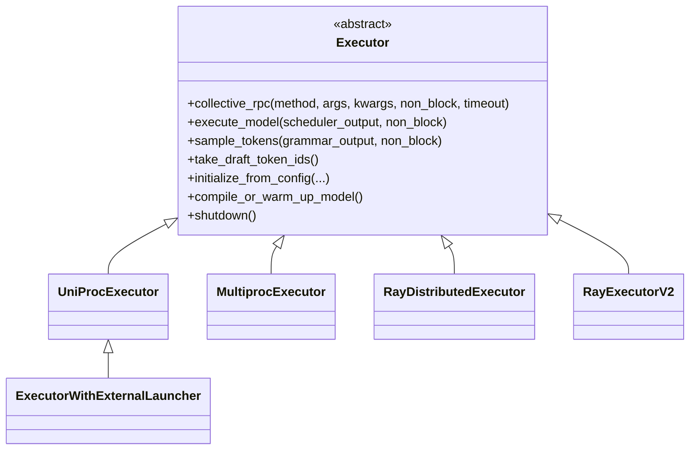

# `v1/executor` — Executor module

## Summary
`v1/executor` 抽象出 vLLM 的"**worker 进程编排**"层。`Executor` 是基类（[abstract.py:38](d:\design\vllm\vllm\v1\executor\abstract.py)），通过 `collective_rpc` 把方法调用广播到所有 worker。具体实现 4 种：`UniProcExecutor` / `MultiprocExecutor` / `RayDistributedExecutor` / `RayExecutorV2`，由配置 `distributed_executor_backend` 选择（[abstract.py:48-93](d:\design\vllm\vllm\v1\executor\abstract.py)）。本期 `"ray"` backend 的默认实现已翻转为 `RayExecutorV2`（见增量小节）。

## Sources
- 模块目录：[d:\design\vllm\vllm\v1\executor\](d:\design\vllm\vllm\v1\executor)（9 个 .py，本期新增 `vllm_net_devices.py`）
- 抽象基类：[abstract.py](d:\design\vllm\vllm\v1\executor\abstract.py)（391 行）
- 单进程：[uniproc_executor.py](d:\design\vllm\vllm\v1\executor\uniproc_executor.py)
- 多进程：[multiproc_executor.py](d:\design\vllm\vllm\v1\executor\multiproc_executor.py)（1122 行，本 demo 重点）
- Ray v1：[ray_executor.py](d:\design\vllm\vllm\v1\executor\ray_executor.py)
- Ray v2：[ray_executor_v2.py](d:\design\vllm\vllm\v1\executor\ray_executor_v2.py)
- Ray 工具：[ray_utils.py](d:\design\vllm\vllm\v1\executor\ray_utils.py), [ray_env_utils.py](d:\design\vllm\vllm\v1\executor\ray_env_utils.py)
- NIC 选择：[vllm_net_devices.py](d:\design\vllm\vllm\v1\executor\vllm_net_devices.py)

## 4 种实现的选择

`Executor.get_class()` 根据 `parallel_config.distributed_executor_backend` 字符串选实现（[abstract.py:48-93](d:\design\vllm\vllm\v1\executor\abstract.py)）：

| backend 字符串 | 实现 | 锚点 |
|---|---|---|
| `"uni"` | `UniProcExecutor` | [abstract.py:74-77](d:\design\vllm\vllm\v1\executor\abstract.py), [uniproc_executor.py](d:\design\vllm\vllm\v1\executor\uniproc_executor.py) |
| `"mp"` | `MultiprocExecutor` | [abstract.py:70-73](d:\design\vllm\vllm\v1\executor\abstract.py), [multiproc_executor.py](d:\design\vllm\vllm\v1\executor\multiproc_executor.py) |
| `"ray"`（默认走 V2，本期翻转） | `RayExecutorV2`（`VLLM_USE_RAY_V2_EXECUTOR_BACKEND` 默认 `1`） | [abstract.py:61-65](d:\design\vllm\vllm\v1\executor\abstract.py), [envs.py:925-926](d:\design\vllm\vllm\envs.py), [ray_executor_v2.py](d:\design\vllm\vllm\v1\executor\ray_executor_v2.py) |
| `"ray"` + env `VLLM_USE_RAY_V2_EXECUTOR_BACKEND=0` | `RayDistributedExecutor`（旧实现，退回口） | [abstract.py:66-69](d:\design\vllm\vllm\v1\executor\abstract.py), [ray_executor.py](d:\design\vllm\vllm\v1\executor\ray_executor.py) |
| `"external_launcher"` | `ExecutorWithExternalLauncher`（在 uniproc_executor.py 中） | [abstract.py:78-81](d:\design\vllm\vllm\v1\executor\abstract.py) |
| 自定义 qualname / 类对象 | 通过 `resolve_obj_by_qualname` 加载 | [abstract.py:54-88](d:\design\vllm\vllm\v1\executor\abstract.py) |

## 核心 API（基类约定）

定义在 [abstract.py](d:\design\vllm\vllm\v1\executor\abstract.py)：

| 方法 | 行号 | 说明 |
|---|---|---|
| `_init_executor()` | [116-118](d:\design\vllm\vllm\v1\executor\abstract.py) | 抽象方法，子类实现 worker 启动逻辑 |
| `collective_rpc(method, args, kwargs, non_block, timeout)` | [154-204](d:\design\vllm\vllm\v1\executor\abstract.py) | 抽象方法，把 `method` 广播到所有 worker；`non_block=True` 返 `Future` |
| `execute_model(scheduler_output, non_block)` | [223-229](d:\design\vllm\vllm\v1\executor\abstract.py) | 默认实现：`collective_rpc("execute_model", ...)` 取 `output[0]` |
| `sample_tokens(grammar_output, non_block)` | [243-249](d:\design\vllm\vllm\v1\executor\abstract.py) | 类似 execute_model |
| `take_draft_token_ids()` | [254-256](d:\design\vllm\vllm\v1\executor\abstract.py) | speculative decoding 用 |
| `initialize_from_config(kv_cache_configs)` | [120-122](d:\design\vllm\vllm\v1\executor\abstract.py) | 创建 KV cache（本期起**不再**顺带触发 warmup） |
| `compile_or_warm_up_model()` | [124-139](d:\design\vllm\vllm\v1\executor\abstract.py) | 本期从 initialize_from_config 拆出：RPC warmup 并聚合各 worker `CompilationTimes` |
| `determine_available_memory()` | [148-149](d:\design\vllm\vllm\v1\executor\abstract.py) | 让 workers profile 显存 |
| `get_kv_cache_specs()` | [151-152](d:\design\vllm\vllm\v1\executor\abstract.py) | 收集 worker 的 KV cache 规格 |
| `get_kv_connector_handshake_metadata()` | [206-209](d:\design\vllm\vllm\v1\executor\abstract.py) | KV connector（PD 分离）handshake |
| `init_kv_output_aggregator(connector)` | [282-286](d:\design\vllm\vllm\v1\executor\abstract.py) | 初始化 KV 输出聚合器 |
| `init_ec_output_aggregator()` | [288-289](d:\design\vllm\vllm\v1\executor\abstract.py) | 本期新增：EC（encoder cache）输出聚合器 |
| `supported_tasks` (cached_property) | [291-295](d:\design\vllm\vllm\v1\executor\abstract.py) | 本期新增：RPC `get_supported_tasks` 一次并缓存 |
| `supports_draft_weight_updates()` | [297-301](d:\design\vllm\vllm\v1\executor\abstract.py) | 本期新增：draft 权重运行时更新能力探测 |
| `register_failure_callback(callback)` | [141-146](d:\design\vllm\vllm\v1\executor\abstract.py) | 注册失败回调（base 是 no-op） |
| `check_health()` | [272-276](d:\design\vllm\vllm\v1\executor\abstract.py) | 抽象方法 |
| `shutdown()` | [278-280](d:\design\vllm\vllm\v1\executor\abstract.py) | 默认实现：广播 `shutdown` |
| `add_lora` / `remove_lora` / `pin_lora` / `list_loras` | [303-319](d:\design\vllm\vllm\v1\executor\abstract.py) | LoRA 管理 |
| `sleep(level)` / `wake_up(tags)` | [329-367](d:\design\vllm\vllm\v1\executor\abstract.py) | sleep/wake 模式（offline 时省内存） |
| `reinitialize_distributed(...)` | [369-372](d:\design\vllm\vllm\v1\executor\abstract.py) | 弹性 EP / 动态拓扑（base 抛 NotImplementedError） |
| `supports_async_scheduling()` (classmethod) | [374-379](d:\design\vllm\vllm\v1\executor\abstract.py) | 默认 False |

~~`max_concurrent_batches` (property)：默认 1，PP 时由子类覆盖~~
**RESOLVED 2026-08-18**：已从 `Executor` 基类与 `MultiprocExecutor` 移除，迁移为 `VllmConfig.max_concurrent_batches`（[d:\design\vllm\vllm\config\vllm.py:L549-554](d:\design\vllm\vllm\config\vllm.py)）。

## 类层次（synthesis）

（`abstract.py` 末尾另有 `UniProcExecutor` / `ExecutorWithExternalLauncher` 的向后兼容 re-export，[abstract.py:382-391](d:\design\vllm\vllm\v1\executor\abstract.py)。）

## 与其它模块的关系

- 被 [v1/engine/core.py](d:\design\vllm\vllm\v1\engine\core.py) 在 `EngineCore.__init__` 中实例化：[core.py:133](d:\design\vllm\vllm\v1\engine\core.py) — `self.model_executor = executor_class(vllm_config)`
- 调用对象：worker 类在 [v1/worker/](d:\design\vllm\vllm\v1\worker)，每个 `MultiprocExecutor` 进程内 `WorkerProc.worker_main` 跑 `worker_busy_loop`（[multiproc_executor.py:1029-1054](d:\design\vllm\vllm\v1\executor\multiproc_executor.py)）
- KV/EC connector 集成：`init_kv_output_aggregator` ([abstract.py:282-286](d:\design\vllm\vllm\v1\executor\abstract.py)) 与 `init_ec_output_aggregator` ([abstract.py:288-289](d:\design\vllm\vllm\v1\executor\abstract.py)) 把传输 connector 接入 RPC 输出聚合

## Increment 2026-08-18 (vLLM 5f7fab88 → d29dc3ab)

本期模块 diff：`abstract.py` 384 → 391 行（+25/-18 量级）、`multiproc_executor.py` 1047 → 1122、`ray_executor.py` +84、`ray_executor_v2.py` +114、`uniproc_executor.py` +63、新增 `vllm_net_devices.py`（243 行）。要点：

- **Ray backend 默认实现翻转**：`VLLM_USE_RAY_V2_EXECUTOR_BACKEND` env 默认值由 `0` 改为 `1`（[d:\design\vllm\vllm\envs.py:L925-926](d:\design\vllm\vllm\envs.py)；旧 pin 为 `"0"`），即 `"ray"` 现默认走 `RayExecutorV2`，旧 `RayDistributedExecutor` 成为显式 `=0` 的退回口（[d:\design\vllm\vllm\v1\executor\abstract.py:L61-69](d:\design\vllm\vllm\v1\executor\abstract.py)）。
- **init/warmup 协议拆分**：旧 pin 中 `Executor.initialize_from_config` 一并 RPC `initialize_from_config` + `compile_or_warm_up_model`；现拆成两个独立方法（[d:\design\vllm\vllm\v1\executor\abstract.py:L120-139](d:\design\vllm\vllm\v1\executor\abstract.py)），调用方（EngineCore 初始化链）分两步触发。
- **`max_concurrent_batches` 出模块**：见上 RESOLVED。
- **新增基类 API**：`init_ec_output_aggregator`（[L288-289](d:\design\vllm\vllm\v1\executor\abstract.py)）、`supported_tasks`（[L291-295](d:\design\vllm\vllm\v1\executor\abstract.py)）、`supports_draft_weight_updates`（[L297-301](d:\design\vllm\vllm\v1\executor\abstract.py)）。
- **新文件 `vllm_net_devices.py`**：`VLLM_GPU_NIC_PCIE_MAPPING`（GPU_BDF=NIC_BDF 对）驱动的 per-worker RDMA NIC 选择，`WorkerProc.worker_main` 早期调用 `set_worker_net_device`（[d:\design\vllm\vllm\v1\executor\multiproc_executor.py:L885-886](d:\design\vllm\vllm\v1\executor\multiproc_executor.py)）。
- MultiprocExecutor 内部变化（file:// rendezvous、CPU 线程管理、EC aggregator、deadline 修复等）详见 [entities/MultiprocExecutor.md](../entities/MultiprocExecutor.md) 增量小节。

> [!todo] VERIFY: `ray_executor.py` / `ray_executor_v2.py` / `uniproc_executor.py` 本期各自 +60~114 行的内部变化未逐一读源核对（本模块页只 verify 了 abstract.py 与 multiproc_executor.py 主锚点）。

## See also
- [entities/MultiprocExecutor.md](../entities/MultiprocExecutor.md) — 多进程实现详解
- [modules/engine.md](engine.md)
- [topics/request-lifecycle.md](../topics/request-lifecycle.md)
- [topics/multiproc-ipc.md](../topics/multiproc-ipc.md)
- `comparison/topics/executor-worker.md`（待建）
