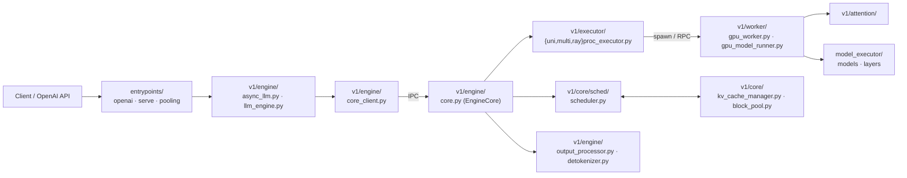

# vLLM Overview

## Summary
synthesis: vLLM 当前主线已经迁移到 **v1 架构**：`vllm/v1/` 是新一代的 Engine/Executor/Worker/Core 实现，旧路径 `vllm/{engine,executor,worker,...}` 在共存中淘汰。本 wiki 重点跟踪 v1。v1 把请求生命周期切成三段：**EngineCore（事件循环 + 调度）→ Executor（worker 进程编排）→ Worker（GPU/CPU/TPU/XPU forward）**。

## Sources
- 主代码根：[d:\design\vllm\vllm\](d:\design\vllm\vllm)
- v1 子树：[d:\design\vllm\vllm\v1\](d:\design\vllm\vllm\v1)
- 服务入口：[d:\design\vllm\vllm\entrypoints\](d:\design\vllm\vllm\entrypoints)
- v1/engine：[d:\design\vllm\vllm\v1\engine\core.py](d:\design\vllm\vllm\v1\engine\core.py), [llm_engine.py](d:\design\vllm\vllm\v1\engine\llm_engine.py), [async_llm.py](d:\design\vllm\vllm\v1\engine\async_llm.py)
- v1/executor：[d:\design\vllm\vllm\v1\executor\multiproc_executor.py](d:\design\vllm\vllm\v1\executor\multiproc_executor.py), [uniproc_executor.py](d:\design\vllm\vllm\v1\executor\uniproc_executor.py), [ray_executor.py](d:\design\vllm\vllm\v1\executor\ray_executor.py), [ray_executor_v2.py](d:\design\vllm\vllm\v1\executor\ray_executor_v2.py), [abstract.py](d:\design\vllm\vllm\v1\executor\abstract.py)
- v1/core (scheduler & kv cache)：[d:\design\vllm\vllm\v1\core\sched\scheduler.py](d:\design\vllm\vllm\v1\core\sched\scheduler.py), [kv_cache_manager.py](d:\design\vllm\vllm\v1\core\kv_cache_manager.py), [block_pool.py](d:\design\vllm\vllm\v1\core\block_pool.py)
- v1/worker：[d:\design\vllm\vllm\v1\worker\](d:\design\vllm\vllm\v1\worker)（68 文件，GPU 主战场在 [worker/gpu/](d:\design\vllm\vllm\v1\worker\gpu) 和 [gpu_model_runner.py](d:\design\vllm\vllm\v1\worker\gpu_model_runner.py)）

## Top-level layout（vllm/vllm 下 30 个顶层模块）

| 顶层模块 | 路径 | 角色（synthesis） |
|---|---|---|
| **v1** | [vllm/v1/](d:\design\vllm\vllm\v1) | 新一代主线（本 wiki 重点） |
| `entrypoints` | [vllm/entrypoints/](d:\design\vllm\vllm\entrypoints) | 服务化入口（OpenAI / Pooling / SageMaker / serve/{disagg,elastic_ep,instrumentator,...}） |
| `engine` | [vllm/engine/](d:\design\vllm\vllm\engine) | v0 引擎（旧路径，与 v1/engine 共存） |
| `executor` | [vllm/executor/](d:\design\vllm\vllm\executor) | v0 executor（旧路径） |
| `model_executor` | [vllm/model_executor/](d:\design\vllm\vllm\model_executor) | 模型实现层（layers / models） |
| `attention` | [vllm/attention/](d:\design\vllm\vllm\attention) | attention backend |
| `distributed` | [vllm/distributed/](d:\design\vllm\vllm\distributed) | TP/PP/EP/DP 通信 |
| `compilation` | [vllm/compilation/](d:\design\vllm\vllm\compilation) | torch.compile / cuda graph |
| `kernels` | [vllm/kernels/](d:\design\vllm\vllm\kernels) | 自定义算子 |
| `device_allocator` | [vllm/device_allocator/](d:\design\vllm\vllm\device_allocator) | 设备内存分配 |
| `multimodal` | [vllm/multimodal/](d:\design\vllm\vllm\multimodal) | 多模态 |
| `lora` | [vllm/lora/](d:\design\vllm\vllm\lora) | LoRA |
| `reasoning` | [vllm/reasoning/](d:\design\vllm\vllm\reasoning) | reasoning 模型适配 |
| `tool_parsers` | [vllm/tool_parsers/](d:\design\vllm\vllm\tool_parsers) | function calling |
| 其他 | `config / inputs / ir / kernels / logging_utils / parser / platforms / plugins / profiler / ray / renderers / tokenizers / tracing / triton_utils / usage / utils / vllm_flash_attn` | 配套 |

## v1 子树拆解（重点）

| v1 子目录 | 路径 | 关键文件数 / 内容 |
|---|---|---|
| `v1/engine` | [v1/engine/](d:\design\vllm\vllm\v1\engine) | 14 个：[core.py](d:\design\vllm\vllm\v1\engine\core.py), [llm_engine.py](d:\design\vllm\vllm\v1\engine\llm_engine.py), [async_llm.py](d:\design\vllm\vllm\v1\engine\async_llm.py), [core_client.py](d:\design\vllm\vllm\v1\engine\core_client.py), [coordinator.py](d:\design\vllm\vllm\v1\engine\coordinator.py), [output_processor.py](d:\design\vllm\vllm\v1\engine\output_processor.py), [input_processor.py](d:\design\vllm\vllm\v1\engine\input_processor.py), [detokenizer.py](d:\design\vllm\vllm\v1\engine\detokenizer.py), [parallel_sampling.py](d:\design\vllm\vllm\v1\engine\parallel_sampling.py), [tensor_ipc.py](d:\design\vllm\vllm\v1\engine\tensor_ipc.py) 等 |
| `v1/executor` | [v1/executor/](d:\design\vllm\vllm\v1\executor) | 8 个：[abstract.py](d:\design\vllm\vllm\v1\executor\abstract.py), [uniproc_executor.py](d:\design\vllm\vllm\v1\executor\uniproc_executor.py), [multiproc_executor.py](d:\design\vllm\vllm\v1\executor\multiproc_executor.py), [ray_executor.py](d:\design\vllm\vllm\v1\executor\ray_executor.py), [ray_executor_v2.py](d:\design\vllm\vllm\v1\executor\ray_executor_v2.py), [ray_utils.py](d:\design\vllm\vllm\v1\executor\ray_utils.py), [ray_env_utils.py](d:\design\vllm\vllm\v1\executor\ray_env_utils.py) |
| `v1/core` | [v1/core/](d:\design\vllm\vllm\v1\core) | 调度 + KV cache 管理：[sched/scheduler.py](d:\design\vllm\vllm\v1\core\sched\scheduler.py), [sched/async_scheduler.py](d:\design\vllm\vllm\v1\core\sched\async_scheduler.py), [sched/request_queue.py](d:\design\vllm\vllm\v1\core\sched\request_queue.py), [kv_cache_manager.py](d:\design\vllm\vllm\v1\core\kv_cache_manager.py), [kv_cache_coordinator.py](d:\design\vllm\vllm\v1\core\kv_cache_coordinator.py), [block_pool.py](d:\design\vllm\vllm\v1\core\block_pool.py), [encoder_cache_manager.py](d:\design\vllm\vllm\v1\core\encoder_cache_manager.py) |
| `v1/worker` | [v1/worker/](d:\design\vllm\vllm\v1\worker) | 68 文件，按硬件分：`gpu_*`、`gpu/`、`cpu_*`、`xpu_*`、`tpu_*`、`worker_base.py` 等 |
| `v1/attention` | [v1/attention/](d:\design\vllm\vllm\v1\attention) | v1 重构的 attention backend |
| `v1/kv_offload` | [v1/kv_offload/](d:\design\vllm\vllm\v1\kv_offload) | KV cache 跨设备 / 跨节点 offload |
| `v1/spec_decode` | [v1/spec_decode/](d:\design\vllm\vllm\v1\spec_decode) | speculative decoding（含 worker/gpu/spec_decode/eagle/ ） |
| `v1/sample` | [v1/sample/](d:\design\vllm\vllm\v1\sample) | sampling logits processors |
| `v1/structured_output` | [v1/structured_output/](d:\design\vllm\vllm\v1\structured_output) | 结构化输出约束 |
| `v1/pool` | [v1/pool/](d:\design\vllm\vllm\v1\pool) | embedding / classify pool 模型 |
| `v1/metrics` | [v1/metrics/](d:\design\vllm\vllm\v1\metrics) | 指标 |
| `v1/simple_kv_offload` | [v1/simple_kv_offload/](d:\design\vllm\vllm\v1\simple_kv_offload) | 简化版 KV offload |

> [!todo] VERIFY: PD 分离（disaggregated serving）入口看起来在 [vllm/entrypoints/serve/disagg/](d:\design\vllm\vllm\entrypoints\serve\disagg)，但 v1 内部未见独立 `disaggregation/` 目录。后续 ingest 时澄清是否分散在 `kv_offload/` 或 `kv_connector` mixin 里（worker 中有 [kv_connector_model_runner_mixin.py](d:\design\vllm\vllm\v1\worker\kv_connector_model_runner_mixin.py)）。

## v1 数据流（synthesis，待 demo 页面验证）

## v0 vs v1 共存

旧路径仍然存在于：

- [vllm/engine/](d:\design\vllm\vllm\engine) — v0 LLMEngine
- [vllm/executor/](d:\design\vllm\vllm\executor) — v0 Executor
- [vllm/worker/](d:\design\vllm\vllm\worker) — v0 Worker

> [!todo] VERIFY: v0 是否仍在维护，还是仅作 fallback。从顶层看 v1 已经实现了 sched/kv_cache/executor/worker 全套。

## 已知 / 重点关注

- **EngineCore + Executor + Worker 主线**：本轮 demo 的目标，详见 [modules/engine.md](modules/engine.md), [modules/executor.md](modules/executor.md), [entities/EngineCore.md](entities/EngineCore.md), [entities/MultiprocExecutor.md](entities/MultiprocExecutor.md), [topics/request-lifecycle.md](topics/request-lifecycle.md), [topics/multiproc-ipc.md](topics/multiproc-ipc.md)。
- **KV connector & offload**：vLLM 把 PD 分离能力下沉到 KV connector / offload 层（待 ingest）。
- **Speculative**：[v1/spec_decode/](d:\design\vllm\vllm\v1\spec_decode) + [v1/worker/gpu/spec_decode/eagle/](d:\design\vllm\vllm\v1\worker\gpu\spec_decode\eagle)（Eagle3 显式存在）。

## See also
- [vllm/index.md](index.md) — 项目内目录
- [comparison/index.md](../comparison/index.md)
- [mindie/overview.md](../mindie/overview.md), [sglang/overview.md](../sglang/overview.md)
