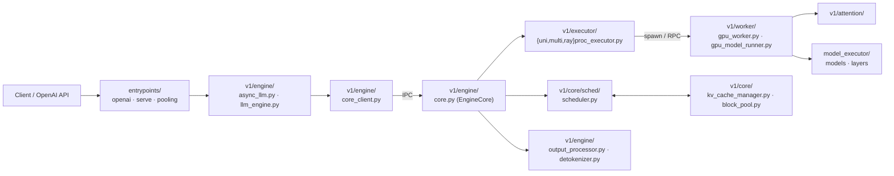

# vLLM Overview

## Summary
synthesis: vLLM 当前主线已经迁移到 **v1 架构**：`vllm/v1/` 是新一代的 Engine/Executor/Worker/Core 实现。~~旧路径 `vllm/{engine,executor,worker,...}` 在共存中淘汰~~ **RESOLVED 2026-08-18**：v0 清退已基本完成——`vllm/executor/`、`vllm/worker/`、`vllm/attention/` 顶层目录在 d29dc3ab **已删除**，`vllm/engine/` 只剩 4 文件兼容壳（见 §Increment）。v1 把请求生命周期切成三段：**EngineCore（事件循环 + 调度）→ Executor（worker 进程编排）→ Worker（GPU/CPU/TPU/XPU forward）**。

## Sources
- 主代码根：[d:\design\vllm\vllm\](d:\design\vllm\vllm)
- v1 子树：[d:\design\vllm\vllm\v1\](d:\design\vllm\vllm\v1)
- 服务入口：[d:\design\vllm\vllm\entrypoints\](d:\design\vllm\vllm\entrypoints)
- v1/engine：[d:\design\vllm\vllm\v1\engine\core.py](d:\design\vllm\vllm\v1\engine\core.py), [llm_engine.py](d:\design\vllm\vllm\v1\engine\llm_engine.py), [async_llm.py](d:\design\vllm\vllm\v1\engine\async_llm.py)
- v1/executor：[d:\design\vllm\vllm\v1\executor\multiproc_executor.py](d:\design\vllm\vllm\v1\executor\multiproc_executor.py), [uniproc_executor.py](d:\design\vllm\vllm\v1\executor\uniproc_executor.py), [ray_executor.py](d:\design\vllm\vllm\v1\executor\ray_executor.py), [ray_executor_v2.py](d:\design\vllm\vllm\v1\executor\ray_executor_v2.py), [abstract.py](d:\design\vllm\vllm\v1\executor\abstract.py)
- v1/core (scheduler & kv cache)：[d:\design\vllm\vllm\v1\core\sched\scheduler.py](d:\design\vllm\vllm\v1\core\sched\scheduler.py), [kv_cache_manager.py](d:\design\vllm\vllm\v1\core\kv_cache_manager.py), [block_pool.py](d:\design\vllm\vllm\v1\core\block_pool.py)
- v1/worker：[d:\design\vllm\vllm\v1\worker\](d:\design\vllm\vllm\v1\worker)（68 文件，GPU 主战场在 [worker/gpu/](d:\design\vllm\vllm\v1\worker\gpu) 和 [gpu_model_runner.py](d:\design\vllm\vllm\v1\worker\gpu_model_runner.py)）

## Top-level layout（vllm/vllm 下 35 个顶层目录，2026-08-18 实地 ls）

| 顶层模块 | 路径 | 角色（synthesis） |
|---|---|---|
| **v1** | [vllm/v1/](d:\design\vllm\vllm\v1) | 新一代主线（本 wiki 重点） |
| `entrypoints` | [vllm/entrypoints/](d:\design\vllm\vllm\entrypoints) | 服务化入口（OpenAI / Pooling / SageMaker / serve/{dev,elastic_ep,engine,fault_tolerance,instrumentator,...} / **scale_out/**（tokens-in/tokens-out 前端，原 serve/disagg）） |
| `engine` | [vllm/engine/](d:\design\vllm\vllm\engine) | ~~v0 引擎（旧路径，与 v1/engine 共存）~~ **RESOLVED 2026-08-18**：只剩 4 文件——`arg_utils.py`（2890 行，CLI 参数仍住这里）+ `llm_engine.py` / `async_llm_engine.py`（各 7 行转发壳）+ `protocol.py`（281 行） |
| ~~`executor`~~ | — | **RESOLVED 2026-08-18**：v0 executor 目录已删除 |
| ~~`worker`~~ | — | **RESOLVED 2026-08-18**：v0 worker 目录已删除 |
| ~~`attention`~~ | — | **RESOLVED 2026-08-18**：顶层 attention 目录已删除，attention backend 集中在 [vllm/v1/attention/](d:\design\vllm\vllm\v1\attention) |
| `model_executor` | [vllm/model_executor/](d:\design\vllm\vllm\model_executor) | 模型实现层（layers / models） |
| `models` | [vllm/models/](d:\design\vllm\vllm\models) | **新增**顶层模型包（实地 ls 见 `common/` / `deepseek_v32/` / `deepseek_v4/` / `dots3_note/` 等子目录） |
| `distributed` | [vllm/distributed/](d:\design\vllm\vllm\distributed) | TP/PP/EP/DP 通信 + kv_transfer（KV connector） |
| `compilation` | [vllm/compilation/](d:\design\vllm\vllm\compilation) | torch.compile / cuda graph |
| `kernels` | [vllm/kernels/](d:\design\vllm\vllm\kernels) | 自定义算子 |
| `device_allocator` | [vllm/device_allocator/](d:\design\vllm\vllm\device_allocator) | 设备内存分配 |
| `multimodal` | [vllm/multimodal/](d:\design\vllm\vllm\multimodal) | 多模态 |
| `lora` | [vllm/lora/](d:\design\vllm\vllm\lora) | LoRA |
| `reasoning` | [vllm/reasoning/](d:\design\vllm\vllm\reasoning) | reasoning 模型适配 |
| `tool_parsers` | [vllm/tool_parsers/](d:\design\vllm\vllm\tool_parsers) | function calling |
| 其他 | `assets / benchmarks / config / cute_utils / inputs / ir / logging_utils / parser / platforms / plugins / profiler / ray / renderers / third_party / tilelang_utils / tokenizers / tracing / transformers_utils / triton_utils / usage / utils / vllm_flash_attn` | 配套（`cute_utils` / `tilelang_utils` / `third_party` 为本期新增） |

> [!todo] VERIFY: 新顶层 `vllm/models/` 与 `vllm/model_executor/models/` 的分工（新模型迁移中？）未读代码确认。

## v1 子树拆解（重点）

| v1 子目录 | 路径 | 关键文件数 / 内容 |
|---|---|---|
| `v1/engine` | [v1/engine/](d:\design\vllm\vllm\v1\engine) | 14 个：[core.py](d:\design\vllm\vllm\v1\engine\core.py), [llm_engine.py](d:\design\vllm\vllm\v1\engine\llm_engine.py), [async_llm.py](d:\design\vllm\vllm\v1\engine\async_llm.py), [core_client.py](d:\design\vllm\vllm\v1\engine\core_client.py), [coordinator.py](d:\design\vllm\vllm\v1\engine\coordinator.py), [output_processor.py](d:\design\vllm\vllm\v1\engine\output_processor.py), [input_processor.py](d:\design\vllm\vllm\v1\engine\input_processor.py), [detokenizer.py](d:\design\vllm\vllm\v1\engine\detokenizer.py), [parallel_sampling.py](d:\design\vllm\vllm\v1\engine\parallel_sampling.py), [tensor_ipc.py](d:\design\vllm\vllm\v1\engine\tensor_ipc.py) 等 |
| `v1/executor` | [v1/executor/](d:\design\vllm\vllm\v1\executor) | 8 个：[abstract.py](d:\design\vllm\vllm\v1\executor\abstract.py), [uniproc_executor.py](d:\design\vllm\vllm\v1\executor\uniproc_executor.py), [multiproc_executor.py](d:\design\vllm\vllm\v1\executor\multiproc_executor.py), [ray_executor.py](d:\design\vllm\vllm\v1\executor\ray_executor.py), [ray_executor_v2.py](d:\design\vllm\vllm\v1\executor\ray_executor_v2.py), [ray_utils.py](d:\design\vllm\vllm\v1\executor\ray_utils.py), [ray_env_utils.py](d:\design\vllm\vllm\v1\executor\ray_env_utils.py) |
| `v1/core` | [v1/core/](d:\design\vllm\vllm\v1\core) | 调度 + KV cache 管理：[sched/scheduler.py](d:\design\vllm\vllm\v1\core\sched\scheduler.py), [sched/async_scheduler.py](d:\design\vllm\vllm\v1\core\sched\async_scheduler.py), [sched/request_queue.py](d:\design\vllm\vllm\v1\core\sched\request_queue.py), [kv_cache_manager.py](d:\design\vllm\vllm\v1\core\kv_cache_manager.py), [kv_cache_coordinator.py](d:\design\vllm\vllm\v1\core\kv_cache_coordinator.py), [block_pool.py](d:\design\vllm\vllm\v1\core\block_pool.py), [encoder_cache_manager.py](d:\design\vllm\vllm\v1\core\encoder_cache_manager.py) |
| `v1/worker` | [v1/worker/](d:\design\vllm\vllm\v1\worker) | 68 文件，按硬件分：`gpu_*`、`gpu/`、`cpu_*`、`xpu_*`、`tpu_*`、`worker_base.py` 等 |
| `v1/attention` | [v1/attention/](d:\design\vllm\vllm\v1\attention) | v1 重构的 attention backend（顶层 attention/ 删除后的唯一实现地） |
| `v1/kv_offload` | [v1/kv_offload/](d:\design\vllm\vllm\v1\kv_offload) | KV cache 跨设备 / 跨节点 offload |
| `v1/spec_decode` | [v1/spec_decode/](d:\design\vllm\vllm\v1\spec_decode) | speculative decoding proposer 层（18 文件；worker 侧执行层在 [v1/worker/gpu/spec_decode/](d:\design\vllm\vllm\v1\worker\gpu\spec_decode)，详见 [topics/spec-decode-eagle.md](topics/spec-decode-eagle.md) §Increment） |
| `v1/sample` | [v1/sample/](d:\design\vllm\vllm\v1\sample) | sampling logits processors |
| `v1/structured_output` | [v1/structured_output/](d:\design\vllm\vllm\v1\structured_output) | 结构化输出约束 |
| `v1/pool` | [v1/pool/](d:\design\vllm\vllm\v1\pool) | embedding / classify pool 模型 |
| `v1/metrics` | [v1/metrics/](d:\design\vllm\vllm\v1\metrics) | 指标 |
| `v1/simple_kv_offload` | [v1/simple_kv_offload/](d:\design\vllm\vllm\v1\simple_kv_offload) | 简化版 KV offload |
| `v1/fault_tolerance` | [v1/fault_tolerance/](d:\design\vllm\vllm\v1\fault_tolerance) | **新增**（含 [engine_core_sentinel.py](d:\design\vllm\vllm\v1\fault_tolerance\engine_core_sentinel.py)，EngineCore 哨兵/容错） |

> ~~[!todo] VERIFY: PD 分离（disaggregated serving）入口看起来在 vllm/entrypoints/serve/disagg/~~ **RESOLVED 2026-08-18**：PD 分离已确认下沉在 `vllm/distributed/kv_transfer/`（KV connector）+ worker 的 [kv_connector_model_runner_mixin.py](d:\design\vllm\vllm\v1\worker\kv_connector_model_runner_mixin.py)，HTTP 前端为 [vllm/entrypoints/scale_out/token_in_token_out/](d:\design\vllm\vllm\entrypoints\scale_out\token_in_token_out)（原 `serve/disagg/`，本期迁移）。详见 [topics/kv-connector.md](topics/kv-connector.md)。

## v1 数据流（synthesis，待 demo 页面验证）

## v0 vs v1 共存

~~旧路径仍然存在于：[vllm/engine/](d:\design\vllm\vllm\engine) — v0 LLMEngine、vllm/executor/ — v0 Executor、vllm/worker/ — v0 Worker~~
**RESOLVED 2026-08-18**：`vllm/executor/` 与 `vllm/worker/` 目录在 d29dc3ab 已删除（实地 ls 0 命中）；`vllm/engine/` 仅存 [arg_utils.py](d:\design\vllm\vllm\engine\arg_utils.py)（2890 行，`EngineArgs` CLI 参数定义）+ 7 行的 [llm_engine.py](d:\design\vllm\vllm\engine\llm_engine.py) / [async_llm_engine.py](d:\design\vllm\vllm\engine\async_llm_engine.py) 转发壳 + [protocol.py](d:\design\vllm\vllm\engine\protocol.py)。~~VERIFY: v0 是否仍在维护~~ → v0 执行路径已物理移除，v1 是唯一实现。

## 已知 / 重点关注

- **EngineCore + Executor + Worker 主线**：本轮 demo 的目标，详见 [modules/engine.md](modules/engine.md), [modules/executor.md](modules/executor.md), [entities/EngineCore.md](entities/EngineCore.md), [entities/MultiprocExecutor.md](entities/MultiprocExecutor.md), [topics/request-lifecycle.md](topics/request-lifecycle.md), [topics/multiproc-ipc.md](topics/multiproc-ipc.md)。
- **KV connector & offload**：vLLM 把 PD 分离能力下沉到 KV connector / offload 层，详见 [topics/kv-connector.md](topics/kv-connector.md)。
- **Speculative**：[v1/spec_decode/](d:\design\vllm\vllm\v1\spec_decode)（proposer 层）+ [v1/worker/gpu/spec_decode/](d:\design\vllm\vllm\v1\worker\gpu\spec_decode)（Speculator 执行层），详见 [topics/spec-decode-eagle.md](topics/spec-decode-eagle.md)。

## Increment 2026-08-18 (vLLM 5f7fab88 → d29dc3ab)

> 本期 4273 commits。以下为影响架构总览的结构性变化（均实地 ls / git 核对）：

1. **v0 物理清退**：顶层 `attention/`、`executor/`、`worker/` 三目录删除；`engine/` 缩为 4 文件兼容壳（见上）。
2. **`v1/worker/gpu/` 包（Model Runner V2）持续扩张**：spec decode 执行层整体落户 [v1/worker/gpu/spec_decode/](d:\design\vllm\vllm\v1\worker\gpu\spec_decode)——`BaseSpeculator → DraftModelSpeculator → AutoRegressiveSpeculator` 家族 + dflash/dspark/gemma4/mtp/multi_module_mtp/eagle 6 类实现 + 新版 RejectionSampler（`standard/synthetic/block` 三模式）。同期 `v1/spec_decode/eagle.py` 被抽空成 22 行薄壳，基类迁至 [llm_base_proposer.py](d:\design\vllm\vllm\v1\spec_decode\llm_base_proposer.py)（commit `cde8d24710`）。详见 [topics/spec-decode-eagle.md](topics/spec-decode-eagle.md) §Increment。
3. **KV transfer 大 churn**（54 文件 +17333/-6313）：P2pNcclConnector 删除；NIXL 拆 base/pull/push（新增 push 写模式）；Mooncake 新增 store/ 子树；connector 注册数 14 → 16。详见 [topics/kv-connector.md](topics/kv-connector.md) §Increment。
4. **entrypoints 重排**：`serve/disagg/` → [scale_out/token_in_token_out/](d:\design\vllm\vllm\entrypoints\scale_out\token_in_token_out)（另有 derender/ / render/）；serve/ 下新增 dev / engine / exception_handling / fault_tolerance / lora / middleware / profile / tokenize / utils 子目录。
5. **v1 新子系统**：[v1/fault_tolerance/](d:\design\vllm\vllm\v1\fault_tolerance)（EngineCore 哨兵）；v1 顶层新文件 `cudagraph_dispatcher.py` / `kv_cache_spec_registry.py`。
6. **新顶层包**：`models/`（新模型实现）、`cute_utils/`、`tilelang_utils/`、`third_party/`。

> [!todo] VERIFY: 本页 v1/engine、v1/executor 小节的文件清单（14 个 / 8 个）未按 d29dc3ab 重新清点；`v1/fault_tolerance/`、`cudagraph_dispatcher.py`、`kv_cache_spec_registry.py` 均未读代码。

## See also
- [vllm/index.md](index.md) — 项目内目录
- [comparison/index.md](../comparison/index.md)
