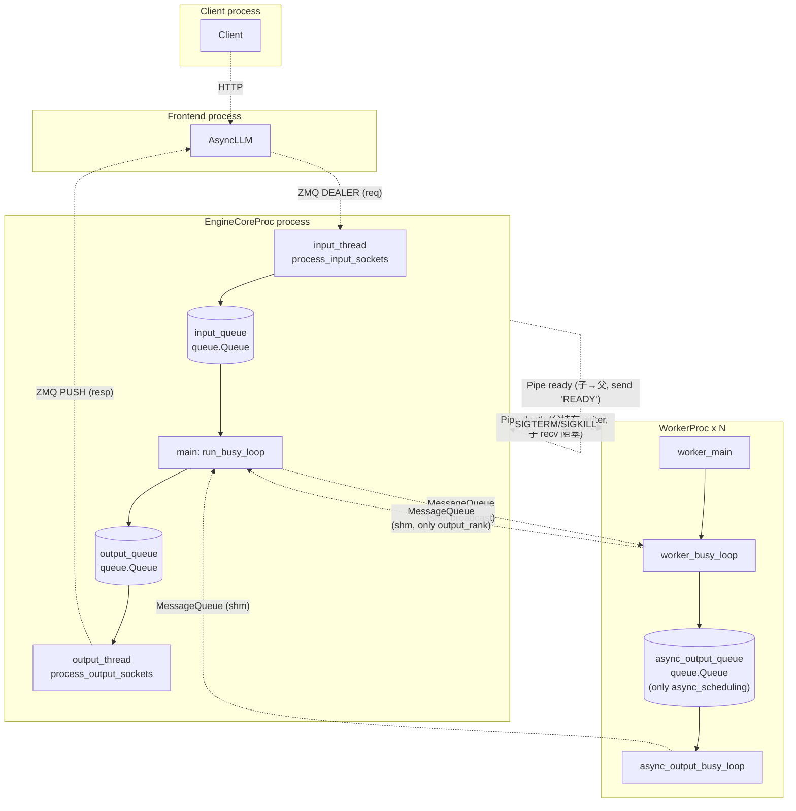
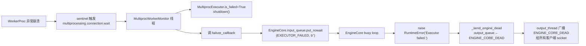

# Multi-process IPC in vLLM v1

## Summary
synthesis: vLLM v1 在 `MultiprocExecutor` 部署下混用 **5 类 IPC 机制**：(1) ZMQ socket（前端 ↔ EngineCoreProc）；(2) `MessageQueue` 共享内存环形 buffer（EngineCoreProc ↔ Workers，**热路径**）；(3) `multiprocessing.Pipe`（ready 信号 + death 信号）；(4) Python `queue.Queue` + threading（EngineCoreProc 内部 IO 线程 ↔ busy loop）；(5) POSIX 信号（SIGTERM/SIGINT/SIGKILL，进程终止）。每种机制承担不同职责，本页梳理边界。

## Sources
- ZMQ：[engine/core.py:1383-1527](d:\design\vllm\vllm\v1\engine\core.py)
- `MessageQueue` 用法：[executor/multiproc_executor.py:129-238, 555-585](d:\design\vllm\vllm\v1\executor\multiproc_executor.py)
- Pipe（ready / death）：[executor/multiproc_executor.py:665-703, 775-798](d:\design\vllm\vllm\v1\executor\multiproc_executor.py)
- queue.Queue + threading：[engine/core.py:821-907](d:\design\vllm\vllm\v1\engine\core.py)
- 信号处理：[executor/multiproc_executor.py:810-821](d:\design\vllm\vllm\v1\executor\multiproc_executor.py)
- `MessageQueue` / `Handle` 实现（待 ingest）：[vllm/distributed/device_communicators/shm_broadcast.py](d:\design\vllm\vllm\distributed\device_communicators\shm_broadcast.py)

## 全景图



## 1. ZMQ Socket（前端 ↔ EngineCoreProc）

**为什么用**：跨进程 / 跨机器、社区成熟、msgspec 序列化兼容。

| 方向 | 类型 | 端 | 锚点 |
|---|---|---|---|
| 客户端 → engine（请求） | `zmq.DEALER` | engine 端 connect（`bind=False`） | [engine/core.py:1383-1391](d:\design\vllm\vllm\v1\engine\core.py) |
| engine → 客户端（输出） | `zmq.PUSH` | engine 端连出 | [engine/core.py:1479-1484](d:\design\vllm\vllm\v1\engine\core.py) |
| DP coordinator → engine | `zmq.XSUB`（订阅） | engine 端发 `b"\x01"` 订阅 | [engine/core.py:1395-1405](d:\design\vllm\vllm\v1\engine\core.py) |
| engine → DP coordinator | `zmq.PUSH` | bind=False | [engine/core.py:1485-1493](d:\design\vllm\vllm\v1\engine\core.py) |

要点：

- **多帧编码**：请求拆 type frame + data frames（msgspec 多个 buffer），用 `recv_multipart(copy=False)` 零拷贝接收（[engine/core.py:1432](d:\design\vllm\vllm\v1\engine\core.py)）。
- **ready 同步**：engine input_thread 启动时给每个 input_socket 主动 send 一个 `EngineCoreReadyResponse`，客户端 ROUTER 收到后才能往 engine 发消息（[engine/core.py:1409-1419](d:\design\vllm\vllm\v1\engine\core.py)）。
- **零拷贝优化**：output 用 `encode_into(outputs, buffer)` + `send_multipart(copy=False, track=True)`，配合 buffer reuse 池（最多 `len(sockets)+1` 个 buffer，[engine/core.py:1494, 1517-1527](d:\design\vllm\vllm\v1\engine\core.py)）。
- **shutdown 信号**：`linger=4000` 确保 `ENGINE_CORE_DEAD = b"ENGINE_CORE_DEAD"` 哨兵在 socket 关闭前能发出（[engine/core.py:1481, 1488, 1498-1501](d:\design\vllm\vllm\v1\engine\core.py)）。
- **ABORT 双路**：abort 同时 put 到 `aborts_queue`（让正在 step 的 model 执行不阻塞 abort）和 `input_queue`（保证顺序），见 [engine/core.py:1452-1460](d:\design\vllm\vllm\v1\engine\core.py)。

## 2. MessageQueue（共享内存环形 buffer）— **热路径**

定义在 [vllm/distributed/device_communicators/shm_broadcast.py](d:\design\vllm\vllm\distributed\device_communicators\shm_broadcast.py)（实现待 ingest），核心 API：

| API | 说明 |
|---|---|
| `MessageQueue(num_writers, num_readers, max_chunk_bytes, connect_ip)` | 构造（leader 端） |
| `MessageQueue.create_from_handle(handle, rank)` | 从导出的 handle 还原（worker 端） |
| `export_handle()` → `Handle` | 把 MQ 跨进程传递所需的元数据导出 |
| `wait_until_ready()` | 阻塞同步两端就绪 |
| `enqueue(item)` / `dequeue(timeout|indefinite=True)` | 收发（item 是任意 picklable 对象） |
| `shutdown()` | 关闭 |

**两条 MQ 通道**：

| 名字 | 方向 | writers / readers | 锚点 |
|---|---|---|---|
| `rpc_broadcast_mq` | EngineCoreProc → 所有 worker（**广播**） | 1 writer, world_size readers | [executor/multiproc_executor.py:149-155](d:\design\vllm\vllm\v1\executor\multiproc_executor.py)（leader 创建）+ [executor/multiproc_executor.py:560-562](d:\design\vllm\vllm\v1\executor\multiproc_executor.py)（worker 端用 handle 创建） |
| `worker_response_mq` | 单个 worker → EngineCoreProc | 1 writer, 1 reader（单节点） | [executor/multiproc_executor.py:565](d:\design\vllm\vllm\v1\executor\multiproc_executor.py)（worker 创建）+ [executor/multiproc_executor.py:712](d:\design\vllm\vllm\v1\executor\multiproc_executor.py)（executor 端 `create_from_handle(..., 0)`） |
| `peer_worker_response_mqs` | 跨节点 worker → driver worker | 多节点用 | [executor/multiproc_executor.py:567-585](d:\design\vllm\vllm\v1\executor\multiproc_executor.py)，[executor/multiproc_executor.py:713-719](d:\design\vllm\vllm\v1\executor\multiproc_executor.py) |

**Handshake 顺序（颠倒会死锁）**：

Executor 端（[executor/multiproc_executor.py:230-238](d:\design\vllm\vllm\v1\executor\multiproc_executor.py)）：
```
rpc_broadcast_mq.wait_until_ready()
for response_mq in self.response_mqs:
    response_mq.wait_until_ready()
```

Worker 端（[executor/multiproc_executor.py:862-866](d:\design\vllm\vllm\v1\executor\multiproc_executor.py)）：
```
worker.rpc_broadcast_mq.wait_until_ready()
worker.worker_response_mq.wait_until_ready()
```

> [!warning] CONTRADICTION: 注释 "Will deadlock if re-ordered" 在两侧都明示，**改这段时必须双侧同步**。

**Handle 通过 ready_pipe 传递**：worker 启动后通过 ready_pipe 发送 `{"status":"READY", "handle": worker_response_mq.export_handle(), "peer_response_handles": ...}`（[executor/multiproc_executor.py:854-860](d:\design\vllm\vllm\v1\executor\multiproc_executor.py)），executor 端 `wait_for_response_handle_ready` 用这些 handle 创建本地 reader（[executor/multiproc_executor.py:705-724](d:\design\vllm\vllm\v1\executor\multiproc_executor.py)）。

**配置**：

- `max_chunk_bytes = envs.VLLM_MQ_MAX_CHUNK_BYTES_MB * 1024 * 1024`（[executor/multiproc_executor.py:136](d:\design\vllm\vllm\v1\executor\multiproc_executor.py)）

## 3. multiprocessing.Pipe（ready / death 双信号）

| Pipe | 方向 | 用途 | 锚点 |
|---|---|---|---|
| `ready_pipe` | child → parent | 子进程 init 完成发 `{"status":"READY", ...}` | [executor/multiproc_executor.py:665, 854-860, 727-762](d:\design\vllm\vllm\v1\executor\multiproc_executor.py) |
| `death_pipe` | parent → child（reader 在 child） | 父进程退出 → 关 writer → child 端 recv() 抛 EOFError → child 自杀 | [executor/multiproc_executor.py:667, 700-703, 775-798](d:\design\vllm\vllm\v1\executor\multiproc_executor.py) |

**ready_pipe 协议**：

- 父端：`multiprocessing.connection.wait(pipes)` 多路复用（避免每个 pipe 一个 thread）（[executor/multiproc_executor.py:740](d:\design\vllm\vllm\v1\executor\multiproc_executor.py)）
- 字段：`{"status": "READY", "handle": <MQ handle>, "peer_response_handles": [...]}`（[executor/multiproc_executor.py:854-860](d:\design\vllm\vllm\v1\executor\multiproc_executor.py)）
- 失败：父端 `EOFError` 抛 `WorkerProc initialization failed...` 异常（[executor/multiproc_executor.py:730-733, 754-756](d:\design\vllm\vllm\v1\executor\multiproc_executor.py)）

**death_pipe 协议**：

- 父端持有 writer 永不主动关闭，直到 shutdown 或父进程崩溃
- 子端线程 `death_pipe_monitor` 阻塞 `death_pipe.recv()`（[executor/multiproc_executor.py:782](d:\design\vllm\vllm\v1\executor\multiproc_executor.py)）
- 父退出 → writer 自动关 → child recv() 立即 EOFError → 设 `shutdown_requested` 并 shutdown 所有 MQ（[executor/multiproc_executor.py:783-788](d:\design\vllm\vllm\v1\executor\multiproc_executor.py)）

> synthesis: 这套机制让 worker 在 **父进程意外崩溃时也能干净自杀**，不依赖 SIGKILL 兜底。

**fork 模式的 fd 处理**：

- fork 时所有 fd 都被子进程继承，包括其它 worker 的 pipe → 必须显式关闭，否则该 fd 不会真正闭合
- executor 端：`inherited_fds` 收集每个新 worker 的 `death_writer.fileno()` 和 `ready_pipe.fileno()`，传给后续 worker（[executor/multiproc_executor.py:165-203](d:\design\vllm\vllm\v1\executor\multiproc_executor.py)）
- worker 端：构造时 `os.close(fd)` 关掉这些 inherited fd（[executor/multiproc_executor.py:831-835](d:\design\vllm\vllm\v1\executor\multiproc_executor.py)）

## 4. Python `queue.Queue` + threading（进程内 IO 线程 ↔ busy loop）

**EngineCoreProc 内部**：

| Queue | writers / readers | 用途 | 锚点 |
|---|---|---|---|
| `input_queue: queue.Queue[(EngineCoreRequestType, Any)]` | input_thread → busy loop | 来自客户端的请求 | [engine/core.py:821, 1186, 1460](d:\design\vllm\vllm\v1\engine\core.py) |
| `output_queue: queue.Queue[(int, EngineCoreOutputs) \| bytes]` | busy loop → output_thread | 给客户端的输出 | [engine/core.py:822, 1208, 1497](d:\design\vllm\vllm\v1\engine\core.py) |
| `aborts_queue: queue.Queue[list[str]]` | input_thread → busy loop（旁路） | abort 加速通道 | [engine/core.py:217, 1457, 1179-1180](d:\design\vllm\vllm\v1\engine\core.py) |

**WorkerProc 内部**（仅 async_scheduling）：

| Queue | 用途 | 锚点 |
|---|---|---|
| `async_output_queue: queue.Queue` | model output → output 线程 → MQ | [executor/multiproc_executor.py:633-639, 925-951](d:\design\vllm\vllm\v1\executor\multiproc_executor.py) |

> synthesis: 把 IO 与计算线程拆开是 vLLM v1 的关键性能特征——**ZMQ / MQ IO 释放 GIL，让 model 执行（也释放 GIL）能与 socket IO 真正并发**。

线程：

| 线程 | 进程 | 启动锚点 |
|---|---|---|
| input_thread | EngineCoreProc | [engine/core.py:886-896](d:\design\vllm\vllm\v1\engine\core.py) |
| output_thread | EngineCoreProc | [engine/core.py:898-907](d:\design\vllm\vllm\v1\engine\core.py) |
| MultiprocWorkerMonitor | EngineCoreProc | [executor/multiproc_executor.py:301-304](d:\design\vllm\vllm\v1\executor\multiproc_executor.py) |
| WorkerAsyncOutputCopy | WorkerProc（仅 async_scheduling） | [executor/multiproc_executor.py:634-639](d:\design\vllm\vllm\v1\executor\multiproc_executor.py) |
| DeathPipeMonitor | WorkerProc | [executor/multiproc_executor.py:793-798](d:\design\vllm\vllm\v1\executor\multiproc_executor.py) |

## 5. POSIX 信号

| 信号 | 接收方 | 行为 | 锚点 |
|---|---|---|---|
| `SIGTERM` | WorkerProc | signal_handler 设 shutdown_requested + raise SystemExit | [executor/multiproc_executor.py:810-821](d:\design\vllm\vllm\v1\executor\multiproc_executor.py) |
| `SIGINT` | WorkerProc | 同上 | 同上 |
| `SIGTERM` | WorkerProc（外部） | executor 在 graceful 等 4s 后调 `proc.terminate()` | [executor/multiproc_executor.py:438-441](d:\design\vllm\vllm\v1\executor\multiproc_executor.py) |
| `SIGKILL` | WorkerProc（外部） | 再等 4s 后 `proc.kill()` 兜底 | [executor/multiproc_executor.py:443-448](d:\design\vllm\vllm\v1\executor\multiproc_executor.py) |
| 父进程死亡 | WorkerProc | DeathPipeMonitor 检测 → 自杀 | [executor/multiproc_executor.py:775-798](d:\design\vllm\vllm\v1\executor\multiproc_executor.py) |
| sentinel 监听 | EngineCoreProc | `multiprocessing.connection.wait([h.proc.sentinel])` 阻塞等任一 worker 死 | [executor/multiproc_executor.py:284-285](d:\design\vllm\vllm\v1\executor\multiproc_executor.py) |
| 任意信号 | EngineCore（DP） | `SignalCallback`（[utils.py](d:\design\vllm\vllm\v1\engine\utils.py)） + [engine/core.py:1118](d:\design\vllm\vllm\v1\engine\core.py) | |

## 6. Tensor IPC（多模态专用）

`TensorIpcReceiver`（[engine/tensor_ipc.py](d:\design\vllm\vllm\v1\engine\tensor_ipc.py)）：

- 多模态 tensor 不走 zmq（避免拷贝大 tensor）
- 由 `multiprocessing.queues.Queue` + 共享内存承载（具体协议待 ingest）
- 在 EngineCoreProc 构造时按需创建：`tensor_queue is not None` → `TensorIpcReceiver(tensor_queue)`（[engine/core.py:817, 833-836](d:\design\vllm\vllm\v1\engine\core.py)）
- 在 msgspec decoder 中作为 `oob_tensor_provider` 注入，反序列化时通过 ipc 替换 tensor placeholder（[engine/core.py:1378-1381](d:\design\vllm\vllm\v1\engine\core.py)）

## 失败传播全景



锚点：

- 监控触发：[executor/multiproc_executor.py:283-299](d:\design\vllm\vllm\v1\executor\multiproc_executor.py)
- callback 注入：[engine/core.py:117-118, 823-825](d:\design\vllm\vllm\v1\engine\core.py)
- EXECUTOR_FAILED 处理：[engine/core.py:1290-1291](d:\design\vllm\vllm\v1\engine\core.py)
- ENGINE_CORE_DEAD 哨兵：[engine/core.py:1354-1366, 1498-1501](d:\design\vllm\vllm\v1\engine\core.py)

worker 内部 RPC 异常：

- worker_busy_loop catch → `handle_output(e)` → `enqueue_output` 把 `(FAILURE, str(e))` 写 MQ（[executor/multiproc_executor.py:910-923, 967-979](d:\design\vllm\vllm\v1\executor\multiproc_executor.py)）
- executor 端 `collective_rpc.get_response` 看到 `FAILURE` 立即 raise（[executor/multiproc_executor.py:398-402](d:\design\vllm\vllm\v1\executor\multiproc_executor.py)）

## Notes / Caveats
> [!todo] VERIFY: `MessageQueue` 的具体共享内存协议（ringbuffer 大小、wraparound、多 reader 时的 fan-out）— 在 [vllm/distributed/device_communicators/shm_broadcast.py](d:\design\vllm\vllm\distributed\device_communicators\shm_broadcast.py)。
> [!todo] VERIFY: `EngineCoreClient` 同步/异步两套客户端如何与本页描述的 ZMQ 端点配合 — 在 [engine/core_client.py](d:\design\vllm\vllm\v1\engine\core_client.py)。
> [!todo] VERIFY: 跨节点（`nnodes_within_dp > 1`）时 `inner_dp_world_group.create_mq_broadcaster` 用的底层是 RDMA 还是 TCP（[executor/multiproc_executor.py:567-585](d:\design\vllm\vllm\v1\executor\multiproc_executor.py)）。

## See also
- [entities/MultiprocExecutor.md](../entities/MultiprocExecutor.md)
- [entities/EngineCore.md](../entities/EngineCore.md)
- [topics/request-lifecycle.md](request-lifecycle.md)
- `comparison/topics/executor-worker.md`（待建）
