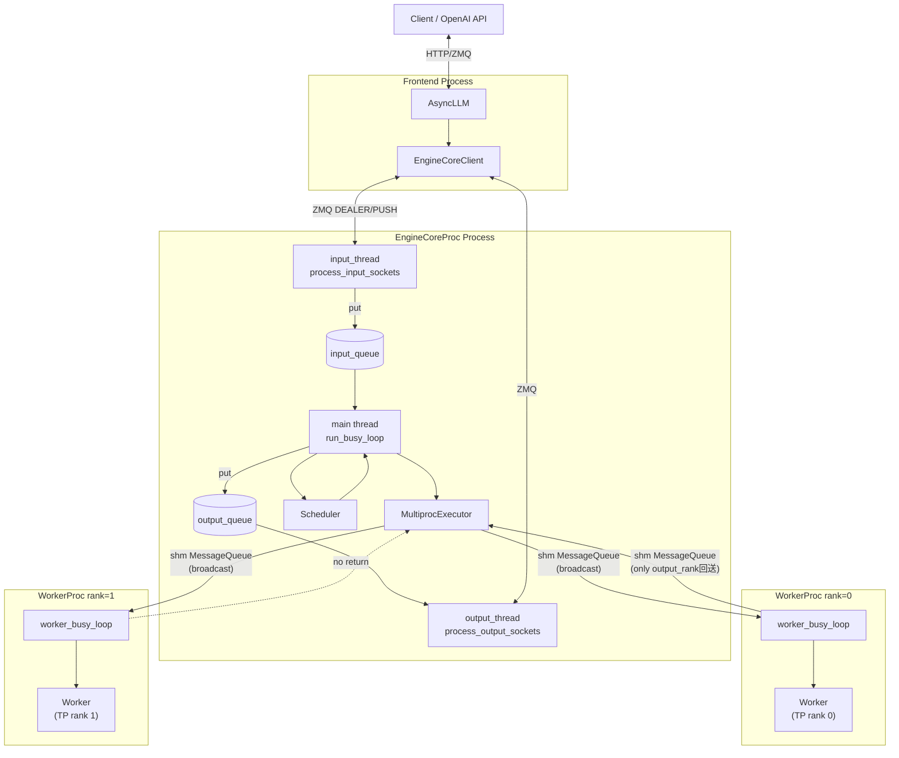
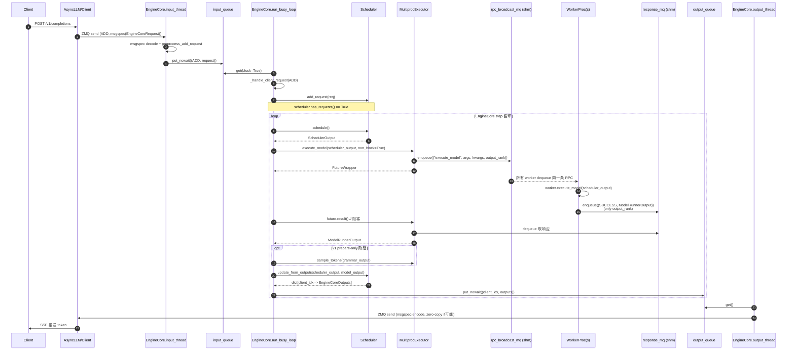

# Request Lifecycle (vLLM v1, MultiprocExecutor 部署)

## Summary
synthesis: 在 `MultiprocExecutor` + `EngineCoreProc` 部署形态下，一个请求从客户端到第一个 token 的产出，需要跨 **3 类进程边界**：客户端 ↔ EngineCoreProc（ZMQ）；EngineCoreProc 内部 IO 线程 ↔ busy loop 线程（Python `queue.Queue`）；EngineCoreProc ↔ N 个 WorkerProc（共享内存 MessageQueue）。本页把这条链按 step 拆开。

## Sources
- EngineCore busy loop & step：[engine/core.py:1160-1219](d:\design\vllm\vllm\v1\engine\core.py)
- EngineCore IO 线程：[engine/core.py:1368-1527](d:\design\vllm\vllm\v1\engine\core.py)
- EngineCore.step：[engine/core.py:404-433](d:\design\vllm\vllm\v1\engine\core.py)
- MultiprocExecutor.collective_rpc：[executor/multiproc_executor.py:348-412](d:\design\vllm\vllm\v1\executor\multiproc_executor.py)
- MultiprocExecutor.execute_model / sample_tokens：[executor/multiproc_executor.py:315-337](d:\design\vllm\vllm\v1\executor\multiproc_executor.py)
- WorkerProc.worker_busy_loop：[executor/multiproc_executor.py:953-979](d:\design\vllm\vllm\v1\executor\multiproc_executor.py)
- FutureWrapper：[executor/multiproc_executor.py:68-99](d:\design\vllm\vllm\v1\executor\multiproc_executor.py)

## 进程拓扑（典型 TP=2, PP=1, MultiprocExecutor）

## 端到端时序

## 关键链路要点

### 1. 客户端 → EngineCore 的入口
- 走 ZMQ DEALER socket，前端把 `EngineCoreRequest` 用 msgspec 序列化后多帧发送（type frame + data frames），由 [engine/core.py:1432, 1442-1450](d:\design\vllm\vllm\v1\engine\core.py) 解码。
- 多模态 tensor 不走 zmq，走单独的共享内存 `TensorIpcReceiver` ([engine/core.py:833-836, 1378-1381](d:\design\vllm\vllm\v1\engine\core.py))。
- 收到 ADD 后**立即** preprocess（在 input_thread 内做），失败直接回错（[engine/core.py:1442-1448](d:\design\vllm\vllm\v1\engine\core.py)）— 不污染 busy loop。
- ABORT 走双路：进 aborts_queue（让 step 立即处理）+ 进 input_queue（保证顺序）（[engine/core.py:1452-1460](d:\design\vllm\vllm\v1\engine\core.py)）。

### 2. EngineCore busy loop
- `run_busy_loop` 简洁：`_process_input_queue` → `_process_engine_step`（[engine/core.py:1160-1168](d:\design\vllm\vllm\v1\engine\core.py)）。
- 没 work 时阻塞 `input_queue.get(block=True)` ([engine/core.py:1184-1186](d:\design\vllm\vllm\v1\engine\core.py))；有 work 时 non-block 接着干。
- KV connector 等 NIXL handshake 时（model 没执行但 scheduler 有 unfinished）会 `time.sleep(0.001)` 让 GIL（[engine/core.py:1216-1217](d:\design\vllm\vllm\v1\engine\core.py)）— **PD 分离场景的微秒级延迟来源之一**。

### 3. EngineCore.step
- `step` 默认走"先 execute_model（拿 ModelRunnerOutput / 或 None） → 必要时 sample_tokens → update_from_output"（[engine/core.py:415-431](d:\design\vllm\vllm\v1\engine\core.py)）。
- `execute_model(non_block=True)` 立即返回 `Future`，让上层有机会 overlap grammar bitmask 计算（[engine/core.py:416-417](d:\design\vllm\vllm\v1\engine\core.py)）。
- PP 场景切到 `step_with_batch_queue`（[engine/core.py:212-214, 445-561](d:\design\vllm\vllm\v1\engine\core.py)），可同时挂 `pp_size` 个 batch 的 future 在 deque 里，pop 时阻塞拿结果，达到 PP 的吞吐效果。

### 4. MultiprocExecutor.collective_rpc
- 写：`rpc_broadcast_mq.enqueue((method, args, kwargs, output_rank))` — 所有 worker 同一份消息（共享内存广播） ([multiproc_executor.py:382](d:\design\vllm\vllm\v1\executor\multiproc_executor.py))
- 读：决定从哪些 `response_mqs` 读：默认只 `unique_reply_rank`（省带宽）；KV connector 聚合时 `output_rank=None` 全收（[multiproc_executor.py:369-376, 384-386](d:\design\vllm\vllm\v1\executor\multiproc_executor.py)）。
- `FutureWrapper.result()` **会先 drain 队列里前面的 future** 保证响应顺序（[multiproc_executor.py:81-89](d:\design\vllm\vllm\v1\executor\multiproc_executor.py)）— 这是 vLLM 用单一响应队列实现 in-order 多 RPC 的关键。

### 5. WorkerProc 内
- 阻塞 `dequeue(indefinite=True)` ([multiproc_executor.py:957-959](d:\design\vllm\vllm\v1\executor\multiproc_executor.py))。
- 字符串方法用 `getattr`，字节串方法用 `cloudpickle.loads + partial(self.worker)` ([multiproc_executor.py:961-964](d:\design\vllm\vllm\v1\executor\multiproc_executor.py))。
- `output_rank` 控制是否回送（[multiproc_executor.py:974-979](d:\design\vllm\vllm\v1\executor\multiproc_executor.py)）。
- async_scheduling 时 output 不直接回 MQ，先入本地 thread queue，由 `async_output_busy_loop` 异步回送（[multiproc_executor.py:925-951](d:\design\vllm\vllm\v1\executor\multiproc_executor.py)）— 让 model 执行的下一 step 可以立刻继续，不被序列化阻塞。
- 异常通过 ResponseStatus.FAILURE 回送字符串，避免序列化 traceback ([multiproc_executor.py:967-976, 906-908](d:\design\vllm\vllm\v1\executor\multiproc_executor.py))。

### 6. EngineCore → 客户端
- 输出从 busy loop `put_nowait` 到 `output_queue` ([engine/core.py:1207-1208](d:\design\vllm\vllm\v1\engine\core.py))。
- output_thread 从 `output_queue.get()` 阻塞拿，msgspec 编码后 ZMQ PUSH ([engine/core.py:1497-1527](d:\design\vllm\vllm\v1\engine\core.py))。
- **零拷贝优化**：`encode_into(outputs, buffer)` 复用 `bytearray` buffer + `send_multipart(copy=False, track=True)` ([engine/core.py:1517-1527](d:\design\vllm\vllm\v1\engine\core.py))。
- 关闭 socket 时用 `linger=4000` 确保 `ENGINE_CORE_DEAD` 哨兵能发出 ([engine/core.py:1481, 1488](d:\design\vllm\vllm\v1\engine\core.py))。

## 一次请求要跨多少进程边界（TP=N, PP=1, no PD）

| 边界 | 介质 | 来回 |
|---|---|---|
| Client ↔ AsyncLLM | HTTP / 本地 socket | 2 次（POST + SSE） |
| AsyncLLM (前端进程) ↔ EngineCoreProc | ZMQ DEALER/PUSH | 每 token 1 次回送（ADD 一次） |
| EngineCoreProc 内部 input_thread → busy loop | Python `queue.Queue` (锁) | 每请求 1 次 |
| EngineCore.step → MultiprocExecutor → broadcast 到 N worker | shm MessageQueue | 每 step 1 次 broadcast |
| 1 个 worker（output_rank） → EngineCore | shm MessageQueue | 每 step 1 次回送 |
| busy loop → output_thread | Python `queue.Queue` | 每输出 1 次 |
| output_thread → Client（前端） | ZMQ PUSH | 每输出 1 次 |

> synthesis: 一个 token 的产出至少经过 5 个进程内/进程间队列。`MessageQueue` 用共享内存避免序列化（除了 RPC payload 本身），是吞吐的关键设计。

## Notes / Caveats
> [!todo] VERIFY: `EngineCoreClient` 的具体收发路径（同步 vs 异步两套）— 在 [engine/core_client.py](d:\design\vllm\vllm\v1\engine\core_client.py)，本轮未深入。
> [!todo] VERIFY: `update_from_output` 内部如何把多 client 的 outputs 分桶到 `dict[int, EngineCoreOutputs]` — 在 [v1/core/sched/scheduler.py](d:\design\vllm\vllm\v1\core\sched\scheduler.py)，待 ingest。
> [!todo] VERIFY: PP 场景下 `step_with_batch_queue` 的 deferred sampling 路径细节（structured output + spec decode 组合）。

## See also
- [entities/EngineCore.md](../entities/EngineCore.md)
- [entities/MultiprocExecutor.md](../entities/MultiprocExecutor.md)
- [topics/multiproc-ipc.md](multiproc-ipc.md)
- [modules/engine.md](../modules/engine.md), [modules/executor.md](../modules/executor.md)
