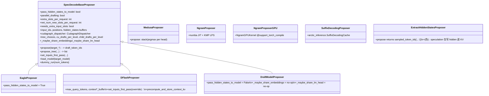

# Speculative Decoding（v1/spec_decode/ 全家 + EagleSpeculator GPU 路径）

## Summary

> synthesis: vLLM v1 把投机解码切成两个并存的实现层：
>
> 1. **`v1/spec_decode/` 通用 proposer 包**（12 个 .py）—— 以 [`SpecDecodeBaseProposer`](d:\design\vllm\vllm\v1\spec_decode\eagle.py)（[eagle.py:60](d:\design\vllm\vllm\v1\spec_decode\eagle.py)）为根，派生 EAGLE / EAGLE3 / DraftModel / DFlash 4 个走 base 通路的子类，并存独立的 `MedusaProposer` / `NgramProposer` (numba CPU) / `NgramProposerGPU` (torch.compile) / `SuffixDecodingProposer` / `ExtractHiddenStatesProposer`。被 `gpu_model_runner.GPUModelRunner` 在 `__init__` 按 `SpeculativeMethod` 分支选择装载（[gpu_model_runner.py:528-579](d:\design\vllm\vllm\v1\worker\gpu_model_runner.py)）。
> 2. **`v1/worker/gpu/spec_decode/` 新版 GPU 路径**（含 `eagle/speculator.py`）—— `init_speculator()`（[__init__.py:8-15](d:\design\vllm\vllm\v1\worker\gpu\spec_decode\__init__.py)）目前**仅**返回 `EagleSpeculator`（覆盖 `use_eagle()` 方法 = `eagle/eagle3/mtp/dflash`），由新 `v1/worker/gpu/model_runner.GPUModelRunner` 使用（[model_runner.py:172](d:\design\vllm\vllm\v1\worker\gpu\model_runner.py)）。`EagleSpeculator` 自带独立 `InputBuffers` + 独立 prefill/decode `EagleCudaGraphManager` + 独立 `BlockTables`。
>
> **`SpeculativeMethod` Literal 实际 6 顶层 + 13 个 MTP 子类型 + 2 EAGLE 衍生**（[speculative.py:34-64](d:\design\vllm\vllm\config\speculative.py)）：`ngram` / `medusa` / `mlp_speculator` / `draft_model` / `suffix` / `EagleModelTypes`(`eagle` + `eagle3` + `extract_hidden_states` + 13 MTP + `dflash`) / `ngram_gpu`。`mlp_speculator` 在 `SpeculativeMethod` 枚举中存在但**没有**对应的 proposer 子类（仅枚举）。
>
> **占位机制双层**：scheduler 层用 `scheduled_spec_decode_tokens: dict[str, list[int]]` 直接传递（[scheduler.py:376, 525-535, 905-924](d:\design\vllm\vllm\v1\core\sched\scheduler.py)）；async path 在 [`AsyncScheduler`](d:\design\vllm\vllm\v1\core\sched\async_scheduler.py) 额外维护 `request.num_output_placeholders`（int 计数）+ 共享只读 `_spec_token_placeholders = [-1] * num_spec_tokens` 列表（[async_scheduler.py:16, 32-35, 51-58](d:\design\vllm\vllm\v1\core\sched\async_scheduler.py)）。`SpecDecodeBaseProposer` 内部还自管 `extra_slots_per_request` 和 `needs_extra_input_slots` 标志做 worker 端 KV 槽预留（[eagle.py:91-97, 185-192](d:\design\vllm\vllm\v1\spec_decode\eagle.py)）。
>
> **Verify 有两套 `RejectionSampler` 并存**：旧版 [`v1/sample/rejection_sampler.py`](d:\design\vllm\vllm\v1\sample\rejection_sampler.py)（`nn.Module`，单一 `_strict_rejection_sample_kernel` Triton + Python 循环）+ 新版 [`v1/worker/gpu/spec_decode/rejection_sampler.py`](d:\design\vllm\vllm\v1\worker\gpu\spec_decode\rejection_sampler.py)（**3 模式：strict / probabilistic / synthetic**，由 `SpeculativeConfig.rejection_sample_method` 控制，[speculative.py:65, 185-189](d:\design\vllm\vllm\config\speculative.py)）。

> **本页的定位**：跨家对照已在 [comparison/topics/speculative-decoding.md](../../comparison/topics/speculative-decoding.md) 写完 9 个子维度（含 MindIE / vLLM / SGLang 对比表与 anchor-driven cross-check），**本页只补 vLLM 内部细节**——文件清单、`SpeculativeMethod` 完整枚举、proposer 类层级、双层占位机制、新旧 GPU 路径并存、3 模式 RejectionSampler、ngram CPU/GPU 双实现、dflash + extract_hidden_states 的配合、与 chunked prefill / structured output / async scheduling 的兼容性硬约束。

## Sources

见 frontmatter `sources`（含两个 RejectionSampler、`v1/spec_decode/` 全包、`v1/worker/gpu/spec_decode/` 全包、SpeculativeConfig、scheduler 接入点）。

## 1. 文件清单（12 个 .py）

`v1/spec_decode/` 一级（12 文件，含 1 个空 `__init__.py`）：

| 文件 | 类型 | 主类 / 用途 | 行数 |
|---|---|---|---|
| [`__init__.py`](d:\design\vllm\vllm\v1\spec_decode\__init__.py) | (空) | 仅作为 package marker | 0 |
| [`eagle.py`](d:\design\vllm\vllm\v1\spec_decode\eagle.py) | 提议器（基类 + EAGLE） | `SpecDecodeBaseProposer`（[eagle.py:60](d:\design\vllm\vllm\v1\spec_decode\eagle.py)）+ `EagleProposer(SpecDecodeBaseProposer)`（[eagle.py:1735-1747](d:\design\vllm\vllm\v1\spec_decode\eagle.py)）+ `compute_probs_and_sample_next_token`（[eagle.py:1756](d:\design\vllm\vllm\v1\spec_decode\eagle.py)，未启用） | 1794 |
| [`dflash.py`](d:\design\vllm\vllm\v1\spec_decode\dflash.py) | 提议器（DFlash） | `DFlashProposer(SpecDecodeBaseProposer)`（[dflash.py:20-282](d:\design\vllm\vllm\v1\spec_decode\dflash.py)，独立 `_context_*_buffer` + 非因果注意力） | 283 |
| [`draft_model.py`](d:\design\vllm\vllm\v1\spec_decode\draft_model.py) | 提议器（独立 draft 模型） | `DraftModelProposer(SpecDecodeBaseProposer)`（[draft_model.py:17-88](d:\design\vllm\vllm\v1\spec_decode\draft_model.py)，`pass_hidden_states_to_model=False` + 不共享 embed/lm_head） | 89 |
| [`medusa.py`](d:\design\vllm\vllm\v1\spec_decode\medusa.py) | 提议器（多头并行） | `MedusaProposer`（[medusa.py:18-79](d:\design\vllm\vllm\v1\spec_decode\medusa.py)，`load_model` 用 `set_model_tag("medusa_head")`） | 79 |
| [`ngram_proposer.py`](d:\design\vllm\vllm\v1\spec_decode\ngram_proposer.py) | 提议器（CPU prompt-lookup） | `NgramProposer` + `batch_propose_numba`（`@njit(parallel=True)`，[ngram_proposer.py:169-195](d:\design\vllm\vllm\v1\spec_decode\ngram_proposer.py)）+ `_find_longest_matched_ngram_and_propose_tokens`（KMP-style LPS 算法，[ngram_proposer.py:198-285](d:\design\vllm\vllm\v1\spec_decode\ngram_proposer.py)） | 286 |
| [`ngram_proposer_gpu.py`](d:\design\vllm\vllm\v1\spec_decode\ngram_proposer_gpu.py) | 提议器（GPU torch.compile） | `NgramGPUKernel(nn.Module)` 用 `@support_torch_compile()` + `NgramProposerGPU`（[ngram_proposer_gpu.py:27, 215](d:\design\vllm\vllm\v1\spec_decode\ngram_proposer_gpu.py)）+ `update_scheduler_for_invalid_drafts` / `update_ngram_gpu_tensors_incremental` 等增量同步 | 670 |
| [`suffix_decoding.py`](d:\design\vllm\vllm\v1\spec_decode\suffix_decoding.py) | 提议器（外部库） | `SuffixDecodingProposer`（[suffix_decoding.py:9-102](d:\design\vllm\vllm\v1\spec_decode\suffix_decoding.py)，包装 `arctic_inference.SuffixDecodingCache`） | 102 |
| [`extract_hidden_states.py`](d:\design\vllm\vllm\v1\spec_decode\extract_hidden_states.py) | 辅助"提议器"（其实是 KV 写入） | `ExtractHiddenStatesProposer`（[extract_hidden_states.py:26-303](d:\design\vllm\vllm\v1\spec_decode\extract_hidden_states.py)）—— 注释明示"This proposer doesn't actually perform speculation - it returns the sampled tokens as 'draft' tokens, ensuring they always verify"（[extract_hidden_states.py:87-89](d:\design\vllm\vllm\v1\spec_decode\extract_hidden_states.py)），用于把 hidden states 缓存进 KV 以便 KV 传输 | 303 |
| [`metadata.py`](d:\design\vllm\vllm\v1\spec_decode\metadata.py) | 元数据 dataclass | `SpecDecodeMetadata`（7 字段：`draft_token_ids` / `num_draft_tokens` / `cu_num_draft_tokens` / `cu_num_sampled_tokens` / `target_logits_indices` / `bonus_logits_indices` / `logits_indices`），含 `make_dummy` 工厂（[metadata.py:9-66](d:\design\vllm\vllm\v1\spec_decode\metadata.py)） | 66 |
| [`metrics.py`](d:\design\vllm\vllm\v1\spec_decode\metrics.py) | 指标 | `SpecDecodingStats` + `SpecDecodingLogging`（log per-position acceptance rate）+ `SpecDecodingProm`（4 个 prometheus counter：`vllm:spec_decode_num_drafts` / `..._num_draft_tokens` / `..._num_accepted_tokens` / `..._num_accepted_tokens_per_pos`）（[metrics.py:17-216](d:\design\vllm\vllm\v1\spec_decode\metrics.py)） | 216 |
| [`utils.py`](d:\design\vllm\vllm\v1\spec_decode\utils.py) | Triton kernel + slot mapping helper | 8 个 helper：`PADDING_SLOT_ID = -1` / `next_power_of_2` / `eagle_step_slot_mapping_metadata_kernel` (Triton) / `eagle_step_update_slot_mapping_and_metadata` / `eagle_prepare_inputs_padded_kernel` / `eagle_prepare_next_token_padded_kernel` / `compute_new_slot_mapping` / `extend_all_queries_by_N` / `copy_and_expand_eagle_inputs_kernel` / `copy_and_expand_dflash_inputs_kernel` / `update_num_computed_tokens_for_batch_change`（[utils.py:14-567](d:\design\vllm\vllm\v1\spec_decode\utils.py)） | 599 |

> synthesis: **分类**——
> - 提议器（8）：`eagle.py`(EAGLE) / `dflash.py` / `draft_model.py` / `medusa.py` / `ngram_proposer.py` / `ngram_proposer_gpu.py` / `suffix_decoding.py` / `extract_hidden_states.py`（"伪提议器"）
> - 元数据（1）：`metadata.py`
> - 指标（1）：`metrics.py`
> - kernel/工具（1）：`utils.py`
> - 包标记（1）：`__init__.py`（空）

`v1/worker/gpu/spec_decode/` 一级（5 文件 + `eagle/` 子目录 5 文件）：

| 文件 | 主类 / 用途 |
|---|---|
| [`__init__.py`](d:\design\vllm\vllm\v1\worker\gpu\spec_decode\__init__.py) | `init_speculator(vllm_config, device)` 工厂——目前只支持 `EagleSpeculator`，其它 method 抛 `NotImplementedError`（[__init__.py:8-15](d:\design\vllm\vllm\v1\worker\gpu\spec_decode\__init__.py)） |
| [`rejection_sampler.py`](d:\design\vllm\vllm\v1\worker\gpu\spec_decode\rejection_sampler.py) | 新版 `RejectionSampler`（3 模式 dispatch + Triton `_strict_rejection_sample_kernel`）（[rejection_sampler.py:23-235](d:\design\vllm\vllm\v1\worker\gpu\spec_decode\rejection_sampler.py)） |
| [`probabilistic_rejection_sampler_utils.py`](d:\design\vllm\vllm\v1\worker\gpu\spec_decode\probabilistic_rejection_sampler_utils.py) | `probabilistic_rejection_sample`（draft logits + target logits 的 ratio-based 接受） |
| [`synthetic_rejection_sampler_utils.py`](d:\design\vllm\vllm\v1\worker\gpu\spec_decode\synthetic_rejection_sampler_utils.py) | `synthetic_rejection_sample` + `compute_synthetic_rejection_sampler_params`（按 `synthetic_acceptance_rate` 几何衰减接受） |
| [`utils.py`](d:\design\vllm\vllm\v1\worker\gpu\spec_decode\utils.py) | 工具（轻） |
| [`eagle/__init__.py`](d:\design\vllm\vllm\v1\worker\gpu\spec_decode\eagle\__init__.py) | (空) |
| [`eagle/speculator.py`](d:\design\vllm\vllm\v1\worker\gpu\spec_decode\eagle\speculator.py) | `EagleSpeculator`（[speculator.py:37-561](d:\design\vllm\vllm\v1\worker\gpu\spec_decode\eagle\speculator.py)）+ 3 个 Triton kernel：`_prepare_eagle_inputs_kernel`（[speculator.py:564-641](d:\design\vllm\vllm\v1\worker\gpu\spec_decode\eagle\speculator.py)）/ `_prepare_eagle_docode_kernel`（[speculator.py:681-727](d:\design\vllm\vllm\v1\worker\gpu\spec_decode\eagle\speculator.py)）/ `_update_eagle_inputs_kernel`（[speculator.py:754-797](d:\design\vllm\vllm\v1\worker\gpu\spec_decode\eagle\speculator.py)） |
| [`eagle/cudagraph.py`](d:\design\vllm\vllm\v1\worker\gpu\spec_decode\eagle\cudagraph.py) | `EagleCudaGraphManager(CudaGraphManager)`（[cudagraph.py:21-81](d:\design\vllm\vllm\v1\worker\gpu\spec_decode\eagle\cudagraph.py)）—— 用 dedicated `pool` 避免 gumbel_sample 临时 buffer 与主模型冲突（[cudagraph.py:33-38](d:\design\vllm\vllm\v1\worker\gpu\spec_decode\eagle\cudagraph.py)） |
| [`eagle/eagle3_utils.py`](d:\design\vllm\vllm\v1\worker\gpu\spec_decode\eagle\eagle3_utils.py) | `set_eagle3_aux_hidden_state_layers` / `get_eagle3_aux_layers_from_config`（[eagle3_utils.py:14-46](d:\design\vllm\vllm\v1\worker\gpu\spec_decode\eagle\eagle3_utils.py)） |
| [`eagle/utils.py`](d:\design\vllm\vllm\v1\worker\gpu\spec_decode\eagle\utils.py) | `load_eagle_model`（[utils.py:9-52](d:\design\vllm\vllm\v1\worker\gpu\spec_decode\eagle\utils.py)）：`set_model_tag("eagle_head")` + 共享 target embed_tokens / lm_head |

## 2. `SpeculativeMethod` 完整枚举（13 顶层名）

[`config/speculative.py:34-64`](d:\design\vllm\vllm\config\speculative.py)：

```text
MTPModelTypes  = Literal[                                  # 14 项（含 "mtp" 通用别名）
    "deepseek_mtp", "mimo_mtp", "glm4_moe_mtp", "glm4_moe_lite_mtp",
    "glm_ocr_mtp", "ernie_mtp", "nemotron_h_mtp",
    "exaone_moe_mtp", "exaone4_5_mtp", "qwen3_next_mtp",
    "qwen3_5_mtp", "longcat_flash_mtp", "mtp", "pangu_ultra_moe_mtp",
    "step3p5_mtp",
]
NgramGPUTypes   = Literal["ngram_gpu"]
DFlashModelTypes = Literal["dflash"]
EagleModelTypes = Literal["eagle", "eagle3", "extract_hidden_states", MTPModelTypes, DFlashModelTypes]
SpeculativeMethod = Literal[
    "ngram", "medusa", "mlp_speculator", "draft_model", "suffix",
    EagleModelTypes,        # eagle / eagle3 / extract_hidden_states / 15 MTP / dflash
    NgramGPUTypes,          # ngram_gpu
]
RejectionSampleMethod = Literal["strict", "probabilistic", "synthetic"]   # spec.rejection_sample_method
```

> synthesis: 顶层一共 **6 + 1 + 3 + 14 + 1 - dup = 22** 个 method 字面值，但**实际跑同一段代码**的归为 7 类：
>
> | 类别 | 字面值 | proposer 实现类 | 行号 |
> |---|---|---|---|
> | EAGLE / EAGLE3 / DFlash / 13 MTP 子类 → 共用 `SpecDecodeBaseProposer` 通路 | `eagle` / `eagle3` / `dflash` / `mtp` / `deepseek_mtp` / ... | `EagleProposer` / `DFlashProposer` | [eagle.py:1735](d:\design\vllm\vllm\v1\spec_decode\eagle.py), [dflash.py:20](d:\design\vllm\vllm\v1\spec_decode\dflash.py) |
> | extract_hidden_states | `extract_hidden_states` | `ExtractHiddenStatesProposer`（**不**继承 `SpecDecodeBaseProposer`） | [extract_hidden_states.py:26](d:\design\vllm\vllm\v1\spec_decode\extract_hidden_states.py) |
> | draft_model | `draft_model` | `DraftModelProposer` | [draft_model.py:17](d:\design\vllm\vllm\v1\spec_decode\draft_model.py) |
> | medusa | `medusa` | `MedusaProposer` | [medusa.py:18](d:\design\vllm\vllm\v1\spec_decode\medusa.py) |
> | ngram (CPU) | `ngram` | `NgramProposer` | [ngram_proposer.py:12](d:\design\vllm\vllm\v1\spec_decode\ngram_proposer.py) |
> | ngram_gpu | `ngram_gpu` | `NgramProposerGPU` | [ngram_proposer_gpu.py:215](d:\design\vllm\vllm\v1\spec_decode\ngram_proposer_gpu.py) |
> | suffix | `suffix` | `SuffixDecodingProposer` | [suffix_decoding.py:9](d:\design\vllm\vllm\v1\spec_decode\suffix_decoding.py) |
> | **mlp_speculator** | `mlp_speculator` | **无对应 proposer 类**（仅在 `SpeculativeMethod` 枚举里出现，[gpu_model_runner.py:528-579](d:\design\vllm\vllm\v1\worker\gpu_model_runner.py) 的 `if/elif` 分支没有 `"mlp_speculator"` 分支） | — |

> [!warning] CONTRADICTION: `SpeculativeMethod` Literal 包含 `"mlp_speculator"`（[speculative.py:59](d:\design\vllm\vllm\config\speculative.py)）且 `__post_init__` 在自动检测时支持 `model_type == "mlp_speculator"` 写入 `self.method = "mlp_speculator"`（[speculative.py:525-526](d:\design\vllm\vllm\config\speculative.py)），但 `gpu_model_runner.py:528-579` 的 proposer 选择 `if/elif` 链**没有** `"mlp_speculator"` 分支，最后会落入 `else: raise ValueError("Unknown speculative decoding method ...")`。配合 [docs/features/speculative_decoding/mlp.md](d:\design\vllm\docs\features\speculative_decoding\mlp.md) 的存在 → mlp_speculator 当前 v1 路径**未实现**或在外部 plugin 实现，需 verify。

`SpeculativeConfig` 关键方法（[speculative.py:866-905](d:\design\vllm\vllm\config\speculative.py)）：

```python
def use_eagle(self) -> bool:        return self.method in ("eagle", "eagle3", "mtp", "dflash")
def use_dflash(self) -> bool:       return self.method == "dflash"
def uses_draft_model(self) -> bool: return self.method == "draft_model"
def uses_extract_hidden_states(self) -> bool: return self.method == "extract_hidden_states"
def use_ngram_gpu(self) -> bool:    return self.method == "ngram_gpu"
@property
def max_num_new_slots_for_drafting(self) -> int:
    slots_per_req = 0
    if self.parallel_drafting:        slots_per_req = self.num_speculative_tokens - 1
    if self.uses_draft_model():       slots_per_req += 1
    return slots_per_req
```

注意 `use_eagle()` 把 `mtp` 也算 EAGLE（"几乎所有 MTP 走 EAGLE 通路"），但**不**把 `extract_hidden_states` 算 EAGLE—— 后者走独立 proposer。

## 3. `SpecDecodeBaseProposer` 类层次



继承链锚点：

- `EagleProposer` 仅设 `pass_hidden_states_to_model=True` 后透传给 base（[eagle.py:1735-1747](d:\design\vllm\vllm\v1\spec_decode\eagle.py)）。
- `DFlashProposer` 设 `pass_hidden_states_to_model=True` 并强制 `parallel_drafting`（在 `SpeculativeConfig.__post_init__` 里 `self.method == "dflash"` 时设 `self.parallel_drafting = True`，[speculative.py:575-576](d:\design\vllm\vllm\config\speculative.py)）；override `set_inputs_first_pass` 用 `copy_and_expand_dflash_inputs_kernel`（[utils.py:458-565](d:\design\vllm\vllm\v1\spec_decode\utils.py)）+ 跨注意力 K/V from target hidden / Q from query embeddings（[dflash.py:87-172](d:\design\vllm\vllm\v1\spec_decode\dflash.py)）；override `_get_eagle3_use_aux_hidden_state_from_config` 改读 `dflash_config.use_aux_hidden_state`（[dflash.py:274-282](d:\design\vllm\vllm\v1\spec_decode\dflash.py)）。
- `DraftModelProposer` 设 `pass_hidden_states_to_model=False`，并强制 `draft_tp == target_tp`（[draft_model.py:36-51](d:\design\vllm\vllm\v1\spec_decode\draft_model.py)），不共享 embed/lm_head（[draft_model.py:80-88](d:\design\vllm\vllm\v1\spec_decode\draft_model.py)）。
- `MedusaProposer` 单独类（**不继承** base），`propose` 直接 `stack(argmax per head)`（[medusa.py:39-55](d:\design\vllm\vllm\v1\spec_decode\medusa.py)）。
- `NgramProposer` / `NgramProposerGPU` / `SuffixDecodingProposer` / `ExtractHiddenStatesProposer` 都不继承 base —— 它们的 `propose` 签名都不同（不接受 `target_hidden_states`，而接受 `sampled_token_ids` / `input_batch`）。

## 4. EAGLE 双路径：`SpecDecodeBaseProposer` vs `EagleSpeculator`

vLLM 当前**有两套并存的 EAGLE GPU 实现**，由两套不同的 ModelRunner 选择：

| | 老路径 `EagleProposer` (in `v1/spec_decode/eagle.py`) | 新路径 `EagleSpeculator` (in `v1/worker/gpu/spec_decode/eagle/speculator.py`) |
|---|---|---|
| 入口 ModelRunner | `v1/worker/gpu_model_runner.py:561` `self.drafter = EagleProposer(...)` | `v1/worker/gpu/model_runner.py:172` `self.speculator = init_speculator(...)` → `EagleSpeculator` |
| 工厂 | 直接 `EagleProposer(...)` 实例化 | `init_speculator()`（[__init__.py:8-15](d:\design\vllm\vllm\v1\worker\gpu\spec_decode\__init__.py)） |
| 状态对象 | 复用 `GPUModelRunner` 的 `input_ids` / `positions` / `hidden_states` buffers + 自己的 `_slot_mapping_buffer`、`tree_draft_pos_offsets` 等 | **独立** `InputBuffers`（[speculator.py:63-67](d:\design\vllm\vllm\v1\worker\gpu\spec_decode\eagle\speculator.py)）+ 独立 `BlockTables`（`set_attn` 时挂入，[speculator.py:155-169](d:\design\vllm\vllm\v1\worker\gpu\spec_decode\eagle\speculator.py)）+ 独立 `idx_mapping` / `temperature` / `seeds` / `draft_tokens` / `last_token_indices` |
| CUDA graph | `CudagraphDispatcher`（PIECEWISE-only，由 `initialize_cudagraph_keys` 设置，[eagle.py:381-396](d:\design\vllm\vllm\v1\spec_decode\eagle.py)） | **独立两个** `EagleCudaGraphManager`：`prefill_cudagraph_manager`（query_len = `num_speculative_steps + 1`）+ `decode_cudagraph_manager`（query_len = 1）（[speculator.py:106-137](d:\design\vllm\vllm\v1\worker\gpu\spec_decode\eagle\speculator.py)）；用 dedicated `torch.cuda.graph_pool_handle()` 避免 gumbel_sample 临时 buffer 与主模型冲突（[cudagraph.py:33-38](d:\design\vllm\vllm\v1\worker\gpu\spec_decode\eagle\cudagraph.py)） |
| 采样 | `_greedy_sample` / `propose_tree` / `compute_probs_and_sample_next_token`（后者注释说当前未启用） | `gumbel_sample`（[speculator.py:245-255, 286-297](d:\design\vllm\vllm\v1\worker\gpu\spec_decode\eagle\speculator.py)）+ 可选 `draft_logits` buffer（仅 `rejection_sample_method == "probabilistic"` 时分配 `[max_num_reqs, num_speculative_steps, vocab_size]` float32，[speculator.py:96-104](d:\design\vllm\vllm\v1\worker\gpu\spec_decode\eagle\speculator.py)） |
| Tree spec 支持 | ✅ `propose_tree` + `tree_choices` + `cu_drafts_per_level` + `child_drafts_per_level` + `TreeAttentionMetadata`（[eagle.py:272-293, 978-1148](d:\design\vllm\vllm\v1\spec_decode\eagle.py)） | ❌ 仅链式 spec |
| 并行 drafting | ✅ via `parallel_drafting` + `_init_parallel_drafting_params`（[eagle.py:101-105, 317-341](d:\design\vllm\vllm\v1\spec_decode\eagle.py)） | ❌（专为 chain spec 优化） |
| EAGLE3 aux hidden state 支持 | `eagle3_use_aux_hidden_state` 自动检测（[eagle.py:1589-1603](d:\design\vllm\vllm\v1\spec_decode\eagle.py)）；`combine_hidden_states` 在 `propose` 入口调（[eagle.py:425-437](d:\design\vllm\vllm\v1\spec_decode\eagle.py)） | `set_eagle3_aux_hidden_state_layers`（[eagle3_utils.py:14-32](d:\design\vllm\vllm\v1\worker\gpu\spec_decode\eagle\eagle3_utils.py)）由 `model_runner.py:280` 调用（aux_layer ids 来自 `hf_config.eagle_aux_hidden_state_layer_ids` 或 `model.get_eagle3_default_aux_hidden_state_layers()`）；`combine_hidden_states` 在 `propose` 入口（[speculator.py:428-432](d:\design\vllm\vllm\v1\worker\gpu\spec_decode\eagle\speculator.py)） |
| Multi-modal | ✅ via `supports_mm_inputs` + `_maybe_share_embeddings` 复杂分支 | ✅ via `MULTIMODAL_REGISTRY.supports_multimodal_inputs(draft_model_config)` + `inputs_embeds` 自管 buffer（[speculator.py:88-94, 191-203](d:\design\vllm\vllm\v1\worker\gpu\spec_decode\eagle\speculator.py)） |

> synthesis（**为何并存**）：从 import 链可见——老 `gpu_model_runner.py` 是 v1 主流路径，import 全部 7 个 proposer 子类；新 `gpu/model_runner.py` 是更精简的 GPU 专用 runner，import `init_speculator` + 新 `RejectionSampler`。新版**只支持** `use_eagle()` = `eagle/eagle3/mtp/dflash` 4 种 method；其它 method（medusa / ngram / suffix / draft_model / extract_hidden_states）只能走老路径。
> [!todo] VERIFY: 两条路径的实际配置开关（哪个 ModelRunner 在哪个执行路径下被用）需要追 `Executor.get_class()` 与 `model_runner_v2` 文档（[docs/design/model_runner_v2.md](d:\design\vllm\docs\design\model_runner_v2.md)）。

## 5. 双层占位机制（scheduler vs worker）

### 5.1 第一层：scheduler 端 `scheduled_spec_decode_tokens`

[`v1/core/sched/scheduler.py:213-222`](d:\design\vllm\vllm\v1\core\sched\scheduler.py) 在 `__init__` 中读取 spec config：

```python
speculative_config = vllm_config.speculative_config
self.use_eagle = False
self.num_spec_tokens = self.num_lookahead_tokens = 0
if speculative_config:
    self.num_spec_tokens = speculative_config.num_speculative_tokens
    if speculative_config.use_eagle():
        self.use_eagle = True
        self.num_lookahead_tokens = self.num_spec_tokens
    if speculative_config.uses_draft_model():
        self.num_lookahead_tokens = self.num_spec_tokens
```

注意 `num_lookahead_tokens` 仅在 EAGLE / draft_model 路径设置；其它（medusa / ngram / suffix）保持 0（前调度阶段不预留额外 KV 槽，由 worker 端处理）。

调度时维护 `scheduled_spec_decode_tokens: dict[str, list[int]]`：

- 入队（[scheduler.py:521-535](d:\design\vllm\vllm\v1\core\sched\scheduler.py)）：当 `request.spec_token_ids` 非空时，按 `num_scheduled_tokens - 1 - num_output_placeholders` 计算 `num_scheduled_spec_tokens`，截取并写入。
- 抢占（[scheduler.py:486](d:\design\vllm\vllm\v1\core\sched\scheduler.py)）：`scheduled_spec_decode_tokens.pop(preempted_req_id, None)`。
- 下发：随 `SchedulerOutput.scheduled_spec_decode_tokens` 一起到 worker（[scheduler.py:905, 924](d:\design\vllm\vllm\v1\core\sched\scheduler.py)）。

Verify 后回填 + 统计被拒绝数（[scheduler.py:1363-1385](d:\design\vllm\vllm\v1\core\sched\scheduler.py)）：

```python
scheduled_spec_token_ids = scheduler_output.scheduled_spec_decode_tokens.get(req_id)
if scheduled_spec_token_ids and generated_token_ids:
    num_draft_tokens = len(scheduled_spec_token_ids)
    ...
    if request.num_output_placeholders > 0:
        request.num_output_placeholders -= num_rejected
```

`shift_computed_tokens=1 if self.use_eagle else 0` 出现两处（[scheduler.py:434, 703](d:\design\vllm\vllm\v1\core\sched\scheduler.py)）—— EAGLE 调度时为下一 step 预留 1 个 shift（**EAGLE 专属**）。

### 5.2 第二层：`AsyncScheduler` 的 `num_output_placeholders` + 共享 `[-1]` 列表

[`async_scheduler.py:12-60`](d:\design\vllm\vllm\v1\core\sched\async_scheduler.py) 完整代码：

```python
class AsyncScheduler(Scheduler):
    def __init__(self, *args, **kwargs) -> None:
        super().__init__(*args, **kwargs)
        # reusable read-only placeholder list for speculative decoding.
        self._spec_token_placeholders: list[int] = [-1] * self.num_spec_tokens     # L16

    def _update_after_schedule(self, scheduler_output: SchedulerOutput) -> None:
        super()._update_after_schedule(scheduler_output)
        spec_decode_tokens = scheduler_output.scheduled_spec_decode_tokens
        for req_id in scheduler_output.num_scheduled_tokens:
            request = self.requests[req_id]
            if request.is_prefill_chunk: continue
            scheduler_output.pending_structured_output_tokens |= (                  # L26-28
                request.use_structured_output and request.num_output_placeholders > 0
            )
            cur_num_spec_tokens = len(spec_decode_tokens.get(req_id, ()))
            request.num_output_placeholders += 1 + cur_num_spec_tokens             # L32
            request.spec_token_ids = self._spec_token_placeholders                 # L35

    def _update_request_with_output(self, request, new_token_ids):
        if request.discard_latest_async_tokens:
            request.discard_latest_async_tokens = False
            return [], False
        status_before_update = request.status
        new_token_ids, stopped = super()._update_request_with_output(request, new_token_ids)
        request.num_output_placeholders -= len(new_token_ids)                      # L52
        assert request.num_output_placeholders >= 0
        if status_before_update == RequestStatus.RUNNING:
            self.kv_cache_manager.cache_blocks(
                request, request.num_computed_tokens - request.num_output_placeholders
            )
        return new_token_ids, stopped
```

要点（synthesis）：

- `_spec_token_placeholders` 是 **只读共享 list**（每次都 `request.spec_token_ids = self._spec_token_placeholders`），避免每个 step 创建新列表。MindIE/SGLang 都没有此优化，参 [comparison/topics/speculative-decoding.md §4](../../comparison/topics/speculative-decoding.md)。
- `num_output_placeholders` 是 **int 计数**：增量 `+= 1 + cur_num_spec_tokens`（1 个非 spec 主 token + 若干 spec token），减量 `-= len(new_token_ids)`（实际生成多少就减多少），最终 assert ≥ 0。
- L26-28 设置 `pending_structured_output_tokens` 标志：当请求启用 structured output 且仍有未生成的占位时置位 → 下游 [`structured_output/__init__.py:190-261`](d:\design\vllm\vllm\v1\structured_output\__init__.py) 据此扩张 grammar bitmask 行数（按 `1 + num_speculative_tokens` 倍）。
- L57-59 提前 cache_blocks 但**减去** `num_output_placeholders`（避免缓存还未确定 token 的占位 KV 块）。

### 5.3 第三层：worker 端 `extra_slots_per_request` / `needs_extra_input_slots`

[`v1/spec_decode/eagle.py:91-97`](d:\design\vllm\vllm\v1\spec_decode\eagle.py)：

```python
self.parallel_drafting: bool = self.speculative_config.parallel_drafting
self.extra_slots_per_request = (
    1 if not self.parallel_drafting else self.num_speculative_tokens
)
self.net_num_new_slots_per_request = self.extra_slots_per_request - (
    1 if (self.pass_hidden_states_to_model and self.method != "dflash") else 0
)
self.needs_extra_input_slots = self.net_num_new_slots_per_request > 0
```

- 串行 draft：`extra_slots = 1`；并行 draft（DFlash 强制 + EAGLE 可选）：`extra_slots = num_speculative_tokens`
- `pass_hidden_states_to_model=True && method != "dflash"`（即 EAGLE / EAGLE3 / MTP）→ 减去 1（因为 hidden state 直接传，不需要额外 input slot）
- `needs_extra_input_slots` 为 True 时 [`eagle.py:185-203`](d:\design\vllm\vllm\v1\spec_decode\eagle.py) 还会做 3 个 raise：`_raise_if_padded_drafter_batch_disabled` / `_raise_if_multimodal` / `_raise_if_mrope`，并分配 `is_rejected_token_mask` / `is_masked_token_mask` 两个 bool buffer。

worker 端 forward 时调 [`compute_new_slot_mapping`](d:\design\vllm\vllm\v1\spec_decode\utils.py)（[utils.py:242-272](d:\design\vllm\vllm\v1\spec_decode\utils.py)）+ [`extend_all_queries_by_N`](d:\design\vllm\vllm\v1\spec_decode\utils.py)（[utils.py:274-306](d:\design\vllm\vllm\v1\spec_decode\utils.py)）扩展 `CommonAttentionMetadata`，并由 `copy_and_expand_eagle_inputs_kernel`（[utils.py:308-456](d:\design\vllm\vllm\v1\spec_decode\utils.py)）/ `copy_and_expand_dflash_inputs_kernel`（[utils.py:458-565](d:\design\vllm\vllm\v1\spec_decode\utils.py)）做 GPU 内的 fused input 准备。

## 6. `RejectionSampler` 三模式（新版 GPU 路径）

[`v1/worker/gpu/spec_decode/rejection_sampler.py:100-235`](d:\design\vllm\vllm\v1\worker\gpu\spec_decode\rejection_sampler.py) 中 `RejectionSampler.__call__`：

| 模式 | 说明 | 关键调用 |
|---|---|---|
| `"strict"` | target 与 draft 完全相同则接受，否则截断；用 `_strict_rejection_sample_kernel` Triton（[rejection_sampler.py:23-77](d:\design\vllm\vllm\v1\worker\gpu\spec_decode\rejection_sampler.py)）—— 每个请求一个 program 串行 for 循环；接受贪婪 sample 后 store target_sampled，遇不匹配置 `rejected = True`，仍写最后一个 token | `self.sampler(logits, input_batch)` 后 `strict_rejection_sample` |
| `"probabilistic"` | 经典 [Leviathan et al.](https://arxiv.org/abs/2211.17192) speculative sampling：用 ratio `target_p / draft_p` 决定接受概率。需要 draft logits（`EagleSpeculator.draft_logits` buffer 仅在此模式分配，[speculator.py:96-104](d:\design\vllm\vllm\v1\worker\gpu\spec_decode\eagle\speculator.py)） | `self.sampler.apply_sampling_params(logits, ...)` → `probabilistic_rejection_sample`（[probabilistic_rejection_sampler_utils.py](d:\design\vllm\vllm\v1\worker\gpu\spec_decode\probabilistic_rejection_sampler_utils.py)） |
| `"synthetic"` | Position-dependent geometric decay 接受率（用于 testing/benchmark），按 `synthetic_acceptance_rate ∈ [0,1]` 校准 mean 接受率 | `compute_synthetic_rejection_sampler_params(rate, num_speculative_steps)` 算 `(base_rate, decay)` → `synthetic_rejection_sample`（[synthetic_rejection_sampler_utils.py](d:\design\vllm\vllm\v1\worker\gpu\spec_decode\synthetic_rejection_sampler_utils.py)） |

由 `SpeculativeConfig.rejection_sample_method` 选择（[speculative.py:185-189](d:\design\vllm\vllm\config\speculative.py)），默认 `"strict"`。`"synthetic"` 还要求 `synthetic_acceptance_rate ∈ [0, 1]`，否则 raise（[rejection_sampler.py:111-118](d:\design\vllm\vllm\v1\worker\gpu\spec_decode\rejection_sampler.py)）。

> [!warning] CONTRADICTION: 旧版 [`v1/sample/rejection_sampler.py`](d:\design\vllm\vllm\v1\sample\rejection_sampler.py) 同样名为 `RejectionSampler`，是 `nn.Module` 子类（[sample/rejection_sampler.py:30](d:\design\vllm\vllm\v1\sample\rejection_sampler.py)），由老 `gpu_model_runner.py:580` 实例化（`RejectionSampler(self.sampler)` 单参 vs 新版 `RejectionSampler(self.sampler, self.speculative_config)` 双参）。两套 RejectionSampler 在导入路径与 `__init__` 签名上不同，**新读者注意区分**。

## 7. NgramProposer：CPU vs GPU 双实现

| 维度 | `NgramProposer` (CPU, [ngram_proposer.py](d:\design\vllm\vllm\v1\spec_decode\ngram_proposer.py)) | `NgramProposerGPU` ([ngram_proposer_gpu.py](d:\design\vllm\vllm\v1\spec_decode\ngram_proposer_gpu.py)) |
|---|---|---|
| 触发字面 | `method == "ngram"` | `method == "ngram_gpu"`（即 `use_ngram_gpu()`） |
| 算法 | KMP-style LPS：`_find_longest_matched_ngram_and_propose_tokens`（[ngram_proposer.py:198-285](d:\design\vllm\vllm\v1\spec_decode\ngram_proposer.py)）—— 把 tokens flip 后找右起最长 prefix=suffix | 全向量化 `unfold + argmax`：见 module docstring（[ngram_proposer_gpu.py:3-8](d:\design\vllm\vllm\v1\spec_decode\ngram_proposer_gpu.py)） |
| 计算后端 | numba `@njit(parallel=True)` + `prange`（[ngram_proposer.py:169-181](d:\design\vllm\vllm\v1\spec_decode\ngram_proposer.py)） | torch + `@support_torch_compile()`（`NgramGPUKernel(nn.Module)`，[ngram_proposer_gpu.py:26-27](d:\design\vllm\vllm\v1\spec_decode\ngram_proposer_gpu.py)）；编译配置 `splitting_ops=[]`、`max_autotune=True`、`coordinate_descent_tuning=True`（[ngram_proposer_gpu.py:221-235](d:\design\vllm\vllm\v1\spec_decode\ngram_proposer_gpu.py)） |
| 线程数控制 | `num_numba_thread_available = min(1, cpu_count // 2) // tp_size`（注释明示 cap to 1，TODO 提到将来支持 TP 后 cap 至 8，[ngram_proposer.py:48-51](d:\design\vllm\vllm\v1\spec_decode\ngram_proposer.py)） | 不需要（GPU kernel） |
| Triggering threshold | `num_tokens_threshold = 8192`（[ngram_proposer.py:36](d:\design\vllm\vllm\v1\spec_decode\ngram_proposer.py)）—— 总 token < 阈值时 `set_num_threads(1)`（小 batch 多线程开销不值） | 没有阈值，直接 GPU |
| Async scheduling 兼容 | ❌ 不在 `EagleModelTypes / NgramGPUTypes` 中，触发 auto-disable async（[vllm.py:801-812](d:\design\vllm\vllm\config\vllm.py)） | ✅ 在 `NgramGPUTypes`，async 允许 |
| 补充组件 | — | `update_scheduler_for_invalid_drafts` / `update_ngram_gpu_tensors_incremental` / `_sync_num_tokens` / `copy_num_valid_draft_tokens`（[ngram_proposer_gpu.py:466-639](d:\design\vllm\vllm\v1\spec_decode\ngram_proposer_gpu.py)）—— scheduler 与 GPU buffer 增量同步，避免每 step 全量 H2D |
| 主 ModelRunner buffer 配套 | 仅 numba 端 buffer（`valid_ngram_draft` / `valid_ngram_num_drafts`） | **`gpu_model_runner` 还会额外分配 4 个 GPU buffer**（[gpu_model_runner.py:540-554](d:\design\vllm\vllm\v1\worker\gpu_model_runner.py)）：`num_tokens_no_spec_gpu` / `token_ids_gpu_tensor[max_num_reqs, max_model_len]` / `_ngram_pinned_idx_buf` / `_ngram_pinned_val_buf` |

> synthesis: vLLM 同时维护 CPU 与 GPU 两套 ngram 实现的核心动机是 **async scheduling 兼容性**：CPU 版 numba propose 依赖 GIL 与 CPU 并行，与 worker forward 的 GPU 异步性不能完美 overlap；GPU 版可全部在 GPU stream 内异步，是 async path 唯一可用的 ngram。

## 8. DFlash + ExtractHiddenStates：parallel drafting + 隐状态写入 KV

### 8.1 DFlash（`dflash`）

`DFlashProposer` 是**唯一**强制 `parallel_drafting = True` 的 method（[speculative.py:575-576](d:\design\vllm\vllm\config\speculative.py)：`if self.method == "dflash": self.parallel_drafting = True`）：所有 spec token 一次 forward 出来，避免 `num_speculative_tokens - 1` 次串行 draft。

关键不同点（[dflash.py:20-282](d:\design\vllm\vllm\v1\spec_decode\dflash.py)）：

- **三对 buffer 拆开**（[dflash.py:42-65](d:\design\vllm\vllm\v1\spec_decode\dflash.py)）：`_context_slot_mapping_buffer` / `_slot_mapping_buffer`（query 端） + `_context_positions_buffer` / `positions`（query 端）—— 因为 DFlash query 数固定 `batch_size * (1 + num_speculative_tokens)`，需要保持地址稳定供 cuda graph capture。
- **跨注意力**（cross-attention）：context K/V 来自 target hidden states，Q 来自 query embeddings（next_token_ids + mask tokens），**非因果**注意力（[dflash.py:154-170](d:\design\vllm\vllm\v1\spec_decode\dflash.py)：`causal=False`），并强制下游每一层 `attn_metadata.causal is False`（[dflash.py:259-272](d:\design\vllm\vllm\v1\spec_decode\dflash.py)）。
- **mask token id** 来源（`SpecDecodeBaseProposer._init_parallel_drafting_params` 中处理，[eagle.py:317-336](d:\design\vllm\vllm\v1\spec_decode\eagle.py)）：DFlash 在 `dflash_config.mask_token_id`；EAGLE-parallel 在 `pard_token` 或 `ptd_token_id`。
- **跳过 multimodal raise**（`_raise_if_multimodal` override 为 pass，[dflash.py:70-74](d:\design\vllm\vllm\v1\spec_decode\dflash.py)：`# Override to allow multimodal inputs since DFlash supports Qwen3.5 models`）。
- **precompute_and_store_context_kv**：`build_model_inputs_first_pass` 直接预先把 context K/V 写进 KV cache（[dflash.py:241-249](d:\design\vllm\vllm\v1\spec_decode\dflash.py)），forward 时只跑 query 部分 → 节省 K/V 重算。

### 8.2 ExtractHiddenStates（`extract_hidden_states`）

特殊 "伪提议器"（[extract_hidden_states.py:26-303](d:\design\vllm\vllm\v1\spec_decode\extract_hidden_states.py)）—— 注释明示 **"This proposer doesn't actually perform speculation"**（[extract_hidden_states.py:87-89](d:\design\vllm\vllm\v1\spec_decode\extract_hidden_states.py)），目的是把 hidden states 缓存到 KV 以便后续 KV 传输（PD 场景）。

特征：

- **强制** `num_speculative_tokens == 1`（[extract_hidden_states.py:30](d:\design\vllm\vllm\v1\spec_decode\extract_hidden_states.py)）+ 禁 `disable_padded_drafter_batch`（[extract_hidden_states.py:31-35](d:\design\vllm\vllm\v1\spec_decode\extract_hidden_states.py)）。
- **必须** draft model config 设 `eagle_aux_hidden_state_layer_ids`（[extract_hidden_states.py:53-58](d:\design\vllm\vllm\v1\spec_decode\extract_hidden_states.py)）——它把 N 层 aux hidden states 全部 cat 进 KV。
- `propose` 返回 `sampled_token_ids[:, :1]` —— 即"接受全部 target token，永不拒绝"（保 verify 总通过）。
- 在 `SpeculativeConfig.__post_init__` 路径（[speculative.py:456-482](d:\design\vllm\vllm\config\speculative.py)）特殊处理：手动 instantiate `ExtractHiddenStatesConfig`、把 `draft_model_config = copy.copy(target_model_config)` 后改 `hf_config`、设 `prompt_lookup_max/min = 0`。
- 与 `gpu_model_runner` 的协同：`use_aux_hidden_state_outputs = True`（[gpu_model_runner.py:574](d:\design\vllm\vllm\v1\worker\gpu_model_runner.py)）。

> synthesis: `extract_hidden_states` 实际上是借 spec 框架做"hidden state KV pre-fill"——用作 PD 场景下把 P 节点的中间 hidden state 写入 KV cache，再通过 KV connector 传到 D 节点。`SpeculativeMethod` 给它一个分类只是**复用 spec 的 "draft + verify" 框架**，而不是真做 spec。三家中独此一份。

## 9. 与 chunked prefill / structured output / async scheduling 的兼容性

| 组合 | 行为 | 锚点 |
|---|---|---|
| spec + **chunked prefill** | scheduler 内 `num_tokens_with_spec` / `num_computed_tokens` 抽象统一处理；不强制禁；`is_prefill_chunk` 时 async path 跳过占位（[async_scheduler.py:23-24](d:\design\vllm\vllm\v1\core\sched\async_scheduler.py)） | [scheduler.py:1075-1086](d:\design\vllm\vllm\v1\core\sched\scheduler.py), [async_scheduler.py:23-24](d:\design\vllm\vllm\v1\core\sched\async_scheduler.py) |
| spec + **structured output** | 由 `pending_structured_output_tokens` 标志协调（[async_scheduler.py:26-28](d:\design\vllm\vllm\v1\core\sched\async_scheduler.py)）；structured output 端按 `1 + max_num_spec_tokens` 倍扩张 batch 处理（[structured_output/__init__.py:196-214](d:\design\vllm\vllm\v1\structured_output\__init__.py)）；scheduler 在 `update_draft_token_ids_with_grammar_validation` 用 `metadata.grammar.validate_tokens(spec_token_ids)` 裁剪不合法 spec token，置 `-1` 表示 invalid（[scheduler.py:1700-1731](d:\design\vllm\vllm\v1\core\sched\scheduler.py)） | [scheduler.py:1700-1731](d:\design\vllm\vllm\v1\core\sched\scheduler.py), [structured_output/__init__.py:190-261](d:\design\vllm\vllm\v1\structured_output\__init__.py), [async_scheduler.py:26-28](d:\design\vllm\vllm\v1\core\sched\async_scheduler.py) |
| spec + **async scheduling** | **仅** `EagleModelTypes` ∪ `NgramGPUTypes` ∪ `"draft_model"` **允许**（[vllm.py:769-784](d:\design\vllm\vllm\config\vllm.py)，显式开启时）；其它（medusa / suffix / ngram CPU）**auto-disable async**（[vllm.py:801-812](d:\design\vllm\vllm\config\vllm.py)）；额外硬约束：`disable_padded_drafter_batch=True` 与 async **不兼容**（[vllm.py:780-784, 813-822](d:\design\vllm\vllm\config\vllm.py)） | [vllm.py:765-832](d:\design\vllm\vllm\config\vllm.py) |
| spec + **cascade attention** | spec + async → **强制禁** cascade attention（"not yet compatible with async speculative decoding"，[vllm.py:853-864](d:\design\vllm\vllm\config\vllm.py)） | [vllm.py:853-864](d:\design\vllm\vllm\config\vllm.py) |
| spec + **multimodal** | 默认 `_raise_if_multimodal`（[eagle.py:303-308](d:\design\vllm\vllm\v1\spec_decode\eagle.py)）—— 但仅在 `needs_extra_input_slots = True` 时 raise；DFlash override 为 pass；EAGLE 路径在 `load_model` 里专门处理多模态目标模型（[eagle.py:1320-1349](d:\design\vllm\vllm\v1\spec_decode\eagle.py)），把 target 的 `image_token_index` 复制到 draft model | [eagle.py:303-308, 1320-1349](d:\design\vllm\vllm\v1\spec_decode\eagle.py), [dflash.py:70-74](d:\design\vllm\vllm\v1\spec_decode\dflash.py) |
| spec + **M-RoPE** | EAGLE 路径仅在 `needs_extra_input_slots = True` 时 raise（[eagle.py:310-315](d:\design\vllm\vllm\v1\spec_decode\eagle.py)）；普通 EAGLE/MTP 通路用 3D `mrope_positions` buffer（[eagle.py:144-157](d:\design\vllm\vllm\v1\spec_decode\eagle.py)） | [eagle.py:310-315, 144-163](d:\design\vllm\vllm\v1\spec_decode\eagle.py) |
| spec + **EAGLE3 use_aux_hidden_state** | 自动检测：`hf_config.eagle_config.use_aux_hidden_state`（默认 True，[eagle.py:1589-1603](d:\design\vllm\vllm\v1\spec_decode\eagle.py)）；DFlash 改读 `dflash_config.use_aux_hidden_state`（[dflash.py:274-282](d:\design\vllm\vllm\v1\spec_decode\dflash.py)）；EAGLE3 / DFlash 还要求 target_model 在白名单（llama / qwen / minicpm / gpt_oss / hunyuan_vl / nemotron_h / deepseek_v2/v3 / kimi_k2/k25 / minimax_m2 / gemma4 等 17 个 model_type，[speculative.py:813-845](d:\design\vllm\vllm\config\speculative.py)） | [speculative.py:813-845](d:\design\vllm\vllm\config\speculative.py), [eagle.py:1589-1603](d:\design\vllm\vllm\v1\spec_decode\eagle.py) |

> synthesis（与 MindIE/SGLang 的差异，不重复 [comparison/topics/speculative-decoding.md §6](../../comparison/topics/speculative-decoding.md) 的 9 子维度对照）：vLLM **唯一在 scheduler 层**做"`num_lookahead_tokens` + `scheduled_spec_decode_tokens` dict + `num_output_placeholders` int + 共享 `[-1]` list" **四件套**；MindIE 是 C++ scheduler 写字面 `-1` 到 outputTokenIds 序列；SGLang 完全用 `EagleDraftInput` dataclass + `accept_length` 在下一 batch 收回。**vLLM 唯一暴露 RejectionSampleMethod 三选一作为 config**（strict / probabilistic / synthetic）；MindIE / SGLang 都没有 synthetic 这种"测试用接受率合成"模式。

## 10. 接入入口（GPUModelRunner 选 proposer 的 if/elif 链）

老路径 [`gpu_model_runner.py:514-580`](d:\design\vllm\vllm\v1\worker\gpu_model_runner.py)：

```python
if self.speculative_config and get_pp_group().is_last_rank:        # L517
    if self.speculative_config.method == "ngram":                  # L528
        from vllm.v1.spec_decode.ngram_proposer import NgramProposer
        self.drafter = NgramProposer(self.vllm_config)
    elif self.speculative_config.uses_draft_model():               # L532
        self.drafter = DraftModelProposer(...)
    elif self.speculative_config.use_ngram_gpu():                  # L538
        self.drafter = NgramProposerGPU(self.vllm_config, self.device, self)
        # 配套分配 4 个 GPU buffer（num_tokens_no_spec_gpu / token_ids_gpu_tensor / 2 个 pinned）
    elif self.speculative_config.use_dflash():                     # L555
        self.drafter = DFlashProposer(...)
        self.use_aux_hidden_state_outputs = True
    elif self.speculative_config.method == "suffix":               # L558
        self.drafter = SuffixDecodingProposer(...)
    elif self.speculative_config.use_eagle():                      # L560
        self.drafter = EagleProposer(...)
        if self.speculative_config.method == "eagle3":
            self.use_aux_hidden_state_outputs = self.drafter.eagle3_use_aux_hidden_state
    elif self.speculative_config.method == "medusa":               # L566
        self.drafter = MedusaProposer(...)
    elif self.speculative_config.method == "extract_hidden_states":# L570
        self.drafter = ExtractHiddenStatesProposer(...)
        self.use_aux_hidden_state_outputs = True
    else:
        raise ValueError("Unknown speculative decoding method: ...")
    self.rejection_sampler = RejectionSampler(self.sampler)        # L580 老版单参 RejectionSampler
```

注意 PP **只在最后一个 rank** 装 drafter（[gpu_model_runner.py:517](d:\design\vllm\vllm\v1\worker\gpu_model_runner.py)），对应注释 "currently we put the entire draft model on the last PP rank"。

新路径 [`v1/worker/gpu/model_runner.py:166-226`](d:\design\vllm\vllm\v1\worker\gpu\model_runner.py)：

```python
self.num_speculative_steps = 0
if self.speculative_config is not None:
    self.num_speculative_steps = self.speculative_config.num_speculative_tokens
    if get_pp_group().is_last_rank:
        self.speculator = init_speculator(self.vllm_config, self.device)         # 仅 EagleSpeculator
    if self.speculative_config.method == "eagle3":
        ...
self.uniform_decode_query_len = 1 + self.num_speculative_steps                    # L182
...
self.rejection_sampler: RejectionSampler | None = None
...
if self.speculative_config is not None:
    self.rejection_sampler = RejectionSampler(self.sampler, self.speculative_config)   # 新版双参
```

EngineCore 端协调 [`v1/engine/core.py:435-443`](d:\design\vllm\vllm\v1\engine\core.py)：

```python
def post_step(self, model_executed: bool) -> None:
    # When using async scheduling we can't get draft token ids in advance,
    # so we update draft token ids in the worker process and don't
    # need to update draft token ids here.
    if not self.async_scheduling and self.use_spec_decode and model_executed:
        draft_token_ids = self.model_executor.take_draft_token_ids()
        if draft_token_ids is not None:
            self.scheduler.update_draft_token_ids(draft_token_ids)
```

> 即：**sync path** 由 EngineCore 主动 `take_draft_token_ids()` → `scheduler.update_draft_token_ids()`；**async path** 由 worker 直接更新（避免再绕一回 EngineCore）。

## 跨子系统引用（[AGENTS.md §5 step 3](../../AGENTS.md) — 5 类 grep 结果）

> 全 grep 范围如下，所有结果是 **2026-04-18** 验证。

### 1. 跨语言绑定（Triton kernels / CUDA kernels）

| # | 模式 | 范围 | 命中 |
|---|---|---|---|
| 1 | `@triton.jit` 在 `v1/spec_decode/utils.py` | `d:\design\vllm\vllm\v1\spec_decode\utils.py` | **5 个 Triton kernel 命中**：`eagle_step_slot_mapping_metadata_kernel`(L29) / `eagle_prepare_inputs_padded_kernel`(L137) / `eagle_prepare_next_token_padded_kernel`(L180) / `copy_and_expand_eagle_inputs_kernel`(L309) / `copy_and_expand_dflash_inputs_kernel`(L459) |
| 2 | `@triton.jit` 在 `v1/worker/gpu/spec_decode/eagle/speculator.py` | 同上 | **3 个 Triton kernel 命中**：`_prepare_eagle_inputs_kernel`(L564) / `_prepare_eagle_docode_kernel`(L681) / `_update_eagle_inputs_kernel`(L754) |
| 3 | `@triton.jit` 在 `v1/sample/rejection_sampler.py` | 同上 | 多个 kernel 命中（旧版 RejectionSampler 用 `PLACEHOLDER_TOKEN_ID: tl.constexpr = -1` + `MAX_SPEC_LEN = 128`，[sample/rejection_sampler.py:23, 27](d:\design\vllm\vllm\v1\sample\rejection_sampler.py)） |
| 4 | `@triton.jit` 在 `v1/worker/gpu/spec_decode/rejection_sampler.py` | 同上 | `_strict_rejection_sample_kernel`(L23) / `_flatten_sampled_kernel`(L80) |
| 5 | C++/CUDA kernel 在 `csrc/` for spec | `d:\design\vllm\csrc\` | 在 `d:\design\vllm\csrc\` 全 C++ 树 grep `spec` / `eagle` / `medusa` **0 命中** —— vLLM spec 全部用 Triton（不写自定义 CUDA），区别于 SGLang `sgl_kernel.verify_tree_greedy`（CUDA 实现） |
| 6 | `@support_torch_compile` | `d:\design\vllm\vllm\v1\spec_decode\` | `NgramGPUKernel` 唯一命中（[ngram_proposer_gpu.py:26](d:\design\vllm\vllm\v1\spec_decode\ngram_proposer_gpu.py)） |
| 7 | `numba` / `@njit` / `@jit` | 同上 | 仅 `ngram_proposer.py:7, 169, 198` 命中（CPU ngram 用 numba） |

### 2. 协作伙伴跨子系统引用

> 选 5 个核心协作类（Scheduler / AsyncScheduler / GPUModelRunner / GPUWorker / EngineCore / RejectionSampler）逐个 grep。

| 协作类 | 范围 | 命中要点 |
|---|---|---|
| `Scheduler` (v1) — spec 接入 | `d:\design\vllm\vllm\v1\core\sched\scheduler.py` | `use_eagle` flag（[L218, 330, 434, 703](d:\design\vllm\vllm\v1\core\sched\scheduler.py)）；`num_lookahead_tokens` 仅 EAGLE / draft_model 设（[L213-222, 466, 759](d:\design\vllm\vllm\v1\core\sched\scheduler.py)）；`scheduled_spec_decode_tokens` 出现 8 次 |
| `AsyncScheduler` — spec 占位 | `d:\design\vllm\vllm\v1\core\sched\async_scheduler.py` | 整个文件 60 行就是为 spec 异步协议设计：`_spec_token_placeholders` / `num_output_placeholders` / `pending_structured_output_tokens` |
| `GPUModelRunner`（老） | `d:\design\vllm\vllm\v1\worker\gpu_model_runner.py` | `self.drafter`（按 method 选 7 类 proposer）+ `self.rejection_sampler` + `self.spec_decode_metadata` 字段（[L384](d:\design\vllm\vllm\v1\worker\gpu_model_runner.py)）+ `make_dummy` 构 dummy SpecDecodeMetadata（[L5630](d:\design\vllm\vllm\v1\worker\gpu_model_runner.py)） |
| `GPUModelRunner`（新 GPU 路径） | `d:\design\vllm\vllm\v1\worker\gpu\model_runner.py` | `self.speculator = init_speculator(...)`（仅 EagleSpeculator 路径）+ `self.num_speculative_steps` + 新版 `RejectionSampler(self.sampler, self.speculative_config)` |
| `EngineCore` | `d:\design\vllm\vllm\v1\engine\core.py` | `self.use_spec_decode = vllm_config.speculative_config is not None`（L153）+ `post_step` 仅 sync path 调 `take_draft_token_ids` → `scheduler.update_draft_token_ids`（L439-443）+ L544 spec metric 收集 |
| `RejectionSampler`（旧） | `d:\design\vllm\vllm\v1\sample\rejection_sampler.py` | 老版 `nn.Module` 子类，单一 strict 路径 |
| `RejectionSampler`（新） | `d:\design\vllm\vllm\v1\worker\gpu\spec_decode\rejection_sampler.py` | 3 模式 dispatch；只能由新 `GPUModelRunner` 装载 |

### 3. 配置 / IPC 共享数据结构

| 模式 | 范围 | 命中要点 |
|---|---|---|
| `SpeculativeConfig` 引用 | `d:\design\vllm\vllm\` 全树 | 重要点：`config/vllm.py:285, 408-409, 456-461`（VllmConfig 持有 + hash + 暴露 `num_speculative_tokens` property）/ `engine/core.py:153`（`use_spec_decode` flag）/ scheduler / model_runner / EagleSpeculator 等 |
| `SpecDecodeMetadata` 引用 | 同上 | `gpu_model_runner.py:384, 1780, 2571, 2637, 3314, 3348, 4485, 5630`（构造 / dummy / 透传到 sampling）；`scheduler.py` / `core/sched/output.py` 不直接持 SpecDecodeMetadata（只持 `scheduled_spec_decode_tokens` dict） |
| `num_speculative_tokens` 字段 | 同上 | 出现在 `SpeculativeConfig` / `Scheduler.num_spec_tokens` / `RejectionSampler.num_speculative_steps` / `metrics.SpecDecodingStats.num_spec_tokens` / `EagleSpeculator.num_speculative_steps` 等核心位置 + `attention/backends/*` 里 `1 + num_speculative_tokens` 用作 query_len padding |
| `scheduled_spec_decode_tokens` 跨进程下发 | `d:\design\vllm\vllm\v1\core\sched\output.py` | `SchedulerOutput.scheduled_spec_decode_tokens: dict[str, list[int]]` 字段（IPC 序列化路径） + `pending_structured_output_tokens: bool` + `num_invalid_spec_tokens: dict[str, int]` |
| `RejectionSampleMethod` Literal | `d:\design\vllm\vllm\config\speculative.py:65, 185-189` | `rejection_sample_method: RejectionSampleMethod = "strict"` |
| `synthetic_acceptance_rate` 字段 | 同上 | `speculative.py:191-196`（仅 synthetic 模式用） |
| `parallel_drafting` 字段 | 同上 | `speculative.py:142-146` + `eagle.py:90-105` + `dflash.py`(强制 True) |

### 4. 测试覆盖反查

`d:\design\vllm\tests\v1\spec_decode\` 14 个测试文件：

| 文件 | 测试目标 |
|---|---|
| [test_eagle.py](d:\design\vllm\tests\v1\spec_decode\test_eagle.py)（48 KB / 最大） | EAGLE proposer 主路径 |
| [test_mtp.py](d:\design\vllm\tests\v1\spec_decode\test_mtp.py) | MTP（共享 EAGLE 通路）|
| [test_eagle_step_kernel.py](d:\design\vllm\tests\v1\spec_decode\test_eagle_step_kernel.py) | `eagle_step_slot_mapping_metadata_kernel` Triton kernel 单测 |
| [test_speculators_eagle3.py](d:\design\vllm\tests\v1\spec_decode\test_speculators_eagle3.py) | EAGLE3 |
| [test_speculators_dflash.py](d:\design\vllm\tests\v1\spec_decode\test_speculators_dflash.py) | DFlash |
| [test_ngram.py](d:\design\vllm\tests\v1\spec_decode\test_ngram.py) | NgramProposer (CPU + numba) |
| [test_extract_hidden_states.py](d:\design\vllm\tests\v1\spec_decode\test_extract_hidden_states.py) | ExtractHiddenStatesProposer |
| [test_acceptance_length.py](d:\design\vllm\tests\v1\spec_decode\test_acceptance_length.py) | metrics.SpecDecodingLogging.mean_acceptance_length |
| [test_max_len.py](d:\design\vllm\tests\v1\spec_decode\test_max_len.py) | max_model_len 边界 |
| [test_backup_token_async_spec.py](d:\design\vllm\tests\v1\spec_decode\test_backup_token_async_spec.py) | `backup_next_token_ids` 路径（async path） |
| [test_tree_attention.py](d:\design\vllm\tests\v1\spec_decode\test_tree_attention.py)（20 KB） | Tree spec / `propose_tree` / `tree_choices` / `TreeAttentionMetadata` |
| [test_probabilistic_rejection_sampler_utils.py](d:\design\vllm\tests\v1\spec_decode\test_probabilistic_rejection_sampler_utils.py) | probabilistic mode utils |
| [test_synthetic_rejection_sampler_utils.py](d:\design\vllm\tests\v1\spec_decode\test_synthetic_rejection_sampler_utils.py) | synthetic mode utils |

E2E 路径 `d:\design\vllm\tests\v1\e2e\spec_decode\`：

| 文件 | 测试目标 |
|---|---|
| [test_spec_decode.py](d:\design\vllm\tests\v1\e2e\spec_decode\test_spec_decode.py)（47 KB / 最大 e2e） | EAGLE / EAGLE3 / Medusa / MTP / DraftModel / Suffix / NGram 全 method 端到端 |
| [test_async_spec_decode.py](d:\design\vllm\tests\v1\e2e\spec_decode\test_async_spec_decode.py) | spec + async scheduler 组合 |
| [test_lora_with_spec_decode.py](d:\design\vllm\tests\v1\e2e\spec_decode\test_lora_with_spec_decode.py) | spec + LoRA |

> **关键测试 N/A 说明**：`d:\design\vllm\tests\v1\spec_decode\` 全树 grep `mlp_speculator` **0 命中** —— 与 §2 的 `[!warning] CONTRADICTION` 相互印证：mlp_speculator 字面在 SpeculativeMethod 中存在但 v1 路径未真正实现。

### 5. doc / config / yaml 反查

| 模式 | 范围 | 命中要点 |
|---|---|---|
| `docs/features/speculative_decoding/` | `d:\design\vllm\docs\features\speculative_decoding\` | 8 个 .md：[README.md](d:\design\vllm\docs\features\speculative_decoding\README.md) / [eagle.md](d:\design\vllm\docs\features\speculative_decoding\eagle.md) / [mtp.md](d:\design\vllm\docs\features\speculative_decoding\mtp.md) / [draft_model.md](d:\design\vllm\docs\features\speculative_decoding\draft_model.md) / [parallel_draft_model.md](d:\design\vllm\docs\features\speculative_decoding\parallel_draft_model.md)（DFlash + parallel）/ [n_gram.md](d:\design\vllm\docs\features\speculative_decoding\n_gram.md) / [suffix.md](d:\design\vllm\docs\features\speculative_decoding\suffix.md) / [mlp.md](d:\design\vllm\docs\features\speculative_decoding\mlp.md) / [speculators.md](d:\design\vllm\docs\features\speculative_decoding\speculators.md) |
| examples 反查 | `d:\design\vllm\examples\` | [offline_inference/spec_decode.py](d:\design\vllm\examples\offline_inference\spec_decode.py)（唯一通用示例）+ [mlpspeculator.py](d:\design\vllm\examples\offline_inference\mlpspeculator.py) + [extract_hidden_states.py](d:\design\vllm\examples\offline_inference\extract_hidden_states.py) |
| `*.yaml` 反查 spec | `d:\design\vllm\` 全树 | spec 字段不通过 yaml 配置（vLLM 用 `--speculative-config` JSON / Pydantic）—— 在 `d:\design\vllm\` 全树 grep `speculation` / `speculative_config` 类型为 `*.yaml` 的文件 **0 命中** |
| `*.json` 反查 spec | `d:\design\vllm\examples` | examples 内有 `*.json` 草稿模型 hf_config，但**不是** spec config 本身；spec config 通过 CLI flag 传 |
| metrics 文档 | `d:\design\vllm\docs\usage\metrics.md` + `docs/mkdocs/hooks/generate_metrics.py` | 提到 `vllm:spec_decode_num_*` 4 个 prometheus counter（与 [metrics.py:154-198](d:\design\vllm\vllm\v1\spec_decode\metrics.py) 一致） |

## Notes / Caveats

> [!warning] CONTRADICTION: `SpeculativeMethod` Literal 的 `"mlp_speculator"` 字面值（[speculative.py:59](d:\design\vllm\vllm\config\speculative.py)）在 `SpeculativeConfig.__post_init__` 自动检测分支被设置（[speculative.py:525-526](d:\design\vllm\vllm\config\speculative.py)），但 `gpu_model_runner.py:528-579` 的 proposer 选择 `if/elif` 链**没有** `"mlp_speculator"` 分支 → 落入 `raise ValueError("Unknown speculative decoding method ...")`。配合 docs 仍有 [mlp.md](d:\design\vllm\docs\features\speculative_decoding\mlp.md) → mlp_speculator 可能仅在 v0 路径或独立 plugin 实现，v1 当前**无 proposer 实现**。

> [!warning] CONTRADICTION: 两套 `RejectionSampler` 同名并存：旧 [`v1/sample/rejection_sampler.py:30`](d:\design\vllm\vllm\v1\sample\rejection_sampler.py)（`nn.Module`，老 `gpu_model_runner.py:580` 调 `RejectionSampler(self.sampler)` 单参）vs 新 [`v1/worker/gpu/spec_decode/rejection_sampler.py:100`](d:\design\vllm\vllm\v1\worker\gpu\spec_decode\rejection_sampler.py)（双参 `RejectionSampler(self.sampler, self.spec_config)` + 3 模式）。新读者不要混淆 import 路径。

> [!warning] CONTRADICTION: 两套 EAGLE GPU 实现并存：老 `EagleProposer(SpecDecodeBaseProposer)`（in `v1/spec_decode/eagle.py`，复用 GPUModelRunner 状态、支持 tree spec / parallel drafting / 7 种 method 通用）vs 新 `EagleSpeculator`（in `v1/worker/gpu/spec_decode/eagle/speculator.py`，独立 InputBuffers + 独立 BlockTables + 独立两个 cudagraph manager、仅链式 spec、仅 4 种 method `use_eagle()`）。两者实际选择由 ModelRunner 类型决定。

> [!todo] VERIFY: `EagleSpeculator` 与新 `RejectionSampler` 实际上由哪条 ModelRunner 路径（`v1/worker/gpu/model_runner.py` vs 老 `gpu_model_runner.py`）在生产场景中使用，何时切换，需要追 `Executor.get_class` 与 [docs/design/model_runner_v2.md](d:\design\vllm\docs\design\model_runner_v2.md)。

> [!todo] VERIFY: `extra_slots_per_request` 与 `net_num_new_slots_per_request` 公式（[eagle.py:91-97](d:\design\vllm\vllm\v1\spec_decode\eagle.py)）在 `parallel_drafting=True` 且 `pass_hidden_states_to_model=True` 且 `method=="dflash"` 三件套同时成立时（DFlash 默认情况）等于 `num_speculative_tokens - 0 = num_speculative_tokens`。其它 EAGLE+parallel 情况是 `num_speculative_tokens - 1`。需要 verify 这是否与下游 worker `compute_new_slot_mapping` 的预期一致。

> [!todo] VERIFY: `gpu_model_runner.py:580` 处的 `self.rejection_sampler = RejectionSampler(self.sampler)` 是**所有 method 都装**（包括 ngram / suffix / extract_hidden_states），还是仅 EAGLE/MTP/DraftModel；如果都装，那 ngram CPU 路径的 verify 怎么走？需要追 `gpu_model_runner.execute_model` 内 verify 调用点。

> [!todo] VERIFY: `Scheduler.use_eagle` 仅在 `shift_computed_tokens=1`（[scheduler.py:434, 703](d:\design\vllm\vllm\v1\core\sched\scheduler.py)）和 `num_lookahead_tokens` 设置（[scheduler.py:218](d:\design\vllm\vllm\v1\core\sched\scheduler.py)）两处使用；本页未列尽其下游影响（如 `use_eagle=True` 是否触发 cache_blocks 公式特殊处理等）。

## See also

- [comparison/topics/speculative-decoding.md](../../comparison/topics/speculative-decoding.md)（**三家全景对照**：9 子维度 + anchor-driven cross-check + KV 占位三种哲学）
- [comparison/topics/async-schedule.md §7 spec decode + structured output 三家协议对照](../../comparison/topics/async-schedule.md)（与本页 §5 / §9 对应）
- [comparison/dimensions.md §dim-spec](../../comparison/dimensions.md)
- [vllm/entities/Scheduler.md](../entities/Scheduler.md)（spec 接入点：`use_eagle` flag、`num_lookahead_tokens`、`scheduled_spec_decode_tokens` dict、`AsyncScheduler` placeholder 协议）
- [mindie/topics/speculative.md](../../mindie/topics/speculative.md)（MindIE 端 3 plugin + `MtpWorker` + C++ `speculationGamma` placeholder——对照"vLLM 怎么把同样的语义拆到三层"）
- 官方文档（vLLM）：[docs/features/speculative_decoding/README.md](d:\design\vllm\docs\features\speculative_decoding\README.md), [eagle.md](d:\design\vllm\docs\features\speculative_decoding\eagle.md), [mtp.md](d:\design\vllm\docs\features\speculative_decoding\mtp.md), [n_gram.md](d:\design\vllm\docs\features\speculative_decoding\n_gram.md), [parallel_draft_model.md](d:\design\vllm\docs\features\speculative_decoding\parallel_draft_model.md)（DFlash + parallel）, [suffix.md](d:\design\vllm\docs\features\speculative_decoding\suffix.md), [draft_model.md](d:\design\vllm\docs\features\speculative_decoding\draft_model.md)
